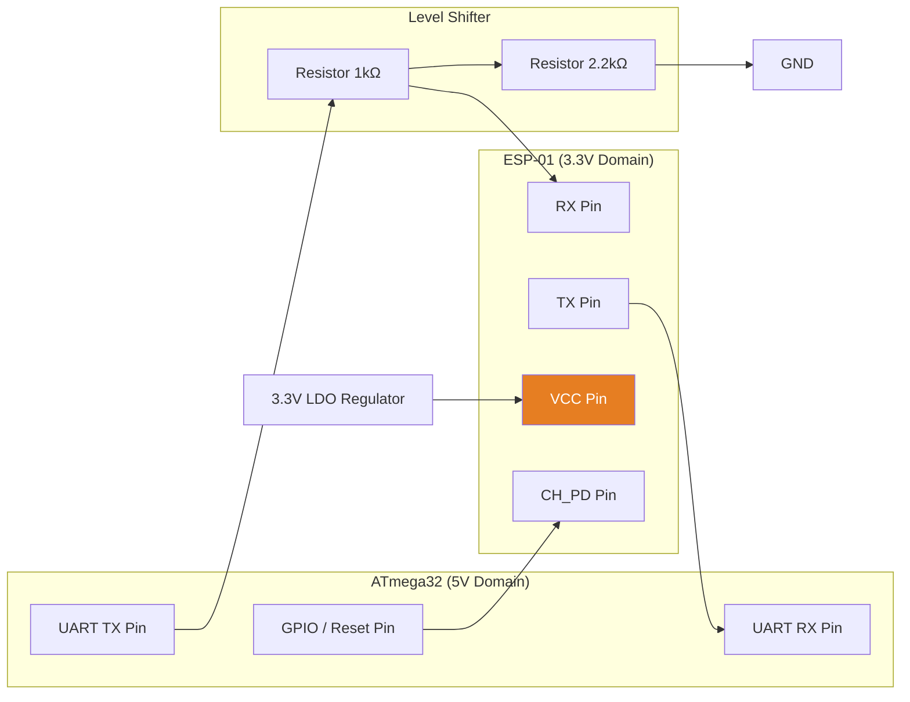
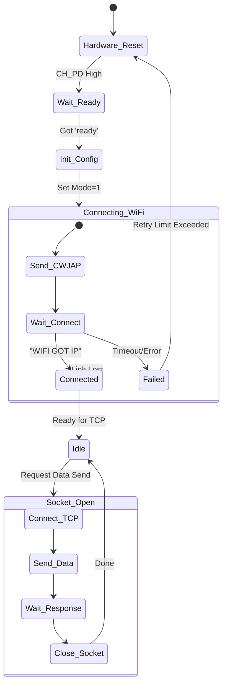
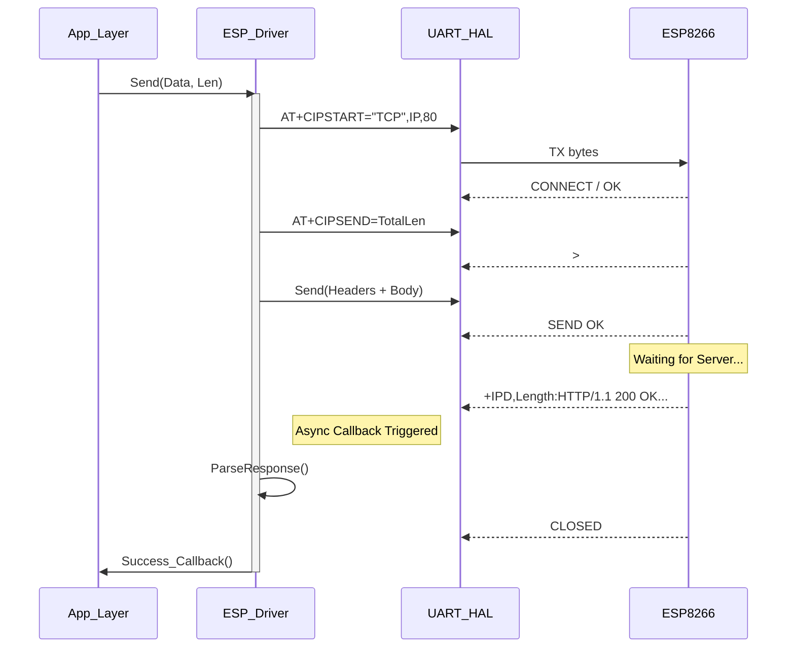
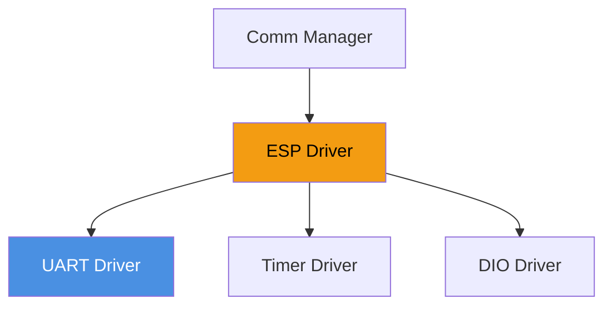

# 📶 ESP-01 Driver

<div align="center">


**ESP-01 Driver**

**Smart Energy Management System - WiFi & IoT Interface**

_Developed by Gestell Company - Professional Embedded Solutions_

</div>

---

## 📋 Table of Contents

- [Module Overview](#-1-module-overview)
- [Hardware Architecture](#-2-hardware-architecture)
- [AT Command Protocol](#-3-at-command-protocol)
- [Socket & Network State Machine](#-4-socket-and-network-state-machine)
- [HTTP Implementation](#-5-http-protocol-implementation)
- [Sequence Diagrams](#-6-sequence-diagrams)
- [Buffer & Data Handling](#-7-buffer-and-data-handling)
- [Configuration](#-8-configuration-parameters)
- [Troubleshooting](#-10-troubleshooting-guide)

---

## 🔗 Related Documentation

| Document                                                                                               | Description   | Status       |
| ------------------------------------------------------------------------------------------------------ | ------------- | ------------ |
| **[UART_Driver.md](../../MCAL_Layer/UART/UART_Driver.md)**                                             | Serial Bus    | ✅ Available |
| **[Communication_Manager.md](../../Application_Layer/Communication_Manager/Communication_Manager.md)** | Network Logic | ✅ Available |

---

## 📋 1. Module Overview

### Purpose and Role

The ESP-01 Driver is the gateway between the isolated embedded system and the Cloud. It manages the ESP8266 Wi-Fi module using a serial AT command interface. This driver encapsulates the complexity of asynchronous network events (disconnections, latencies, partial data packets) and provides a clean, synchronous-like API to the Application Layer.

### Key Responsibilities

- **WiFi Management**: Scanning, Connecting, and Auto-reconnecting to Access Points (AP).
- **Protocol Stack**: Implementing TCP/IP socket lifecycle (Open, Send, Receive, Close).
- **Data Parsing**: Extracting meaningful payloads (JSON) from raw AT streams.
- **Hardware Control**: Hard-resetting the module via GPIO if software hangs occur.
- **Power Management**: putting the radio to sleep when not in use.

---

## 2. Hardware Architecture

### 2.1 Connection Schematic

The ESP-01 logic level is **3.3V**, while the ATmega32 is **5V**. Direct connection is risky.



**Critical Note**: The ESP-01 can draw spikes of **300mA**. The ATmega32's 5V pin cannot supply this. A dedicated AMS1117-3.3 regulator is mandatory.

---

## 3. AT Command Protocol

The driver interacts with the module using a Request-Response structure.

### 3.1 Command Table

| Command                | Description        | Time Limit | Expected Response |
| ---------------------- | ------------------ | ---------- | ----------------- |
| `AT`                   | Test communication | 100ms      | `OK`              |
| `AT+RST`               | Software Reset     | 2000ms     | `ready`           |
| `AT+CWMODE=1`          | Set Station Mode   | 200ms      | `OK`              |
| `AT+CWJAP="SSID","PW"` | Connect to AP      | 15000ms    | `WIFI CONNECTED`  |
| `AT+CIFSR`             | Get IP Address     | 500ms      | `192.168.x.x`     |
| `AT+CIPSTART=...`      | Open TCP Socket    | 5000ms     | `CONNECT`         |
| `AT+CIPSEND=Length`    | Prepare Send       | 200ms      | `>`               |
| `AT+CIPCLOSE`          | Close Socket       | 500ms      | `CLOSED`          |

---

## 4. Socket and Network State Machine

The driver implements a robust state machine to handle network instability.



### Automatic Recovery

- **Level 1**: AT Command retry (3 times).
- **Level 2**: Software Reset (`AT+RST`).
- **Level 3**: Hardware Power Cycle (`CH_PD` Low -> High).
- **Level 4**: System Fault Report (Red LED).

---

## 5. HTTP Protocol Implementation

Since the ESP-01 only provides raw TCP, the driver must construct valid HTTP headers manually.

### 5.1 POST Request Structure

**Goal**: Send JSON data `{"v":220}` to `api.server.com/log`.

1.  **Calculate Content Length**: `{"v":220}` is 9 bytes.
2.  **Construct Header**:
    ```http
    POST /log HTTP/1.1\r\n
    Host: api.server.com\r\n
    Content-Type: application/json\r\n
    Content-Length: 9\r\n
    \r\n
    {"v":220}
    ```
3.  **Command Sequence**:
    - `AT+CIPSEND=(HeaderSize + BodySize)`
    - Wait for `>` prompt.
    - Send the constructed string.

### 5.2 GET Request Structure

**Goal**: Fetch configuration.

```http
GET /config HTTP/1.1\r\n
Host: api.server.com\r\n
Connection: close\r\n
\r\n
```

---

## 6. Sequence Diagrams

### 6.1 Successful Data Upload



---

## 7. Buffer and Data Handling

One of the biggest challenges is the limited RAM on the ATmega32 (2KB).

### 7.1 Circular Buffer Strategy

Since the ESP-01 might send data faster than the MCU can process:

- **RX Interrupt**: Pushes byte into `RingBuffer` (size 128 bytes).
- **Main Loop**: Polls `RingBuffer`, parsing line-by-line looking for delimiters (`\r\n`).

### 7.2 Zero-Copy Transmission

To avoid duplicating the large HTTP buffer (which might exceed RAM):

- The driver sends the **Header** (stored in Flash/PROGMEM) directly to UART.
- Then sends the **Payload** (from RAM) directly to UART.
- This avoids creating a massive concatenated string in memory.

---

## 8. Configuration Parameters

Configured in `ESP_Config.h`.

| Parameter     | Default       | Description                                     |
| ------------- | ------------- | ----------------------------------------------- |
| `WIFI_SSID`   | "Gestell_IoT" | Target Network Name.                            |
| `WIFI_PASS`   | "****\*****"" | Network Password.                               |
| `SERVER_IP`   | "192.168.1.5" | Remote Server IP (or Domain).                   |
| `SERVER_PORT` | `80`          | Port (80 for HTTP, 443 Not supported directly). |
| `RX_BUF_SIZE` | `128`         | Bytes. Increase for large JSON responses.       |
| `CMD_TIMEOUT` | `5000`        | Milliseconds to wait for OK.                    |

---

## 9. Module Dependencies



- **Timer**: Used for non-blocking timeout measurement.
- **UART**: Must be configured for 115200 baud (default for most ESPs) or 9600.

---

## 10. Troubleshooting Guide

### 10.1 "Garbage" Characters

- **Cause**: Baud rate mismatch.
- **Fix**: Verify if ESP is 9600 or 115200. Send `AT+UART_DEF=9600,8,1,0,0` to force it to a slower speed compatible with 8MHz AVRs.

### 10.2 "Busy s..." or Freeze

- **Cause**: Power supply droop.
- **Fix**: Add 100µF capacitor directly on ESP VCC/GND pins.

### 10.3 Scan finds APs, but fails to join

- **Cause**: Weak signal or WPA3 security (ESP8266 supports WPA2).
- **Fix**: Move router closer. Check router security settings.

---

<div align="center">

**Built with ❤️ by Gestell Team**

_Professional Embedded Systems Engineering_

**Copyright © 2025-2026 Gestell Company - All Rights Reserved**

</div>
