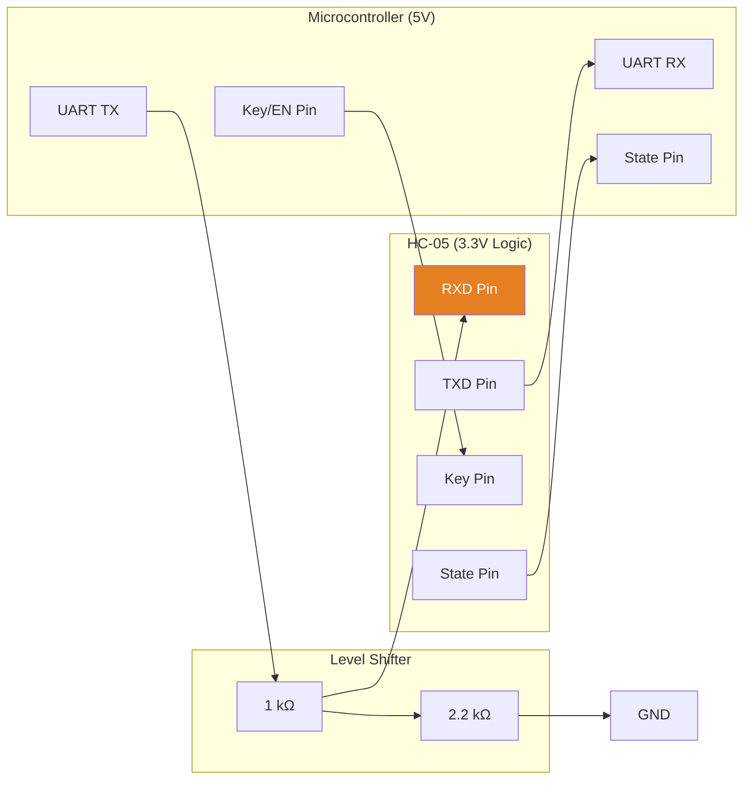
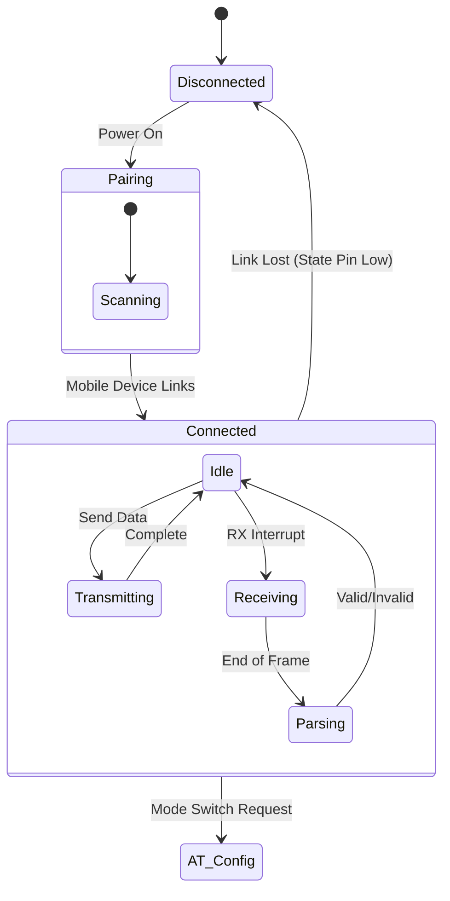
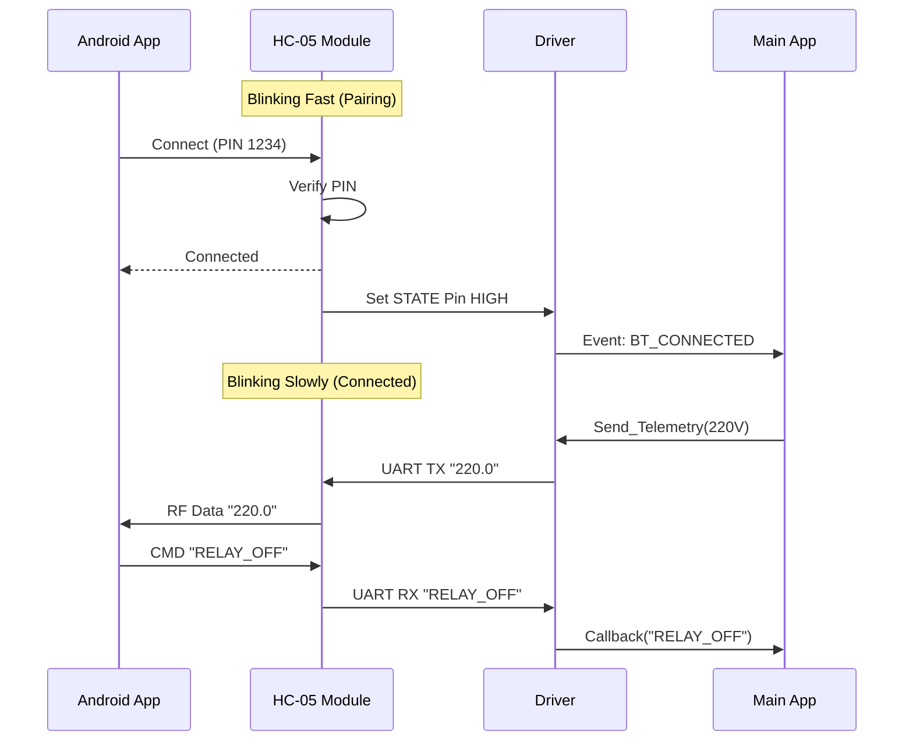
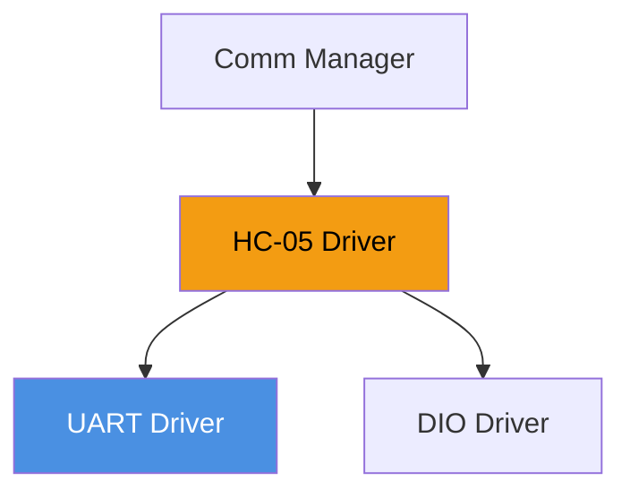

# 🔵 HC-05 Bluetooth Module Driver

<div align="center">


**HC-05 Driver**

**Smart Energy Management System - Serial Wireless Bridge**

_Developed by Gestell Company - Professional Embedded Solutions_

</div>

---

## 📋 Table of Contents

- [Module Overview](#-1-module-overview)
- [Hardware Architecture](#-2-hardware-architecture)
- [Operating Modes](#-3-operating-modes)
- [AT Command Set](#-4-at-command-reference)
- [Packet Protocol](#-5-packet-protocol-structure)
- [State Machine](#-6-state-machine)
- [Sequence Diagrams](#-7-sequence-diagrams)
- [Configuration](#-8-configuration-parameters)
- [Dependencies](#-9-module-dependencies)

---

## 🔗 Related Documentation

| Document                                                                                               | Description    | Status       |
| ------------------------------------------------------------------------------------------------------ | -------------- | ------------ |
| **[UART_Driver.md](../../MCAL_Layer/UART/UART_Driver.md)**                                             | Serial Bus     | ✅ Available |
| **[Communication_Manager.md](../../Application_Layer/Communication_Manager/Communication_Manager.md)** | Protocol Logic | ✅ Available |

---

## 📋 1. Module Overview

### Purpose and Role

The HC-05 Driver facilitates wireless serial communication between the Energy Meter and an Android/iOS mobile application. It acts as a transparent bridge, converting UART serial frames into Bluetooth 2.0 (Classic) radio packets.

This module is essential for the "Technician Mode", allowing field engineers to configure thresholds, read error logs, and calibrate sensors without physical access to the device (up to 10 meters).

### Key Responsibilities

- **Transparent Bridge**: Passing bytes from UART Rx to Bluetooth Air, and Air to UART Tx.
- **Configuration**: Entering AT Mode to set Name, PIN, and Baud Rate.
- **State Monitoring**: Detecting connection status via the STATE pin.
- **Security**: Managing PIN pairing (default "1234").

---

## 2. Hardware Architecture

### 2.1 Interface Schematic



### 2.2 Pin Descriptions

1.  **RXD (HC-05)**: Receiving Data. **3.3V Logic Limit!** Requires divider.
2.  **TXD (HC-05)**: Transmitting Data. 3.3V Logic, but safe for 5V MCU input ($V_{IH} > 2.0V$).
3.  **KEY**: Pull HIGH during power-on to enter AT Command Mode.
4.  **STATE**: LOW = Disconnected. HIGH = Connected. Used by driver to pause transmission if link is lost.

---

## 3. Operating Modes

The HC-05 has two distinct operational states.

| Mode          | Entry Condition | LED Pattern                                     | Baud Rate         | Function         |
| ------------- | --------------- | ----------------------------------------------- | ----------------- | ---------------- |
| **Data Mode** | Standard Boot   | Fast Blink (Pairing) / Double Blink (Connected) | Configured (9600) | Transparent Data |
| **AT Mode**   | KEY High @ Boot | Slow Blink (2s period)                          | Fixed (38400)     | Configuration    |

> **Driver Strategy**: The driver operates primarily in Data Mode. AT Mode is only used during "Factory Reset" or generic setup, requiring a specific boot sequence.

---

## 4. AT Command Reference

Although rarely used in runtime, these commands are essential for setup.

| Command    | Description     | Parameter Example      | Response |
| ---------- | --------------- | ---------------------- | -------- |
| `AT`       | Test            | -                      | `OK`     |
| `AT+NAME`  | Set Device Name | `AT+NAME=GestellMeter` | `OK`     |
| `AT+PSWD`  | Set Pairing PIN | `AT+PSWD=8888`         | `OK`     |
| `AT+UART`  | Set Baud Rate   | `AT+UART=9600,0,0`     | `OK`     |
| `AT+ROLE`  | Master/Slave    | `0`=Slave, `1`=Master  | `OK`     |
| `AT+RESET` | Soft Reboot     | -                      | `OK`     |
| `AT+ORGL`  | Restore Factory | -                      | `OK`     |

---

## 5. Packet Protocol Structure

To ensure data integrity over the noisy wireless link, we use a simple frame structure.

### 5.1 JSON Frame (ASCII)

User readable, easy to debug.

```json
{
  "T": "DATA",
  "V": 220.5,
  "I": 5.12,
  "E": 150
}
```

- **Overhead**: High.
- **Parsing**: Requires `scanf` or parser.
- **Usage**: Technician Dashboard.

### 5.2 Binary Frame (Hex)

Compact, efficient.

| Start Byte | Cmd ID | Payload Len | Payload [0..N] | Checksum (XOR) | End Byte |
| ---------- | ------ | ----------- | -------------- | -------------- | -------- |
| `0xAA`     | `0x01` | `0x04`      | `00 00 00 00`  | `0x55`         | `0xFF`   |

- **Overhead**: Low (4 bytes).
- **Usage**: Firmware Upload, Raw Logging.

---

## 6. State Machine



---

## 7. Sequence Diagrams

### 7.1 Connection & Data Exchange



---

## 8. Configuration Parameters

Configured in `HC05_Cfg.h`.

| Parameter        | Default  | Description                        |
| ---------------- | -------- | ---------------------------------- |
| `BT_UART_BAUD`   | `9600`   | Must match module setting.         |
| `STATE_PIN`      | `PIN_D4` | Connection monitor input.          |
| `KEY_PIN`        | `PIN_D5` | AT Mode control output.            |
| `RX_BUFFER_SIZE` | `64`     | RAM buffer for incoming commands.  |
| `TX_BUFFER_SIZE` | `64`     | RAM buffer for outgoing telemetry. |

---

## 9. Module Dependencies



### 9.1 UART Conflict

**Issue**: The ATmega32 has only one UART.
**Conflict**: ESP-01 and HC-05 both need UART.
**Solution**:

1.  **Multiplexing**: Use logic gates to switch TX/RX lines based on a `SELECT` pin.
2.  **Software UART**: Use a Bit-Banging driver for the slower device (HC-05 @ 9600).
3.  **Exclusive Mode**: User selects "WiFi Mode" OR "Bluetooth Mode" via button.

> **Current Implementation**: **Exclusive Mode**. The system boots in WiFi mode by default. Holding a button switches to Bluetooth mode (swapping RX/TX ISR focus).

---

<div align="center">

**Built with ❤️ by Gestell Team**

_Professional Embedded Systems Engineering_

**Copyright © 2025-2026 Gestell Company - All Rights Reserved**

</div>
