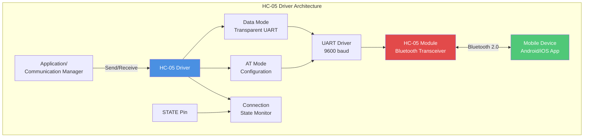
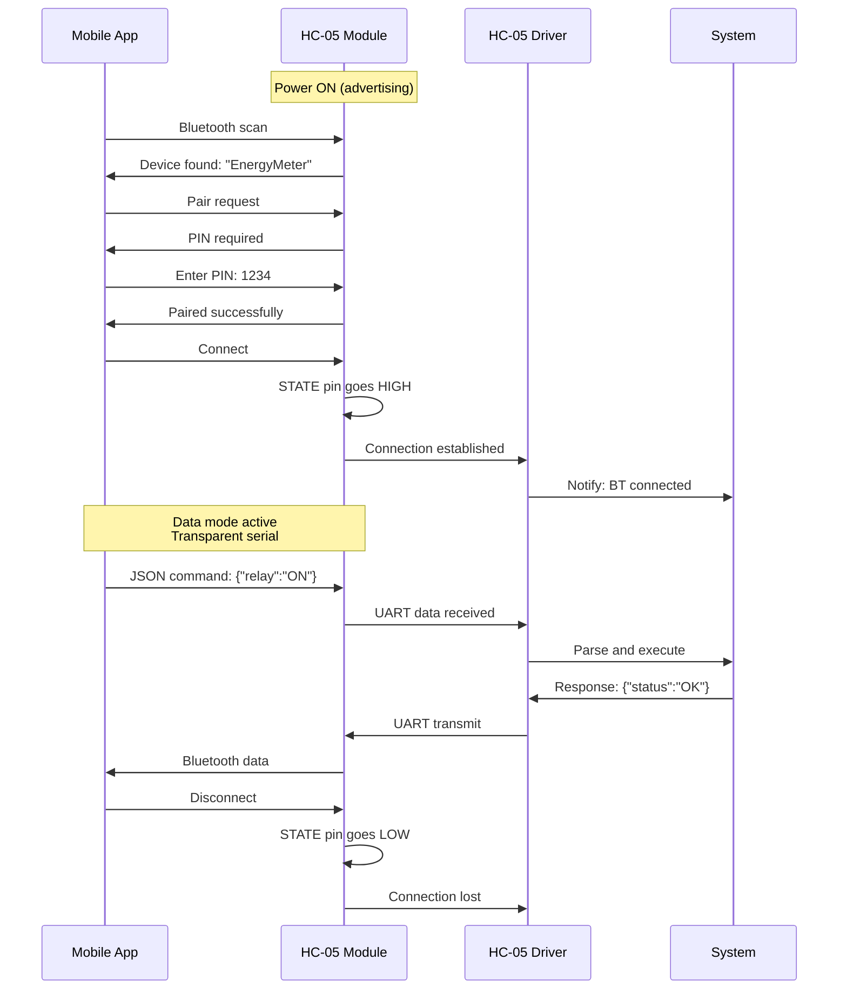
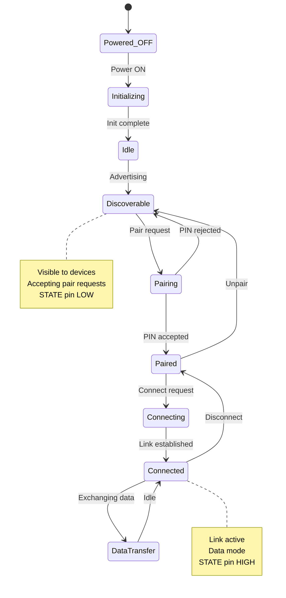
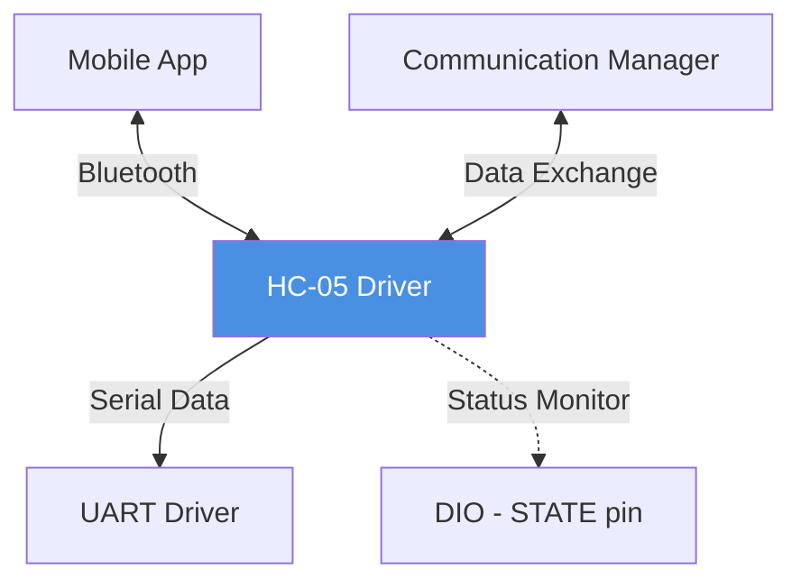

# HC-05 Bluetooth Module Driver

**Module**: HC-05 Bluetooth 2.0  
**Interface**: UART (AT Commands + Data)  
**Purpose**: Bluetooth connectivity for mobile app communication

---

## 1. Module Overview

### Purpose and Role

The HC-05 driver provides Bluetooth Classic connectivity, enabling wireless communication with mobile applications for real-time monitoring, control, and configuration.

### Key Responsibilities

- Bluetooth pairing and connection management
- Transparent serial data transmission
- AT command mode configuration
- Connection status monitoring
- Mobile app data exchange

### Hardware Component

- Bluetooth: Version 2.0 + EDR
- Range: ~10 meters (Class 2)
- Interface: UART (transparent serial)
- Default baud: 9600 or 38400
- Power: 3.3V (built-in regulator, 5V tolerant)

---

## 2. Architecture Diagram



---

## 3. Operating Modes

### Data Mode (Normal Operation)

**Characteristics:**

- Transparent serial bridge
- Data sent via UART appears on Bluetooth
- Data received via Bluetooth appears on UART
- No AT commands (except when disconnected)
- Automatic mode when paired and connected

### AT Command Mode

**Entry Methods:**

1. **Before pairing**: HC-05 accepts AT commands when not connected
2. **KEY pin**: Pull HIGH before power-on (hardware mode)

**Common AT Commands:**

| Command | Purpose            | Response | Example             |
| ------- | ------------------ | -------- | ------------------- |
| AT      | Test communication | OK       | Basic test          |
| AT+NAME | Set device name    | OK       | AT+NAME=EnergyMeter |
| AT+PSWD | Set PIN code       | OK       | AT+PSWD=1234        |
| AT+UART | Set baud rate      | OK       | AT+UART=9600,0,0    |
| AT+ROLE | Set master/slave   | OK       | AT+ROLE=0 (slave)   |

---

## 4. Connection Sequence



---

## 5. State Machine



---

## 6. Pin Connections

| HC-05 Pin | MCU Pin  | Function | Description                                         |
| --------- | -------- | -------- | --------------------------------------------------- |
| VCC       | 5V       | Power    | Module has 3.3V regulator                           |
| GND       | GND      | Ground   | Common ground                                       |
| TXD       | PD0 (RX) | Transmit | HC-05 → MCU (3.3V level, OK for 5V MCU)             |
| RXD       | PD1 (TX) | Receive  | MCU → HC-05 (needs level shift or resistor divider) |
| STATE     | GPIO     | Status   | HIGH=connected, LOW=disconnected                    |
| EN/KEY    | GPIO     | AT mode  | HIGH=AT mode (optional)                             |

**Level Shifting (TX → RXD):**

- Voltage divider: 1kΩ + 2kΩ (5V → 3.3V)
- Or dedicated level shifter IC

---

## 7. Configuration Parameters

### Default Settings

| Parameter   | Default    | Configurable  |
| ----------- | ---------- | ------------- |
| Device name | HC-05      | Yes (AT+NAME) |
| PIN code    | 1234       | Yes (AT+PSWD) |
| Baud rate   | 9600/38400 | Yes (AT+UART) |
| Role        | Slave      | Yes (AT+ROLE) |
| Parity      | None       | Yes           |

### Recommended Settings for Energy Meter

- Name: "EnergyMeter" or "SmartPower"
- PIN: Custom 4-digit code (e.g., 5678)
- Baud: 9600 (stable, compatible with UART shared with ESP-01)
- Role: Slave (mobile app connects to it)

---

## 8. Data Protocol

**Mobile App ← System (Telemetry):**

```
JSON format:
{
  "voltage": 220.5,
  "current": 5.2,
  "power": 1146.6,
  "energy": 12.5,
  "status": "normal"
}
```

**Mobile App → System (Commands):**

```
JSON format:
{
  "command": "relay",
  "value": "ON" / "OFF"
}

{
  "command": "threshold",
  "current": 10.0
}
```

---

## 9. Module Dependencies



---

## 10. Performance Characteristics

**Bluetooth Range:**

- Line of sight: ~10 meters
- Through walls: ~5 meters
- Class 2 device

**Data Rate:**

- Maximum: ~1 Mbps (Bluetooth 2.0 EDR)
- Practical UART: 9600 bps = 960 bytes/sec
- Throughput: ~800 bytes/sec (with protocol overhead)

**Power Consumption:**

- Active (connected): ~40 mA
- Discoverable: ~30 mA
- Idle (paired, not connected): ~8 mA

**Resource Usage:**

- RAM: ~50 bytes
- Flash: ~400 bytes
- UART: Shared with ESP-01

---

## Implementation Notes

### UART Sharing

**Challenge**: Both HC-05 and ESP-01 use UART
**Solutions:**

1. Software UART for one module (bit-banging)
2. Hardware UART multiplexer (analog switch)
3. Time-division: Use one module at a time
4. **Recommended**: Use HC-05 for local, ESP-01 for cloud (mutually exclusive)

### Pairing Security

- Change default PIN from 1234
- Use device name to identify correct module
- Implement authentication at application protocol level

### Connection Monitoring

- Monitor STATE pin to detect connection status
- Auto-reconnect logic in mobile app
- Timeout disconnected connections (power saving)

---

**Document Version**: 2.0  
**Last Updated**: January 2026  
**Maintained By**: Gestell Engineering Team
