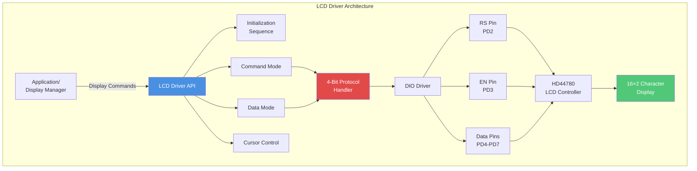
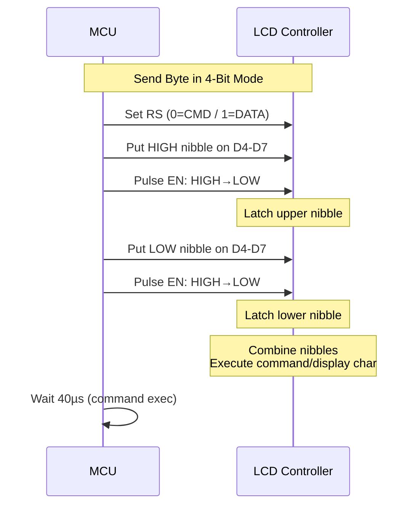
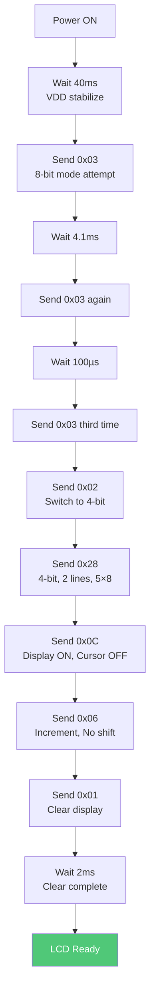
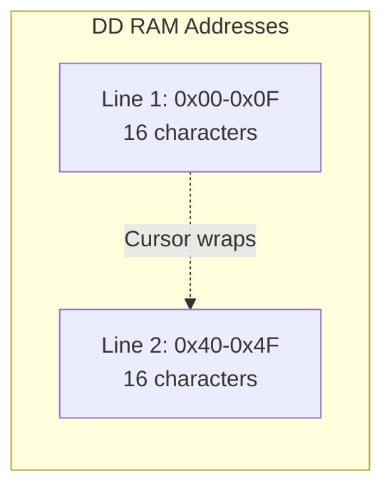
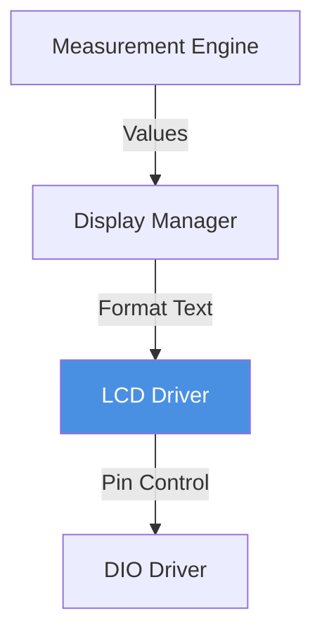

# LCD Driver - HD44780 Character Display

**Display**: 16×2 Character LCD  
**Controller**: HD44780 Compatible  
**Interface**: 4-bit parallel mode  
**Purpose**: User interface display for real-time system information

---

## 1. Module Overview

### Purpose and Role

The LCD driver controls a 16×2 character display for presenting system information including voltage, current, power, energy consumption, and system status to users.

### Key Responsibilities

- Initialize LCD in 4-bit mode
- Display text strings on 2 lines
- Cursor positioning and control
- Special character support
- Screen clearing and updating

### Hardware Component

- Type: 16 characters × 2 lines alphanumeric
- Controller: Hitachi HD44780 or compatible
- Interface: 4-bit data bus (D4-D7)
- Supply: 5V DC
- Current: 1-2 mA (display) + 15-20 mA (backlight)

---

## 2. Architecture Diagram

---

## 3. Pin Connections

| LCD Pin | Function        | MCU Pin       | Description                     |
| ------- | --------------- | ------------- | ------------------------------- |
| RS      | Register Select | PD2           | 0=Command, 1=Data               |
| E       | Enable          | PD3           | Falling edge triggers operation |
| D4-D7   | Data Bus        | PD4-PD7       | 4-bit parallel data             |
| RW      | Read/Write      | GND           | Write-only mode                 |
| VDD/VSS | Power           | +5V/GND       | Power supply                    |
| V0      | Contrast        | Potentiometer | Contrast adjustment             |
| A/K     | Backlight       | +5V/GND       | LED backlight                   |

---

## 4. 4-Bit Interface Protocol

---

## 5. Initialization Sequence

---

## 6. Display Memory Layout

**Cursor Positioning:**

- Line 1, Column 0: Address 0x00, Command 0x80
- Line 2, Column 0: Address 0x40, Command 0xC0
- Line 2, Column 5: Address 0x45, Command 0xC5

---

## 7. Common Commands

| Operation       | Command     | Execution Time | Description               |
| --------------- | ----------- | -------------- | ------------------------- |
| Clear Display   | 0x01        | 1.64ms         | Clear screen, home cursor |
| Return Home     | 0x02        | 1.64ms         | Cursor to position 0      |
| Display ON      | 0x0C        | 40µs           | Enable display            |
| Display OFF     | 0x08        | 40µs           | Blank display             |
| Cursor Position | 0x80 + addr | 40µs           | Set DD RAM address        |

---

## 8. Timing Requirements

| Parameter            | Minimum | Typical | Notes              |
| -------------------- | ------- | ------- | ------------------ |
| Enable pulse width   | 230ns   | 500ns   | HIGH state         |
| Enable cycle time    | 500ns   | 1µs     | Total pulse        |
| Command execution    | 40µs    | 50µs    | Most commands      |
| Clear/Home execution | 1.64ms  | 2ms     | Special commands   |
| Inter-command delay  | 40µs    | 50µs    | Between operations |

**Safe Implementation**: Use 50µs delays between operations, 2ms after clear/home.

---

## 9. Module Dependencies

---

## 10. Performance Characteristics

**Display Update:**

- Single character: ~100µs
- Full line (16 chars): ~1.6ms
- Full screen (32 chars): ~3.2ms
- Refresh rate: Typically 2-5 Hz

**Resource Usage:**

- RAM: ~50 bytes (driver state)
- Flash: ~600 bytes
- Pins: 6 GPIO (RS, EN, D4-D7)

---

## Implementation Notes

### Character Write Procedure

1. Set RS=HIGH (data mode)
2. Send high nibble + pulse EN
3. Send low nibble + pulse EN
4. Wait 40µs
5. Cursor auto-advances

### String Display

- Loop through characters
- Position cursor first if needed
- Auto-wrap at position 15 to line 2

---

**Document Version**: 2.0  
**Last Updated**: January 2026  
**Maintained By**: Gestell Engineering Team
