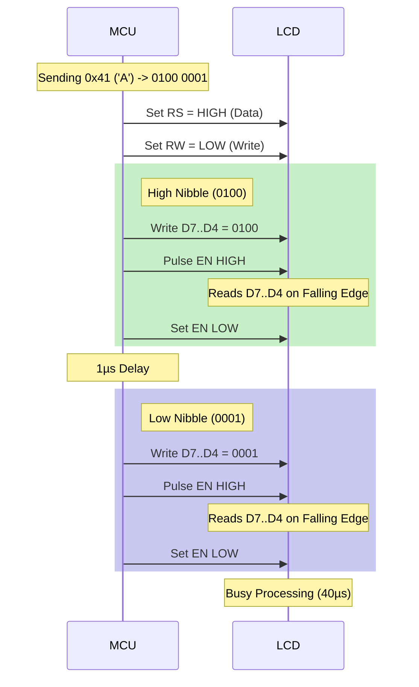
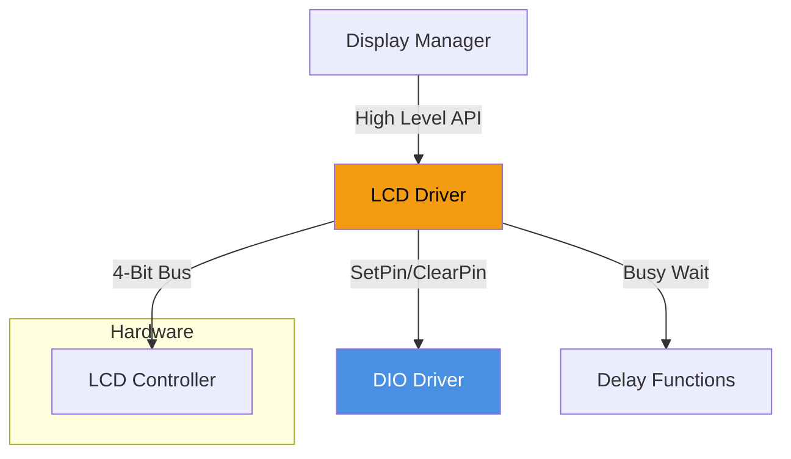

# 🖥️ LCD Driver

<div align="center">


**LCD Driver**

**Smart Energy Management System - HD44780 Character Display Interface**

_Developed by Gestell Company - Professional Embedded Solutions_

</div>

---

## 📋 Table of Contents

- [Module Overview](#-1-module-overview)
- [Hardware Architecture](#-2-hardware-architecture)
- [Communication Protocol](#-3-communication-protocol-4-bit-mode)
- [Memory Organization (DDRAM)](#-4-memory-organization-ddram)
- [Custom Graphics (CGRAM)](#-5-custom-graphics-cgram)
- [Initialization Sequence](#-6-initialization-sequence)
- [Optimization Strategies](#-7-optimization-strategies)
- [Configuration](#-8-configuration-parameters)
- [Dependencies](#-9-module-dependencies)

---

## 🔗 Related Documentation

| Document                                                  | Description  | Status       |
| --------------------------------------------------------- | ------------ | ------------ |
| **[DIO_Driver.md](../../MCAL_Layer/DIO/DIO_Driver.md)**   | Pin Control  | ✅ Available |
| **[Common_Layer.md](../../Common_Layer/Common_Layer.md)** | Delays/Types | ✅ Available |

---

## 📋 1. Module Overview

### Purpose and Role

The LCD Driver allows the system to communicate with standard alphanumeric liquid crystal displays (16x2, 20x4) powered by the Hitachi HD44780 controller (or compatible clones). It is the primary readout for the Energy Management System, displaying real-time voltage, current, power, and connection status.

### Key Responsibilities

- **Abstraction**: Hiding the complex command sequences required to position the cursor or clear the screen.
- **Pin Management**: Handling the nibble-swapping required for 4-bit parallel communication.
- **Timing Compliance**: Ensuring all control signals meet the microsecond-level setup and hold times mandated by the HD44780 datasheet.
- **Customization**: Uploading user-defined icons (e.g., WiFi Bars, Battery Level) to the display's volatile memory.

---

## 2. Hardware Architecture

### 2.1 Interface Logic

To conserve microcontroller pins, the driver operates in **4-bit Mode**.

```mermaid
graph LR
    subgraph "Microcontroller (ATmega32)"
        RS[RS Pin<br/>(Register Select)]
        EN[EN Pin<br/>(Enable)]
        D4[Data Pin 4]
        D5[Data Pin 5]
        D6[Data Pin 6]
        D7[Data Pin 7]
    end

    subgraph "LCD Module (HD44780)"
        L_RS[RS]
        L_RW[RW (Grounded)]
        L_EN[EN]
        L_D4[DB4]
        L_D5[DB5]
        L_D6[DB6]
        L_D7[DB7]
        L_VO[V0 Contrast]
    end

    RS --> L_RS
    EN --> L_EN
    GND --> L_RW

    D4 --> L_D4
    D5 --> L_D5
    D6 --> L_D6
    D7 --> L_D7

    POT[10k Potentiometer] --> L_VO

    style L_RS fill:#2ECC71,color:#fff
    style L_D4 fill:#3498DB,color:#fff
```

### 2.2 Contrast Circuit (V0)

- **Pin V0 (Pin 3)** controls the contrast voltage driving the liquid crystals.
- **Requirement**: A variable voltage typically between 0V and 1.5V relative to VDD.
- **Implementation**: A 10kΩ potentiometer acts as a voltage divider.
  - Too High Voltage -> Ghost rectangles (Pixels always ON).
  - Too Low Voltage -> Invisible text (Pixels always OFF).

---

## 3. Communication Protocol (4-Bit Mode)

Sending a byte (8 bits) requires two separate write cycles ("Nibbles").

### 3.1 Write Timing Diagram



### 3.2 Critical Timings

- **Enable Pulse Width**: Min 450ns.
- **Data Setup Time**: Min 80ns before Enable falls.
- **Execution Time**:
  - Normal Command/Data: 37µs - 1.52ms.
  - Clear Display: **> 1.52ms** (Very slow!). The driver _must_ incorporate a blocking delay here or poll the Busy Flag (check D7).

---

## 4. Memory Organization (DDRAM)

The HD44780 has 80 bytes of Display Data RAM (DDRAM). The visible screen is a "window" into this memory.

### 4.1 Address Map (20x4 Display)

| Line      | start (Col 0) | End (Col 19) | Invisible Area (Storage) |
| --------- | ------------- | ------------ | ------------------------ |
| **Row 0** | `0x00`        | `0x13`       | `0x14` ... `0x27`        |
| **Row 1** | `0x40`        | `0x53`       | `0x54` ... `0x67`        |
| **Row 2** | `0x14`        | `0x27`       | `0x28` ... `0x3F`        |
| **Row 3** | `0x54`        | `0x67`       | `0x68` ... `0x7F`        |

> **Addressing Quirk**: Note that Row 2 is logically continuous with Row 0, and Row 3 with Row 1. Simply incrementing the address from `0x13` (end of Row 0) jumps to `0x14` (start of Row 2) on a 20x4 display logic! The driver handles `LCD_SetCursor(row, col)` to manage these non-linear jumps.

---

## 5. Custom Graphics (CGRAM)

The LCD supports 8 user-definable characters (5x8 pixels). These are stored in CGRAM (Character Generator RAM).

### 5.1 Bitmap Design

Example: **WiFi Icon**

```text
Pixel Map   Binary    Hex
...#...     00100     0x04
..#.#..     01010     0x0A
.#...#.     10001     0x11
.......     00000     0x00
...#...     00100     0x04
.......     00000     0x00
.......     00000     0x00
.......     00000     0x00
```

### 5.2 Upload Sequence

1.  **Set Address**: Send Command `0x40 + (Index * 8)`.
    - Index 0 -> 0x40
    - Index 1 -> 0x48
2.  **Write Data**: Send 8 bytes of bitmap data sequentially.
3.  **Reset**: Send Command `0x80` to return to DDRAM mode (normal printing).

---

## 6. Initialization Sequence

The "Power-On" initialization is notoriously tricky. If the LCD is in an unknown state (e.g., after a brown-out), it requires a specific "Knock" sequence to force it into 4-bit mode.

```mermaid
flowchart TD
    Start[Power On] --> Wait[Wait >15ms]
    Wait --> Cmd1[Send 0x03<br/>(Function Set)]
    Cmd1 --> Wait1[Wait >4.1ms]
    Wait1 --> Cmd2[Send 0x03<br/>(Function Set)]
    Cmd2 --> Wait2[Wait >100us]
    Wait2 --> Cmd3[Send 0x03<br/>(Function Set)]

    Cmd3 --> Set4Bit[Send 0x02<br/>(Switch to 4-bit)]

    Set4Bit --> Config[Function Set:<br/>2 Lines, 5x8 Font]
    Config --> DispOff[Display OFF]
    DispOff --> Clear[Clear Display]
    Clear --> EntryMode[Entry Mode:<br/>Inc Cursor, No Shift]
    EntryMode --> DispOn[Display ON]
    DispOn --> Ready([Ready])

    style Cmd1 fill:#E74C3C,color:#fff
    style Set4Bit fill:#F39C12,color:#fff
```

---

## 7. Optimization Strategies

### 7.1 "Dirty" Display Buffer

Writing to the LCD is slow (~2ms per screen). To improve system responsiveness:

1.  **Shadow Buffer**: Maintain a `char screen_buffer[4][20]` in the MCU RAM.
2.  **Comparison**: Before writing, compare new character with current buffer content.
3.  **Skip**: If `new == old`, do nothing.
4.  **Result**: Only changed digits (e.g., last digit of voltage) are transmitted. Updates take 50µs instead of 20ms.

### 7.2 Busy Flag Polling (Future)

Instead of hard-coded delays (e.g., `_delay_ms(2)`), read the **Busy Flag** (BF, Bit 7) from the LCD.

- Set RW=Read, RS=Command.
- Read D7. If 1, LCD is busy. If 0, LCD is ready.
- _Requires RW pin to be connected to MCU (currently grounded in our schematic)._

---

## 8. Configuration Parameters

Configured in `LCD_Config.h`.

| Parameter       | Default | Description               |
| --------------- | ------- | ------------------------- |
| `LCD_DATA_PORT` | `PORTA` | Port connected to D4-D7.  |
| `LCD_CTRL_PORT` | `PORTB` | Port connected to RS, EN. |
| `RS_PIN`        | `PIN1`  | Register Select pin mask. |
| `EN_PIN`        | `PIN2`  | Enable pin mask.          |
| `D4_PIN`        | `PIN4`  | Data Bit 4 pin mask.      |
| `LCD_MODE`      | `4BIT`  | 4BIT / 8BIT selector.     |
| `LCD_ROWS`      | `4`     | 2 or 4 rows.              |
| `LCD_COLS`      | `20`    | 16 or 20 columns.         |

---

## 9. Module Dependencies



---

<div align="center">

**Built with ❤️ by Gestell Team**

_Professional Embedded Systems Engineering_

**Copyright © 2025-2026 Gestell Company - All Rights Reserved**

</div>
