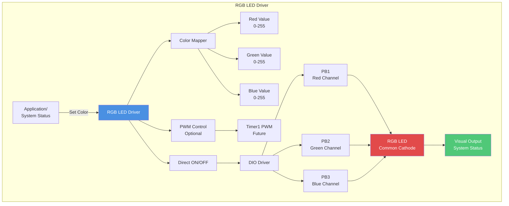
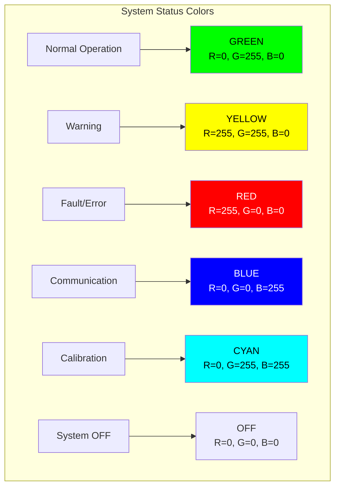
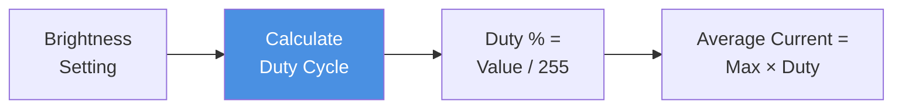
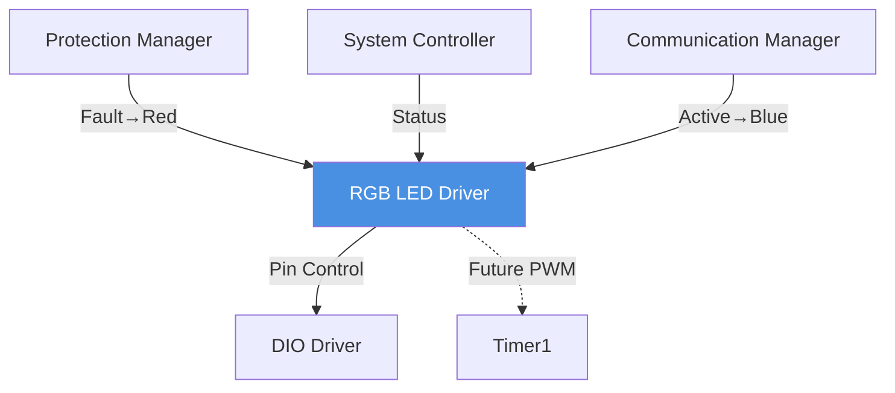

# RGB LED Driver - Status Indicator

**LED Type**: Common Cathode RGB LED  
**Control**: PWM for brightness control  
**Pins**: PB1 (Red), PB2 (Green), PB3 (Blue)  
**Purpose**: Visual system status indication

---

## 1. Module Overview

### Purpose and Role

The RGB LED driver provides visual status indication through a single RGB LED that can display multiple colors representing different system states.

### Key Responsibilities

- Color mixing for status display
- Brightness control via PWM
- State-to-color mapping
- Power-efficient operation

### Hardware Component

- Type: Common cathode RGB LED (3 LEDs in one package)
- Control: Individual color channels
- Current limiting resistors: R=150Ω, G=100Ω, B=100Ω
- Maximum current: ~20 mA per channel

---

## 2. Architecture Diagram

---

## 3. Color States

---

## 4. Color Mapping

| System State     | R   | G   | B   | Visual Color | Meaning                 |
| ---------------- | --- | --- | --- | ------------ | ----------------------- |
| Normal Operation | 0   | 255 | 0   | Green        | All systems OK          |
| Warning          | 255 | 255 | 0   | Yellow       | Approaching threshold   |
| Fault/Protection | 255 | 0   | 0   | Red          | Overcurrent/Overvoltage |
| Communication    | 0   | 0   | 255 | Blue         | Data transmission       |
| Calibration Mode | 0   | 255 | 255 | Cyan         | Calibration active      |
| System OFF       | 0   | 0   | 0   | OFF          | No power/standby        |

---

## 5. PWM Control (Future Enhancement)

### Timer1 PWM Channels

**Configuration:**

- PB1 (OC1A): Red channel PWM (future)
- PB2 (OC1B): Green channel PWM (future)
- PB3: Blue digital ON/OFF (current)

**PWM Parameters:**

- Frequency: ~1 kHz (above flicker threshold)
- Resolution: 8-bit (0-255 brightness levels)
- Duty cycle: Brightness / 255

**Current Implementation:**

- Simple ON/OFF control via DIO
- PWM reserved for future brightness control

---

## 6. Brightness Control

**Modes:**

- **Full Brightness**: All channels 255 (full ON)
- **Dimmed**: All values × 0.5 (night mode)
- **OFF**: All channels 0

---

## 7. Module Dependencies

---

## 8. Electrical Specifications

| Channel | Forward Voltage | Resistor | Current | Power |
| ------- | --------------- | -------- | ------- | ----- |
| Red     | ~2.0V           | 150Ω     | 20 mA   | 40 mW |
| Green   | ~3.3V           | 100Ω     | 17 mA   | 56 mW |
| Blue    | ~3.3V           | 100Ω     | 17 mA   | 56 mW |

**Maximum Power:**

- All channels ON: ~152 mW
- Typical single color: ~40-56 mW

---

## 9. Implementation Notes

### Current Implementation

**Simple ON/OFF Control:**

- Each channel controlled via DIO_SetPin
- HIGH = LED ON, LOW = LED OFF
- No brightness gradation (future PWM feature)

### Future PWM Enhancement

**Advantages:**

- Smooth brightness control
- Color mixing for intermediate colors
- Power savings in dimmed mode

**Requirements:**

- Timer1 reconfiguration for PWM mode
- Changes to ADC triggering mechanism
- Software PWM alternative for blue channel

---

## 10. Performance Characteristics

**Response Time:**

- Instant (GPIO switching)
- < 1µs transition

**Power Consumption:**

- OFF: 0 mA
- Single color: 17-20 mA
- All colors: ~54 mA (worst case)

**Lifetime:**

- LED lifespan: 50,000+ hours
- Continuous operation: > 5 years

---

**Document Version**: 2.0  
**Last Updated**: January 2026  
**Maintained By**: Gestell Engineering Team
