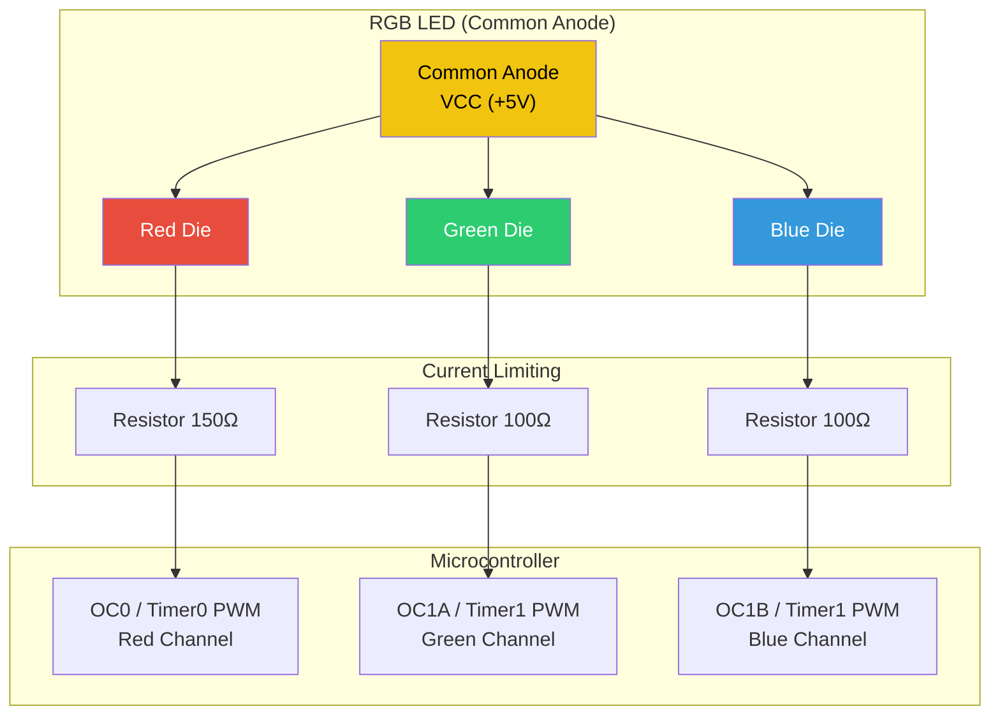
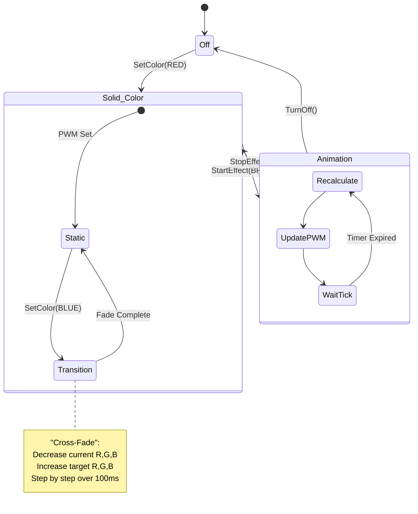
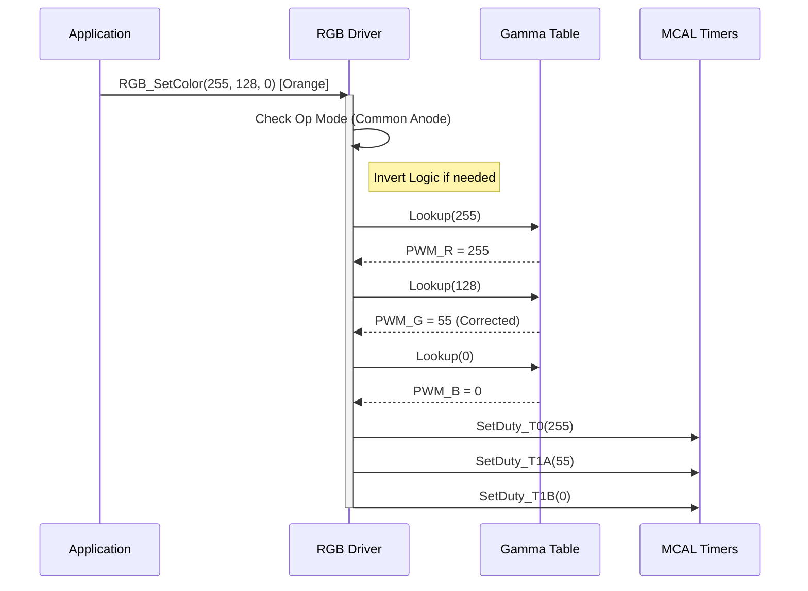
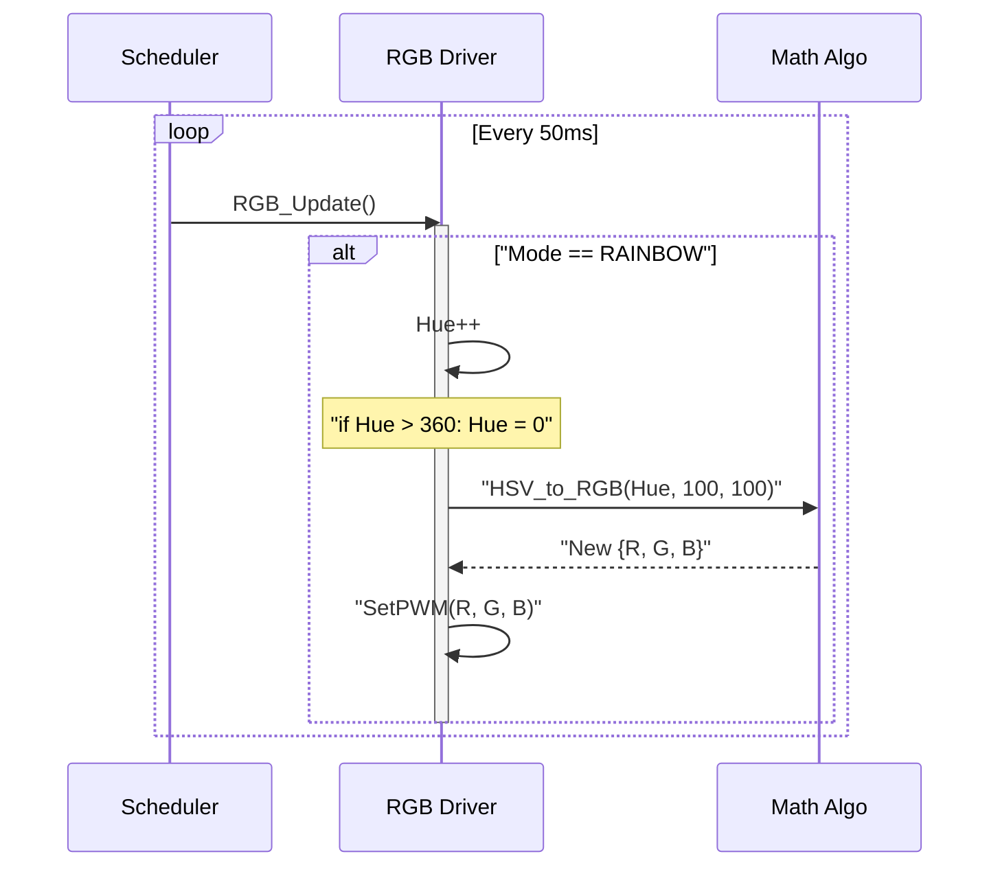
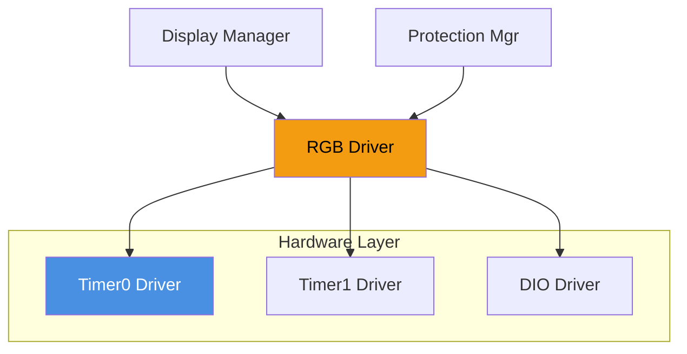

# 🌈 RGB LED Driver

**RGB LED Driver**

**Smart Energy Management System - Advanced Illumination Controller**

_Developed by Gestell Company - Professional Embedded Solutions_

---

## 📋 Table of Contents

- [Module Overview](#-1-module-overview)
- [Hardware Architecture](#-2-hardware-architecture)
- [Color Theory & Physics](#-3-color-theory-and-perception)
- [Control Algorithms](#-4-control-algorithms)
- [Animation Engine](#-5-animation-and-effects-engine)
- [State Machine](#-6-state-machine)
- [Sequence Diagrams](#-7-sequence-diagrams)
- [Configuration](#-8-configuration-parameters)
- [Dependencies](#-9-module-dependencies)

---

## 🔗 Related Documentation

| Document                                                         | Description      | Status       |
| ---------------------------------------------------------------- | ---------------- | ------------ |
| **[Timer0_Driver.md](../../MCAL_Layer/Timer0/Timer0_Driver.md)** | PWM Channel R    | ✅ Available |
| **[Timer1_Driver.md](../../MCAL_Layer/Timer1/Timer1_Driver.md)** | PWM Channels G/B | ✅ Available |
| **[DIO_Driver.md](../../MCAL_Layer/DIO/DIO_Driver.md)**          | Pin Config       | ✅ Available |

---

## 📋 1. Module Overview

### Purpose and Role

The RGB LED Driver transforms a simple 4-pin electronic component into a sophisticated user feedback mechanism. By independently controlling the intensity of Red, Green, and Blue channels using Pulse Width Modulation (PWM), the system can display over 16 million colors ($256^3$).

In the Smart Energy Management System, the RGB LED serves as the primary visual status indicator, communicating device state (e.g., Connected, Fault, Charging) instantly without requiring the user to read text on the LCD.

### Key Responsibilities

- **Channel Mixing**: Combining R, G, B intensities to create composite colors (e.g., Orange, Purple).
- **Gamma Correction**: Adjusting linear PWM values to match logarithmic human eye perception.
- **Brightness Control**: Global scaling of output without changing hue.
- **Animation**: executing smooth transitions (fading) and temporal patterns (blinking, breathing).
- **Hardware Abstraction**: Handling the differences between Common Anode and Common Cathode connections.

---

## 2. Hardware Architecture

### 2.1 Component Structure

An RGB LED is essentially three LEDs (Red, Green, Blue) packaged in a single case with a shared lead.

1.  **Common Cathode**:
    - Shared pin is Ground (GND).
    - R/G/B pins need **Active High** drive.
    - MCU sources current.

2.  **Common Anode**:
    - Shared pin is VCC.
    - R/G/B pins need **Active Low** drive.
    - MCU sinks current.

> **Project Configuration**: This driver assumes **Common Anode** (Active Low logic) as it is more compatible with standard MCU sink capabilities.

### 2.2 Drive Circuit

### 2.3 Resistor Calculation

Different LED colors have different forward voltages ($V_f$).

- **Red**: $V_f \approx 2.0V$. Target Current $I \approx 20mA$.
  $$ R = \frac{V\_{CC} - V_f}{I} = \frac{5 - 2.0}{0.02} = 150\Omega $$
- **Green/Blue**: $V_f \approx 3.2V$.
  $$ R = \frac{5 - 3.2}{0.02} = 90\Omega \to 100\Omega \text{ (Standard)} $$

---

## 3. Control Algorithms

### 3.1 Gamma Correction

**Problem**: The human eye perceives brightness logarithmically, but LEDs respond to PWM linearly. A 50% duty cycle looks to the eye like ~73% brightness. Low duty cycles (0-10%) show abrupt steps.

**Solution**: Map linear request (0-255) to a corrective curve.
$$ PWM\_{Out} = 255 \times (\frac{Input}{255})^{2.2} $$

**Lookup Table Strategy**:
To save CPU cycles, pre-calculate a 256-byte look-up table stored in Flash (PROGMEM).

- `Input 128 (50%)` -> `Gamma Table` -> `Output 55 (21%)`
- This provides smooth, natural fading.

### 3.2 HSV to RGB Conversion

While RGB is efficient for hardware, **HSV (Hue, Saturation, Value)** is better for color design.

- **Hue (0-360)**: The color type (0=Red, 120=Green, 240=Blue).
- **Saturation (0-100)**: "Richness" (0=White, 100=Bold).
- **Value (0-100)**: Brightness.

**Driver Feature**: A helper utility converts target HSV values into R,G,B PWM duties, allowing effects like "Rainbow Cycling" by just incrementing Hue.

---

## 4. Animation and Effects Engine

The driver maintains "virtual channels" for animation to avoid blocking the main loop.

### 4.1 Breathing Effect

Smoothly ramps brightness up and down using a sine-wave approximation.

$$ y(t) = 128 + 127 \cdot \sin(t) $$

Implementation:

1.  **State**: `BREATHING_RISING`, `BREATHING_FALLING`.
2.  **Tick**: Every 20ms.
3.  **Step**: Increment Duty Cycle by varying amounts (small step at peaks, large step at midpoints) OR use a pre-calculated sine table.

### 4.2 Strobe / Blink

Used for warnings.

- **Period**: Total cycle time (e.g., 1000ms).
- **Duty**: ON time (e.g., 500ms).
- **Color**: Target color.

---

## 5. State Machine

The driver orchestrates transitions between colors to prevent abrupt "jumps".

---

## 6. Sequence Diagrams

### 6.1 Setting a Color with Gamma Correction

### 6.2 Rainbow Animation Cycle

---

## 7. Configuration Parameters

Configured in `RGB_Config.h`.

| Parameter         | Default        | Description                                             |
| ----------------- | -------------- | ------------------------------------------------------- |
| `RGB_MODE`        | `COMMON_ANODE` | `COMMON_ANODE` (0=ON) or `COMMON_CATHODE` (1=ON).       |
| `GAMMA_ENABLE`    | `TRUE`         | Enable logarithmic perception correction.               |
| `MAX_BRIGHTNESS`  | `100`          | Global scaling limit (0-100%). Useful for power saving. |
| `TRANSITION_STEP` | `5`            | Speed of cross-fading (higher = faster).                |
| `R_PIN`           | `OC0`          | Timer0 Compare Output Pin.                              |
| `G_PIN`           | `OC1A`         | Timer1 Channel A Pin.                                   |
| `B_PIN`           | `OC1B`         | Timer1 Channel B Pin.                                   |

---

## 8. Dependencies

- **Timer0/Timer1**: The driver takes ownership of these timers for PWM generation. This may conflict with other modules (like Buzzer if Passive). Conflict resolution: Move Buzzer to software PWM or dedicated Timer2.

---

## 9. Implementation Notes

### 9.1 Power Consumption

RGB LEDs are power hungry.

- White (R+G+B) @ 20mA each = 60mA total.
- **Power Save Strategy**: When running on battery, limit `MAX_BRIGHTNESS` to 50% or use "Breathing" mode to reduce average current.

### 9.2 Inverted Logic (Common Anode)

If using Common Anode:

- `SetDuty(0)` -> 0V output -> $V_{CC}$ across LED -> **MAX Brightness**.
- `SetDuty(255)` -> 5V output -> 0V across LED -> **OFF**.

The driver must handle this inversion internally so the user API `SetColor(255,255,255)` remains intuitive (White).

- Raw_Write = `255 - Gamma_Corrected_Value`.

---

**Built with ❤️ by Gestell Team**

_Professional Embedded Systems Engineering_

**Copyright © 2025-2026 Gestell Company - All Rights Reserved**

