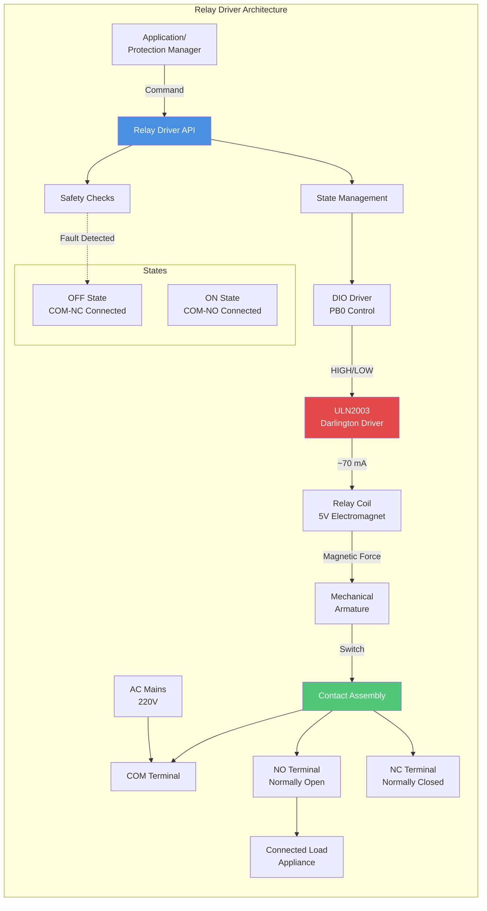
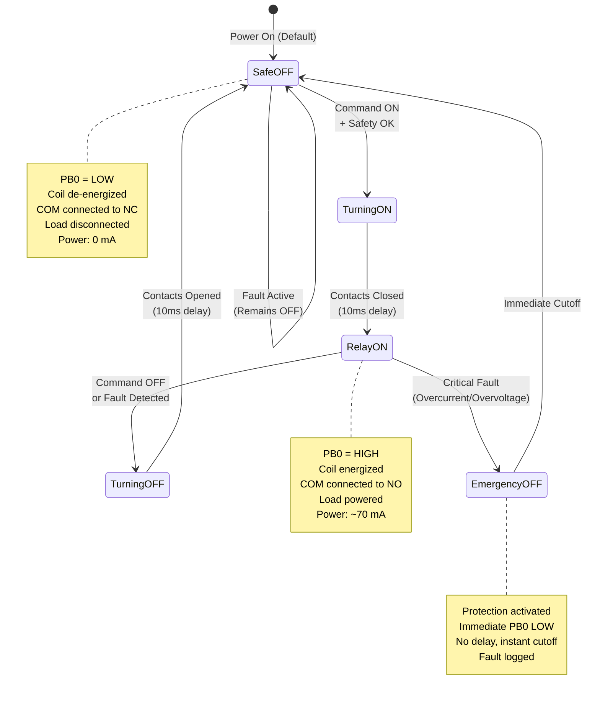
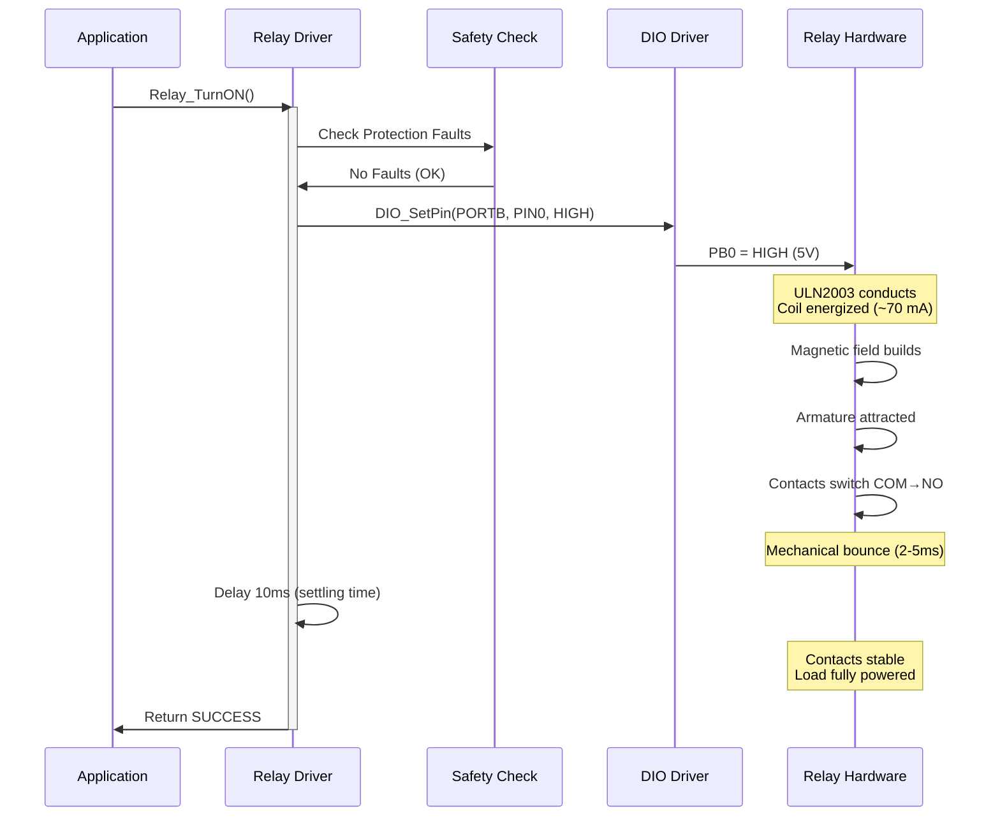
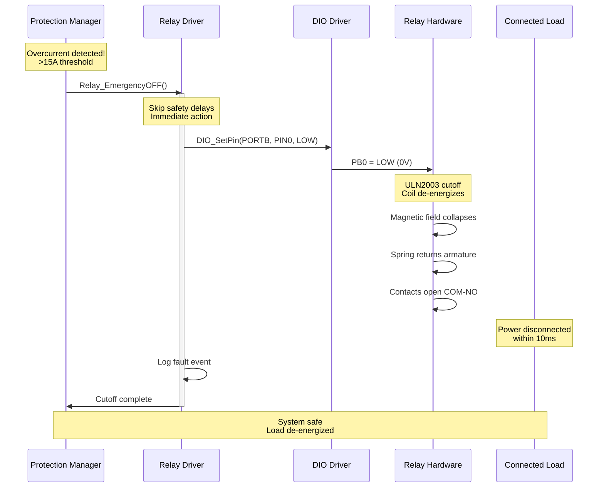
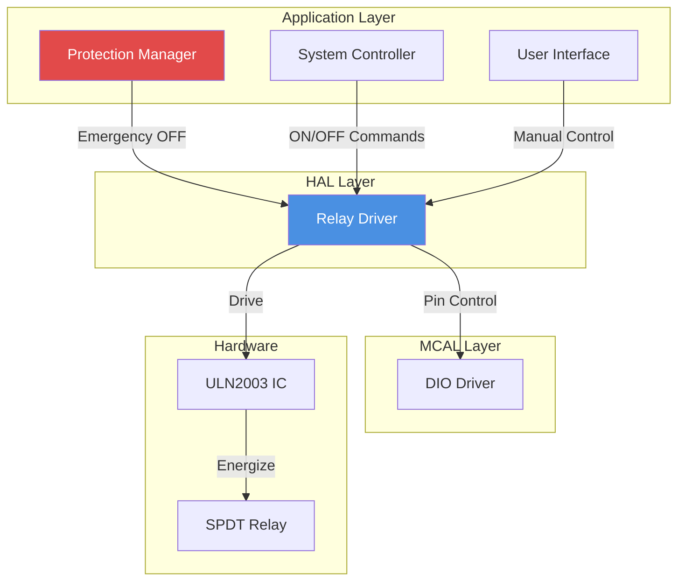

# Relay Driver - Load Switching Control

**Hardware**: 5V SPDT Relay  
**Driver IC**: ULN2003 Darlington Array  
**Control Pin**: PB0  
**Purpose**: Safe electrical isolation and load switching for AC mains control

---

## 1. Module Overview

### Purpose and Role

The Relay driver provides electrical isolation and safe switching of AC mains power to connected loads. Acting as the critical safety component between low-voltage control signals and high-voltage AC mains, the relay enables the system to turn loads on/off based on user commands, protection triggers, or scheduling.

### Key Responsibilities

- Safe switching of AC mains power (220V)
- Electrical isolation between microcontroller and AC circuit
- Protection command execution (emergency shutdown)
- Load state management and monitoring
- Mechanical contact bounce handling

### Hardware Components

**Relay Specifications:**

- Type: SPDT (Single Pole Double Throw)
- Coil voltage: 5V DC
- Coil current: ~70 mA
- Contact rating: 10A @ 250V AC or 30V DC
- Contact configuration: COM (Common), NO (Normally Open), NC (Normally Closed)

**Driver Circuit:**

- IC: ULN2003 Darlington transistor array
- Purpose: Current amplification (MCU cannot source 70 mA directly)
- Protection: Internal flyback diodes for inductive spike suppression

---

## 2. Architecture Diagram

---

## 3. Hardware Interface

### Electrical Connections

**Control Side (Low Voltage):**

- PB0 → ULN2003 input pin
- ULN2003 output → Relay coil positive
- Relay coil negative → GND
- 5V supply → Relay coil (via ULN2003)

**Power Side (High Voltage):**

- AC mains live → COM terminal
- NO terminal → Load connection (active when relay ON)
- NC terminal → Not used (can be used for indicator or alternative load)

### Safety Features

**Electrical Isolation:**

- Relay provides 2000V+ isolation between control and power circuits
- No electrical connection between microcontroller and mains
- Ensures MCU safety even if relay fails shorted

**Mechanical Protection:**

- Contact arc suppression (built into relay design)
- Flyback diode protection for coil (in ULN2003)
- Current limiting via ULN2003 saturation

### Pin Configuration

| Pin | Direction | Function                         |
| --- | --------- | -------------------------------- |
| PB0 | Output    | Relay coil control (via ULN2003) |

---

## 4. Data Flow Diagram

```mermaid
flowchart TB
    subgraph "Turn ON Sequence"
        CMD_ON[Command: Relay ON] --> CHK_ON{Safety Check<br/>Pass?}
        CHK_ON -->|No| BLOCK_ON[Reject Command<br/>Return Error]
        CHK_ON -->|Yes| SET_HIGH[Set PB0 HIGH]
        SET_HIGH --> ULN_ON[ULN2003 Conducts]
        ULN_ON --> COIL_ON[Coil Energized<br/>~70 mA]
        COIL_ON --> MAG_ON[Magnetic Field<br/>Attracts Armature]
        MAG_ON --> CONTACT_ON[Contacts Switch<br/>COM→NO]
        CONTACT_ON --> SETTLE_ON[Wait 10ms<br/>Bounce Settling]
        SETTLE_ON --> LOAD_ON[Load Powered]
    end

    subgraph "Turn OFF Sequence"
        CMD_OFF[Command: Relay OFF] --> SET_LOW[Set PB0 LOW]
        SET_LOW --> ULN_OFF[ULN2003 Cutoff]
        ULN_OFF --> COIL_OFF[Coil De-energized]
        COIL_OFF --> MAG_OFF[Magnetic Field<br/>Collapses]
        MAG_OFF --> SPRING[Spring Returns<br/>Armature]
        SPRING --> CONTACT_OFF[Contacts Switch<br/>COM→NC]
        CONTACT_OFF --> SETTLE_OFF[Wait 10ms<br/>Bounce Settling]
        SETTLE_OFF --> LOAD_OFF[Load Disconnected]
    end

    style SET_HIGH fill:#50C878,color:#fff
    style SET_LOW fill:#E24A4A,color:#fff
    style CONTACT_ON fill:#F39C12,color:#000
```

---

## 5. State Machine

---

## 6. Sequence Diagrams

### Turn ON Sequence

### Emergency Shutdown Sequence

---

## 7. Module Dependencies

### Dependency Diagram

### Dependencies

**DIO Driver:**

- Required for PB0 pin control
- Must initialize DIO before Relay driver

**Protection Manager:**

- Source of emergency shutdown commands
- Monitors current and voltage thresholds

---

## 8. Configuration Parameters

### Timing Parameters

| Parameter            | Value   | Description                             |
| -------------------- | ------- | --------------------------------------- |
| Coil energize time   | ~5 ms   | Time for magnetic field to build        |
| Contact closure time | 5-10 ms | Mechanical switching time               |
| Bounce settling time | 2-5 ms  | Contact bounce duration                 |
| Total ON delay       | 10 ms   | Safe delay before considering relay ON  |
| Total OFF delay      | 10 ms   | Safe delay before considering relay OFF |
| Emergency cutoff     | < 10 ms | Maximum time to disconnect on fault     |

### Electrical Parameters

| Parameter         | Value         | Notes                   |
| ----------------- | ------------- | ----------------------- |
| Coil voltage      | 5V DC         | Nominal                 |
| Coil current      | 70 mA         | Typical                 |
| Coil resistance   | ~71 Ω         | V/I = 5/0.07            |
| Contact rating    | 10A @ 250V AC | Maximum                 |
| Recommended load  | < 8A          | 80% derating for safety |
| Isolation voltage | 2000V+        | Control to power side   |

---

## 9. Error Handling Strategy

### Safety Checks

**Pre-Turn-ON Checks:**

1. No active protection faults
2. Voltage within safe range (180-260V)
3. Current below threshold before switching
4. No communication errors

**Failure Modes:**

**Relay Stuck ON:**

- Detection: Current flow with PB0 LOW
- Response: Major fault, alert user, disable system

**Relay Stuck OFF:**

- Detection: No current with PB0 HIGH
- Response: Fault flag, notify user, retry once

**Coil Open Circuit:**

- Detection: Cannot energize relay
- Response: Hardware fault, require service

### Fault Recovery

- Automatic retry: 1 attempt after 1 second
- Manual reset required for stuck conditions
- Fault logged to EEPROM for diagnostic

---

## 10. Performance Characteristics

### Switching Performance

| Metric                           | Value                               |
| -------------------------------- | ----------------------------------- |
| ON command to load powered       | ~10 ms                              |
| OFF command to load disconnected | ~10 ms                              |
| Emergency shutdown time          | < 10 ms                             |
| Maximum switching frequency      | < 1 Hz (limited by mechanical life) |

### Reliability

- Mechanical life: 100,000 operations minimum
- Electrical life: 100,000 operations @ rated load
- Contact resistance: < 100 mΩ when closed
- Insulation resistance: > 100 MΩ when open

### Power Consumption

- Relay OFF: < 1 mA (driver idle)
- Relay ON: ~70 mA (coil energized)
- Daily energy (8 hours ON): ~10 Wh = negligible

---

## Implementation Notes

### Fail-Safe Design

**Power-On Default**: Relay OFF

- Ensures load disconnected on startup
- Requires explicit command to turn ON
- Safe state in case of MCU reset

**Protection Priority**: Fault conditions override user commands

- Emergency OFF cannot be blocked
- Manual override requires fault clearance

### Mechanical Considerations

**Contact Bounce**: 2-5 ms typical

- Software delays (10 ms) exceed bounce duration
- Ensures stable contact before proceeding

**Arc Suppression**: Relay rated for AC switching

- Contacts designed for arc quenching
- No external snubber required for resistive loads

---

**Document Version**: 2.0  
**Last Updated**: January 2026  
**Maintained By**: Gestell Engineering Team  
**Related Documents**: DIO_Driver.md, Protection_Manager.md, System_Controller.md
