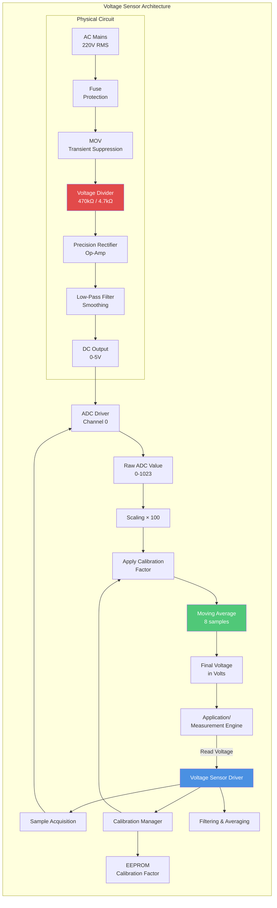
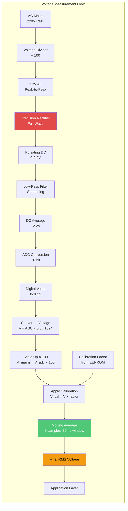
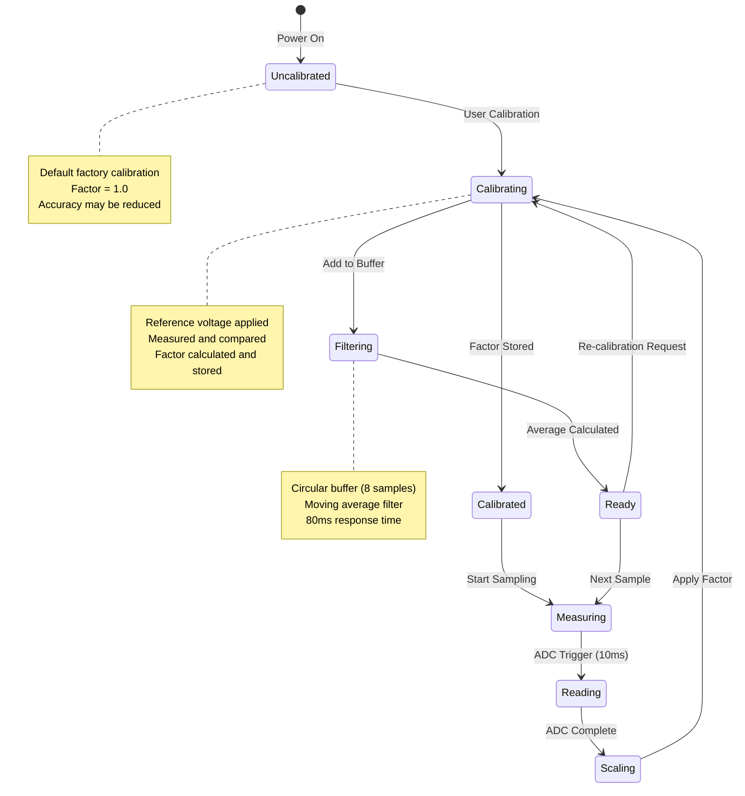
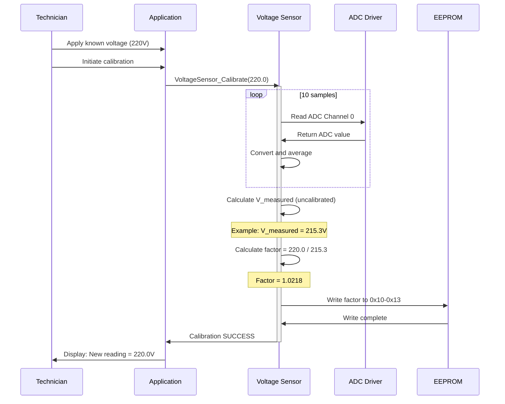
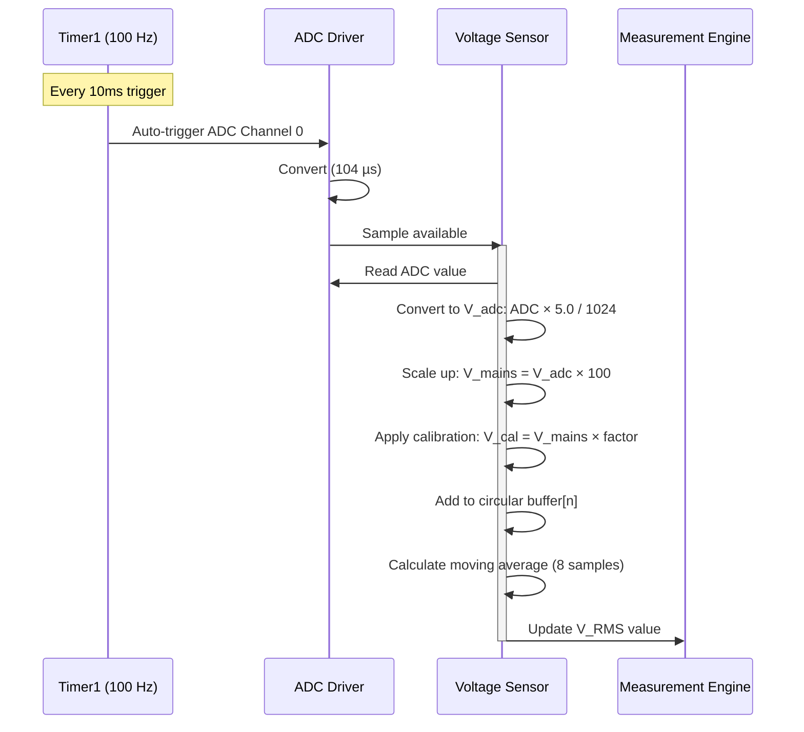
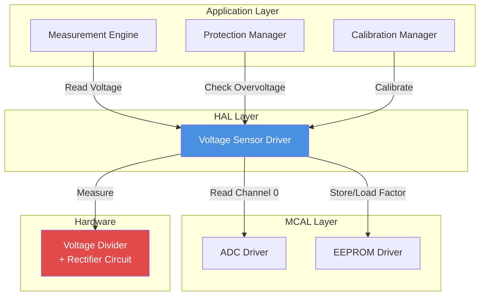

# ⚡ Voltage Sensor Driver - AC Mains

<div align="center">


**Voltage Sensor Driver**

**Smart Energy Management System - AC Mains Measurement**

_Developed by Gestell Company - Professional Embedded Solutions_

</div>

---

## 📋 Table of Contents

- [Module Overview](#-1-module-overview)
- [Architecture](#-2-architecture-diagram)
- [Hardware Interface](#-3-hardware-interface)
- [Data Flow](#-4-data-flow-diagram)
- [State Machine](#-5-state-machine)
- [Calibration](#-6-sequence-diagrams)
- [Dependencies](#-7-module-dependencies)

---

## 🔗 Related Documentation

| Document                                                                   | Description  | Status       |
| -------------------------------------------------------------------------- | ------------ | ------------ |
| **[ADC_Driver.md](../../MCAL_Layer/ADC/ADC_Driver.md)**                    | Analog Input | ✅ Available |
| **[Current_Sensor_Driver.md](../Current_Sensor/Current_Sensor_Driver.md)** | Current      | ✅ Available |

---

## 📋 1. Module Overview

### Purpose and Role

The Voltage Sensor driver enables safe measurement of AC mains voltage (220V RMS) through a voltage divider network and precision rectifier circuit. It provides calibrated voltage readings essential for energy calculation, power quality monitoring, and overvoltage protection.

### Key Responsibilities

- Measure AC RMS voltage (0-280V range)
- Voltage divider scaling (100:1 ratio)
- Calibration factor application
- Noise filtering and averaging
- Overvoltage detection support
- Safe galvanic isolation from mains

### Hardware Components

**Stage 1 - Voltage Divider:**

- Primary resistor: 470 kΩ (1% tolerance)
- Secondary resistor: 4.7 kΩ (1% tolerance)
- Division ratio: 100:1
- 220V AC → 2.2V AC

**Stage 2 - Precision Rectifier:**

- Full-wave rectifier with op-amp
- AC to pulsating DC conversion
- Low-pass filter smoothing
- Output: 0-5V DC for ADC

---

## 2. Architecture Diagram



---

## 3. Hardware Interface

### Safety Isolation

**Clearance Requirements:**

- PCB trace spacing: Minimum 5mm between high/low voltage
- Isolation voltage: 2000V+ via physical separation
- Fuse: Fast-blow 250mA on input side
- MOV: Metal Oxide Varistor for transient protection

### Pin Configuration

| Pin | Function      | Type                   |
| --- | ------------- | ---------------------- |
| PA0 | Voltage Input | Analog Input (ADC CH0) |

### Voltage Scaling

**Divider Calculation:**

```
V_adc = V_mains / 100
For 220V AC: V_adc ≈ 2.2V AC
After rectification: ~2.2V DC (average)
```

---

## 4. Data Flow Diagram



---

## 5. State Machine



---

## 6. Sequence Diagrams

### Calibration Sequence



### Normal Measurement Sequence



---

## 7. Module Dependencies

### Dependency Diagram



---

## 8. Configuration Parameters

### Calibration Storage

| Parameter          | EEPROM Address | Type            | Description                     |
| ------------------ | -------------- | --------------- | ------------------------------- |
| Calibration factor | 0x10-0x13      | float (4 bytes) | Multiplier for voltage readings |

### Measurement Parameters

| Parameter       | Value     | Description                |
| --------------- | --------- | -------------------------- |
| Divider ratio   | 100:1     | 470kΩ / 4.7kΩ              |
| ADC resolution  | 10-bit    | 1024 levels                |
| Voltage per LSB | ~0.488V   | After scaling              |
| Sampling rate   | 100 Hz    | Shared with current sensor |
| Filter window   | 8 samples | 80ms moving average        |

### Range and Accuracy

| Metric                  | Value                        |
| ----------------------- | ---------------------------- |
| Minimum voltage         | 0V (10V practical minimum)   |
| Nominal voltage         | 220V RMS                     |
| Maximum voltage         | 280V (overvoltage threshold) |
| Accuracy (calibrated)   | ±2% @ 220V                   |
| Accuracy (uncalibrated) | ±5%                          |

---

## 9. Error Handling Strategy

### Error Detection

**Out-of-Range Voltage:**

- ADC < 10 or > 1020 for extended period
- Indicates sensor disconnection or fault
- Response: Set error flag, notify Protection Manager

**Calibration Out of Range:**

- Factor outside 0.90-1.10 range
- Indicates EEPROM corruption or invalid calibration
- Response: Revert to default (1.0), request recalibration

### Filtering Strategy

**Moving Average Filter:**

- Purpose: Reduce noise and transients
- Window size: 8 samples (80ms)
- Trade-off: Latency vs noise reduction

**Outlier Rejection (Optional):**

- Median filter preprocessing
- Take 3 samples, keep median
- Rejects spikes and impulses

---

## 10. Performance Characteristics

### Accuracy

| Condition         | Accuracy | Notes               |
| ----------------- | -------- | ------------------- |
| After calibration | ±2%      | @ 220V, 25°C        |
| Uncalibrated      | ±5%      | Component tolerance |
| Temperature drift | ±0.5%    | 0-50°C range        |

### Response Time

- Single reading: 104 µs (ADC)
- Filtered reading: 80 ms (8 samples)
- Step response: < 100 ms

### Resource Usage

- RAM: 32 bytes (8 samples × 4 bytes float)
- Flash: ~400 bytes
- EEPROM: 4 bytes

---

## Implementation Notes

### RMS vs Average Rectified

**Assumption**: Pure sinusoidal waveform

**Conversion:**

- Average rectified value from circuit
- Form factor = 1.11 applied
- V_RMS = V_avg × 1.11

**Limitation**: Accurate only for pure sine waves

### Safety Considerations

- High-voltage circuit physically isolated
- Fuse protection prevents overcurrent
- MOV clamps transients
- Fail-safe: Disconnection reads low/zero voltage

---

---

## 📞 Support & Contact

**Project Information**:

- **Project Name**: Smart Energy Management System
- **Development Company**: Gestell - Professional Embedded Solutions

**Technical Support**: Hisham4Ahmed@gmail.com

---

## 📄 Document Control

| Attribute            | Value                               |
| -------------------- | ----------------------------------- |
| **Document Type**    | Voltage Sensor Driver Documentation |
| **Document Status**  | Active                              |
| **Document Version** | 2.0                                 |
| **Last Updated**     | January 2026                        |
| **Prepared By**      | Gestell Engineering Team            |

---

<div align="center">

**Built with ❤️ by Gestell Team**

_Professional Embedded Systems Engineering_

**Copyright © 2025-2026 Gestell Company - All Rights Reserved**

</div>
