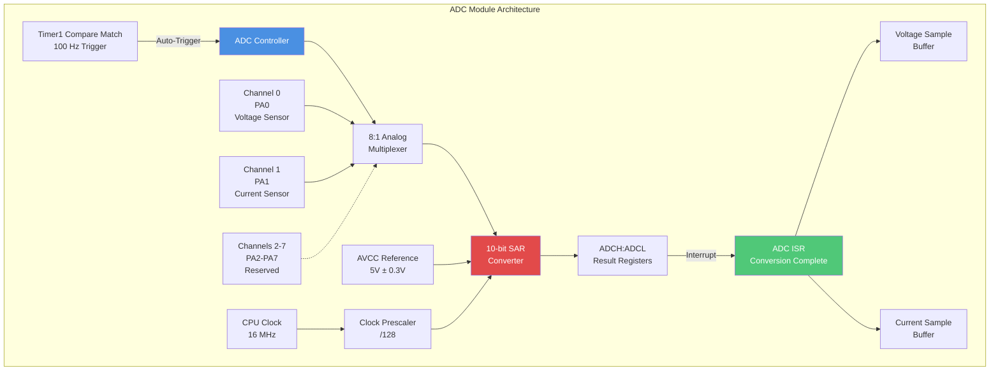
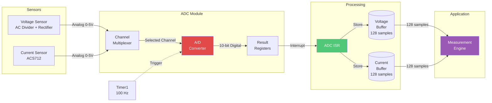
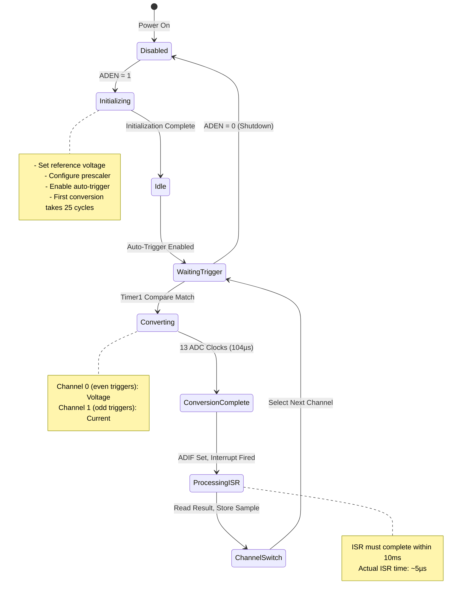
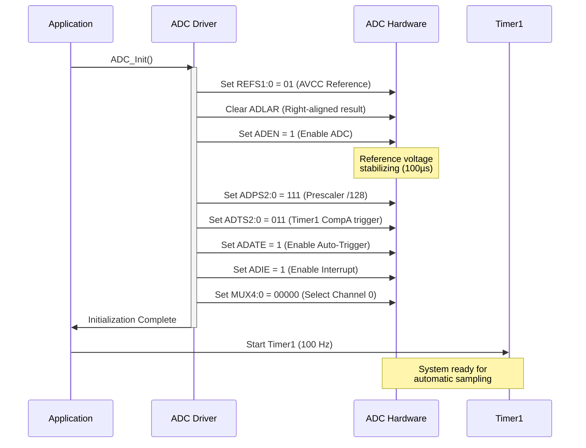
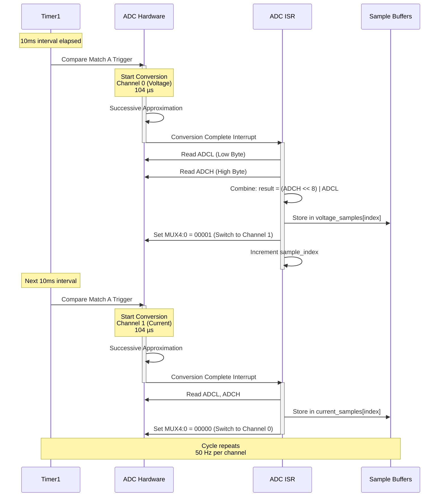
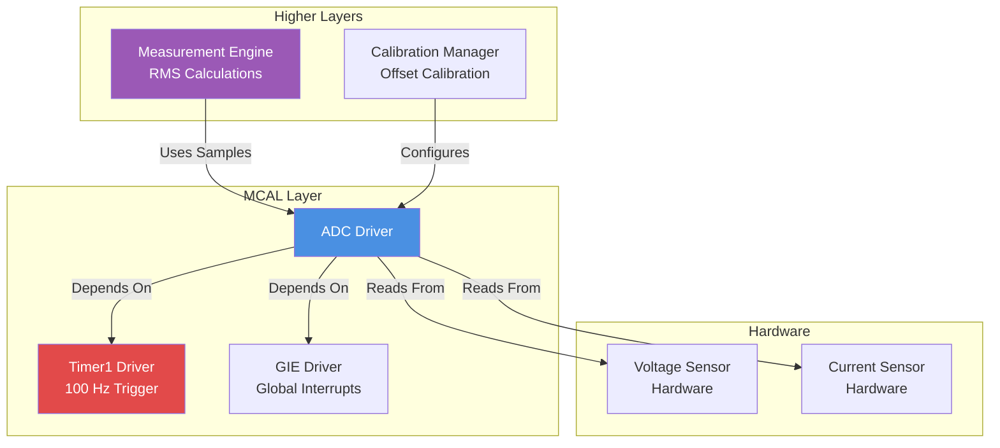
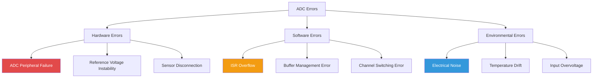

# ADC Driver - Analog to Digital Converter

**MCU**: ATmega32  
**Resolution**: 10-bit (1024 discrete levels)  
**Purpose**: Convert analog sensor signals to digital values for energy measurement processing

---

## 1. Module Overview

### Purpose and Role

The ADC (Analog-to-Digital Converter) driver is a critical component in the Smart Energy Management System, responsible for converting continuous analog voltage signals from sensors into discrete digital values that the microcontroller can process. This module enables the system to measure:

- **AC Mains Voltage**: Through a voltage divider and rectifier circuit
- **AC Current**: Through the ACS712 current sensor

### Key Responsibilities

- Precise 10-bit analog-to-digital conversion
- Synchronized sampling at 100 Hz (triggered by Timer1)
- Automatic channel multiplexing between voltage and current sensors
- Interrupt-driven data acquisition
- Reference voltage management
- Noise reduction through hardware and software techniques

### Hardware Peripheral

Utilizes the ATmega32's built-in 10-bit successive approximation ADC with:

- 8 multiplexed input channels
- Programmable reference voltage selection
- Auto-trigger capability from multiple sources
- Conversion complete interrupt support

---

## 2. Architecture Diagram



---

## 3. Hardware Interface

### Pin Configuration

| Pin     | Function          | Channel      | Connected To                                 |
| ------- | ----------------- | ------------ | -------------------------------------------- |
| PA0     | ADC Input         | Channel 0    | Voltage Sensor (Voltage Divider + Rectifier) |
| PA1     | ADC Input         | Channel 1    | Current Sensor (ACS712 Analog Output)        |
| PA2-PA7 | ADC Input         | Channels 2-7 | Reserved for future expansion                |
| AVCC    | Reference Voltage | -            | Filtered 5V supply via LC filter             |
| AGND    | Analog Ground     | -            | Stable ground plane                          |

### Electrical Characteristics

**Power Supply:**

- AVCC voltage: 5V ± 0.3V (must be stable)
- AVCC filtering: 10µH inductor + 100nF capacitor
- Bypass capacitor: 100nF close to AVCC pin

**Input Specifications:**

- Input voltage range: 0V to AVCC (5V)
- Input impedance: ~100 MΩ
- Recommended source impedance: < 10 kΩ
- Maximum input voltage: AVCC + 0.3V (absolute maximum)

**Performance:**

- Resolution: 10 bits (1024 levels)
- LSB size: AVCC / 1024 ≈ 4.88 mV
- Quantization error: ± 0.5 LSB (± 2.44 mV)
- Integral nonlinearity: ± 1 LSB
- Conversion time: 13 ADC clock cycles (104 µs @ 125 kHz)
- First conversion time: 25 ADC clock cycles (200 µs @ 125 kHz)

### Register Overview

**ADMUX (ADC Multiplexer Selection Register):**

- Controls reference voltage selection (REFS1:0)
- Sets result alignment (ADLAR)
- Selects input channel (MUX4:0)

**ADCSRA (ADC Control and Status Register A):**

- Enables ADC (ADEN)
- Starts conversion (ADSC)
- Enables auto-trigger (ADATE)
- Sets clock prescaler (ADPS2:0)
- Controls interrupt (ADIE, ADIF)

**ADCSRB/SFIOR (ADC Control and Status Register B):**

- Selects auto-trigger source (ADTS2:0)

**ADCH:ADCL (ADC Data Registers):**

- Contains 10-bit conversion result
- Must read ADCL before ADCH for atomic access

---

## 4. Data Flow Diagram



### Data Flow Description

**Input Stage:**

1. Analog voltage from voltage sensor (0-5V representing scaled AC voltage)
2. Analog voltage from current sensor (0-5V representing AC current)

**Conversion Stage:**

1. Timer1 generates 100 Hz trigger pulse
2. ADC automatically selects next channel (alternating between voltage and current)
3. Successive Approximation Register converts analog to 10-bit digital value
4. Conversion takes 104 microseconds

**Output Stage:**

1. Conversion complete interrupt fires
2. ISR reads ADCH:ADCL registers
3. Sample stored in appropriate buffer (voltage or current)
4. Buffers accumulate 128 samples each for RMS calculations

---

## 5. State Machine



### State Descriptions

**Disabled:**

- ADC peripheral powered down
- Minimal power consumption
- Entry state after reset

**Initializing:**

- Reference voltage stabilizing (100 µs required)
- Registers configured
- First conversion will take longer (25 cycles vs 13)

**Idle:**

- ADC ready but not actively converting
- Waiting for trigger enable

**WaitingTrigger:**

- Auto-trigger enabled
- Monitoring Timer1 Compare Match signal
- Low power consumption while waiting

**Converting:**

- Successive approximation in progress
- 13 ADC clock cycles
- Cannot be interrupted

**ConversionComplete:**

- Result available in ADCH:ADCL
- ADIF flag set
- Interrupt pending

**ProcessingISR:**

- CPU executing ADC ISR
- Reading conversion result
- Storing sample in buffer

**ChannelSwitch:**

- Updating MUX settings for next conversion
- Toggling between channels 0 and 1

---

## 6. Sequence Diagrams

### Initialization Sequence



### Normal Operation Sequence



### Timing Diagram

```mermaid
gantt
    title ADC Conversion Timing (100 Hz Sampling Rate)
    dateFormat X
    axisFormat %L ms

    section Timer1
    Trigger 1 :milestone, 0, 0ms
    Waiting :10ms
    Trigger 2 :milestone, 10, 10ms
    Waiting :10ms
    Trigger 3 :milestone, 20, 20ms

    section ADC
    Conv CH0 :crit, 0, 0.104ms
    Idle :0.104, 9.896ms
    Conv CH1 :crit, 10, 0.104ms
    Idle :10.104, 9.896ms
    Conv CH0 :crit, 20, 0.104ms

    section ISR
    Process V :active, 0.104, 0.005ms
    Process I :active, 10.104, 0.005ms
    Process V :active, 20.104, 0.005ms
```

---

## 7. Module Dependencies

### Dependency Diagram



### Dependencies On Other Modules

**Timer1 Driver:**

- Provides precise 100 Hz trigger for ADC conversions
- Generates Compare Match A events for auto-trigger
- ADC cannot function without Timer1 initialization

**GIE Driver:**

- Global interrupts must be enabled for ADC ISR to execute
- Critical for interrupt-driven data acquisition

**Voltage Sensor (Hardware):**

- Provides scaled and rectified AC voltage signal (0-5V)
- Signal conditioning must meet ADC input specifications

**Current Sensor (Hardware):**

- ACS712 provides analog output proportional to AC current
- Output voltage centered at 2.5V (±2.5V swing for ±30A)

### Modules That Depend On This Module

**Measurement Engine:**

- Consumes voltage and current samples for RMS calculations
- Performs power and energy computations
- Depends on consistent 100 Hz sampling rate

**Calibration Manager:**

- Uses ADC readings to determine zero-current offset
- Performs voltage divider ratio calibration
- Configures gain and offset parameters

**Protection Manager:**

- May read instantaneous values for overcurrent detection
- Uses ADC data for safety threshold monitoring

---

## 8. Configuration Parameters

### Clock Configuration

| Parameter        | Value   | Calculation                  | Notes                             |
| ---------------- | ------- | ---------------------------- | --------------------------------- |
| CPU Clock        | 16 MHz  | System crystal               | Fixed                             |
| Prescaler        | 128     | Configured via ADPS2:0 = 111 | Selected for optimal ADC clock    |
| ADC Clock        | 125 kHz | 16 MHz ÷ 128                 | Within optimal range (50-200 kHz) |
| Conversion Time  | 104 µs  | 13 cycles ÷ 125 kHz          | Normal conversion                 |
| First Conversion | 200 µs  | 25 cycles ÷ 125 kHz          | After enable or channel change    |

### Sampling Configuration

| Parameter             | Value                  | Description                         |
| --------------------- | ---------------------- | ----------------------------------- |
| Trigger Source        | Timer1 Compare Match A | Auto-trigger mode                   |
| Trigger Frequency     | 100 Hz                 | 10 ms period                        |
| Per-Channel Rate      | 50 Hz                  | Channels alternate                  |
| Samples Per Cycle     | 128                    | For RMS over 1.28 seconds           |
| AC Frequency Coverage | 50/60 Hz               | Nyquist satisfied (50 Hz > 2×50 Hz) |

### Reference Voltage

| Parameter       | Value        | Description                    |
| --------------- | ------------ | ------------------------------ |
| Reference Type  | AVCC         | Connected to VCC via LC filter |
| Nominal Voltage | 5.0V         | System power supply            |
| Tolerance       | ±0.3V        | Must be stable                 |
| Filtering       | 10µH + 100nF | LC low-pass filter             |

### Channel Assignment

| Channel | Pin     | Function            | Sensor                      | Range                   |
| ------- | ------- | ------------------- | --------------------------- | ----------------------- |
| 0       | PA0     | Voltage Measurement | Voltage Divider + Rectifier | 0-5V (0-500V AC scaled) |
| 1       | PA1     | Current Measurement | ACS712-30A                  | 0-5V (0-30A scaled)     |
| 2-7     | PA2-PA7 | Reserved            | Future expansion            | -                       |

### Result Format

| Parameter  | Value         | Description           |
| ---------- | ------------- | --------------------- |
| Resolution | 10 bits       | 1024 levels           |
| Alignment  | Right-aligned | ADLAR = 0             |
| Range      | 0-1023        | Digital output values |
| LSB Value  | 4.88 mV       | AVCC / 1024           |

---

## 9. Error Handling Strategy

### Error Detection Mechanisms

**Reference Voltage Monitoring:**

- Unstable AVCC causes measurement drift
- Detection: Compare consecutive readings for excessive variation
- Threshold: > 50 LSB change in stable signal indicates issue

**Channel Verification:**

- Ensures correct channel is being sampled
- Detection: Track channel sequence (should alternate 0→1→0→1)
- Error: Incorrect channel read indicates MUX failure

**Trigger Synchronization:**

- Verify conversions occur at expected 100 Hz rate
- Detection: Monitor time between ISR calls
- Error: Missed triggers or timing drift

**Conversion Complete Flag:**

- ADIF should set after each conversion
- Detection: Timeout if flag doesn't set within expected time
- Error: Hardware failure or clock issue

**Sample Buffer Overflow:**

- Buffers must not overflow before RMS calculation
- Detection: Index wraparound before processing
- Error: ISR timing issue or application not servicing buffers

### Error Classification



### Recovery Procedures

**Reference Voltage Instability:**

1. Detect excessive variation in readings
2. Flag measurement as unreliable
3. Increase averaging window temporarily
4. Log error for maintenance alert
5. Continue operation with reduced accuracy

**Channel Switching Error:**

1. Detect incorrect channel sequence
2. Reset channel to 0 (voltage)
3. Discard current sample
4. Re-synchronize with Timer1
5. Resume normal operation

**Trigger Synchronization Loss:**

1. Detect missed triggers via timestamp
2. Reset ADC auto-trigger configuration
3. Restart Timer1 if necessary
4. Clear sample buffers
5. Re-initialize data acquisition

**Buffer Overflow:**

1. Detect index wraparound before processing
2. Flag data set as invalid
3. Clear buffers
4. Reset sample index
5. Alert application layer

### Fault Tolerance

- **Graceful Degradation**: Continue operation with reduced accuracy if minor errors occur
- **Data Validation**: Discard outlier samples beyond physical limits
- **Redundant Checking**: Cross-validate voltage and current readings for consistency
- **Recovery Time**: Most errors recoverable within 1-2 sample cycles (10-20 ms)

---

## 10. Performance Characteristics

### Timing Constraints

| Operation        | Constraint                    | Actual Performance       | Margin           |
| ---------------- | ----------------------------- | ------------------------ | ---------------- |
| Conversion Time  | < 10 ms (before next trigger) | 104 µs                   | 98.96% margin    |
| ISR Execution    | < 10 ms                       | ~5 µs                    | 99.95% margin    |
| Total Latency    | < 10 ms                       | ~109 µs                  | 98.91% margin    |
| Sample Rate      | 100 Hz ± 1%                   | 100 Hz (Timer1 accuracy) | Negligible error |
| Per-Channel Rate | 50 Hz                         | 50 Hz                    | Exact            |

### Resource Usage

**Memory (SRAM):**

- Voltage sample buffer: 256 bytes (128 samples × 2 bytes)
- Current sample buffer: 256 bytes (128 samples × 2 bytes)
- Driver state variables: ~16 bytes
- Total: ~528 bytes

**Program Memory (Flash):**

- Initialization code: ~150 bytes
- ISR code: ~80 bytes
- Helper functions: ~100 bytes
- Total: ~330 bytes

**CPU Usage:**

- ISR execution: 5 µs every 10 ms = 0.05% CPU time
- Context switching overhead: ~2 µs = 0.02% CPU time
- Total: ~0.07% CPU utilization

**Peripheral Resources:**

- ADC peripheral: 100% dedicated
- Timer1 Compare Match A: Shared with ADC trigger
- One interrupt vector: ADC_vect

### Accuracy and Precision

**Theoretical Limits:**

- Resolution: 10 bits = 0.098% of full scale
- Quantization error: ±0.5 LSB = ±2.44 mV
- Integral nonlinearity: ±1 LSB = ±4.88 mV

**Practical Performance:**

- Noise floor: ~5 LSB RMS (with averaging)
- Effective resolution: ~8-9 bits after noise
- Measurement repeatability: ±0.2% typical

**Mains Voltage Measurement:**

- Input: 0-500V AC (scaled to 0-5V DC)
- Scaling factor: 100:1
- ADC uncertainty: ±2.44 mV × 100 = ±244 mV
- Percentage error: ±0.1% at 220V nominal

**Current Measurement:**

- Input: 0-30A AC
- Sensor: ACS712-30A (66 mV/A)
- ADC uncertainty: ±2.44 mV ÷ 66 mV/A = ±37 mA
- Percentage error: ±0.37% at 10A load

### Limitations

**Sampling Rate:**

- Maximum useful frequency: ~40 Hz (80% of Nyquist)
- Cannot accurately measure harmonics above 40 Hz
- Aliasing may occur for high-frequency noise

**Input Range:**

- Strictly limited to 0-5V
- Overvoltage protection required in sensor circuits
- Cannot measure negative voltages directly

**Channel Count:**

- Limited to 2 active channels (voltage and current)
- Channel switching adds settling time
- First conversion after switch takes longer (25 vs 13 cycles)

**Temperature Sensitivity:**

- Reference voltage drifts with temperature
- ADC accuracy degrades at temperature extremes
- Periodic calibration recommended

**Processing Delay:**

- 128 samples required for RMS = 1.28 seconds per measurement
- Real-time response limited to ~1 second latency
- Not suitable for fast protection mechanisms (use hardware comparison instead)

---

## Implementation Notes

### Key Design Decisions

**Why Auto-Trigger Mode:**

- Eliminates CPU intervention for each conversion
- Ensures precise timing synchronized with Timer1
- Reduces jitter compared to software-triggered conversions

**Why 100 Hz Sampling Rate:**

- Satisfies Nyquist criterion for 50/60 Hz AC measurement
- Provides good time resolution for RMS calculations
- Balances accuracy with CPU/memory overhead

**Why Alternating Channels:**

- Both sensors measured at same effective rate (50 Hz each)
- Simplifies synchronization (voltage and current paired)
- Reduces switching overhead compared to rapid multiplexing

**Why Right-Aligned Results:**

- Natural for 10-bit processing in 16-bit integers
- Simplifies arithmetic operations
- Standard practice for full-resolution ADC usage

### Optimization Opportunities

**Future Enhancements:**

- Implement oversampling and decimation for 12-bit effective resolution
- Add DMA support to reduce ISR overhead (if migrating to advanced MCU)
- Implement adaptive sampling rate based on load conditions
- Add digital filtering for harmonic analysis

**Power Optimization:**

- Use ADC Noise Reduction sleep mode during conversion
- Disable ADC when system in low-power mode
- Reduce sampling rate during idle periods

---

**Document Version**: 2.0  
**Last Updated**: January 2026  
**Maintained By**: Gestell Engineering Team  
**Related Documents**: Timer1_Driver.md, Measurement_Engine.md, Calibration_Manager.md
