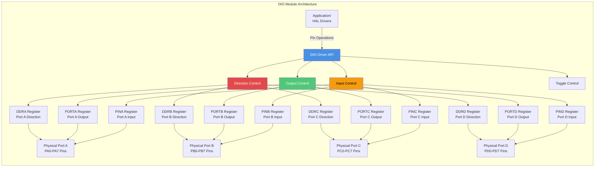
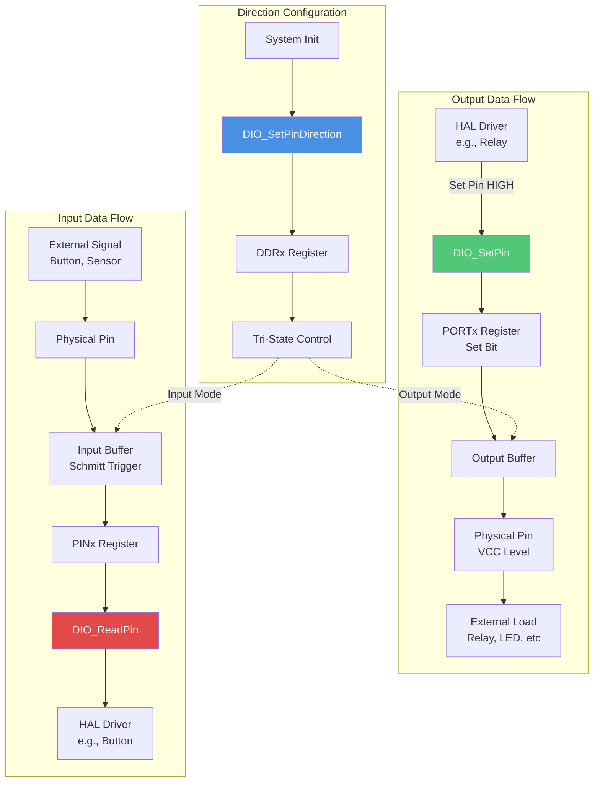
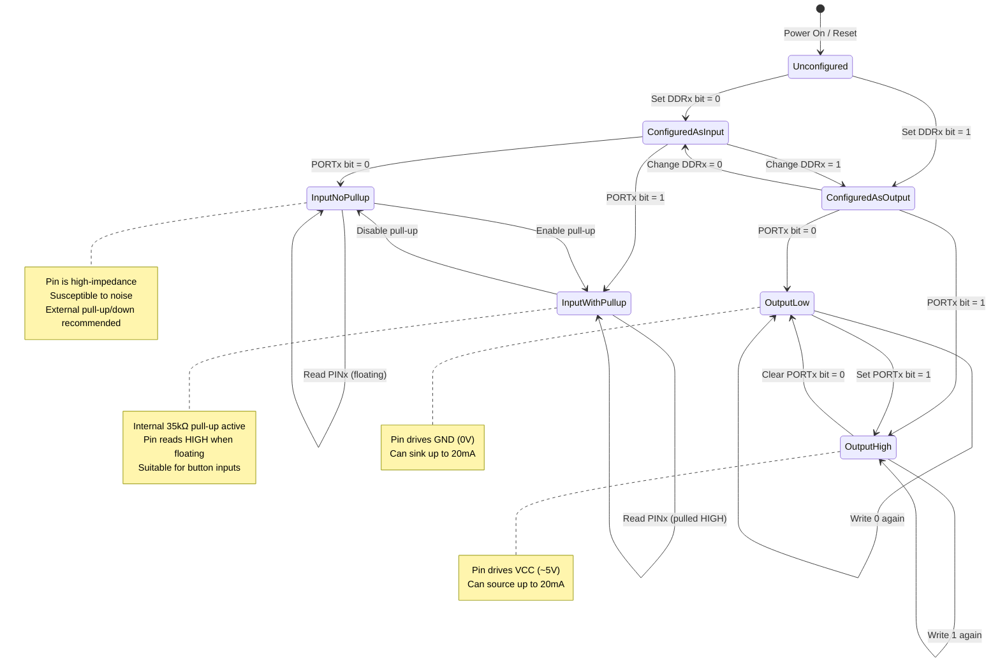
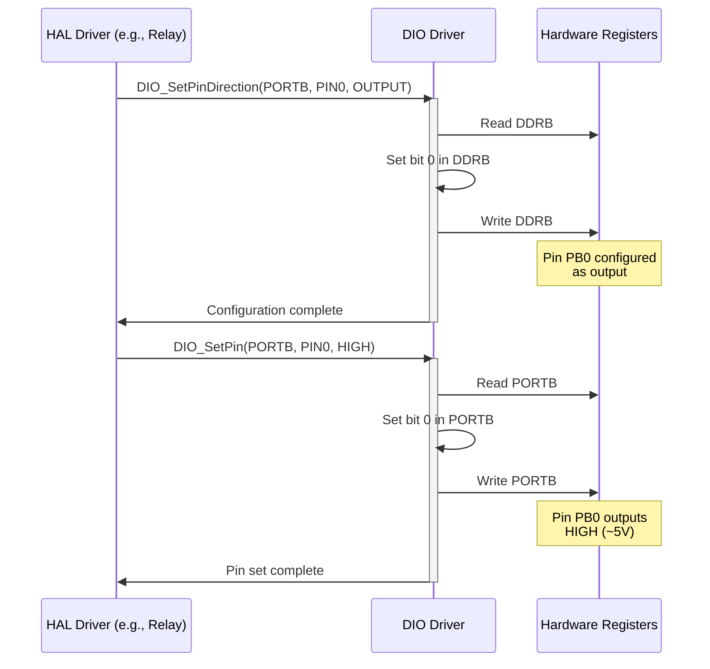
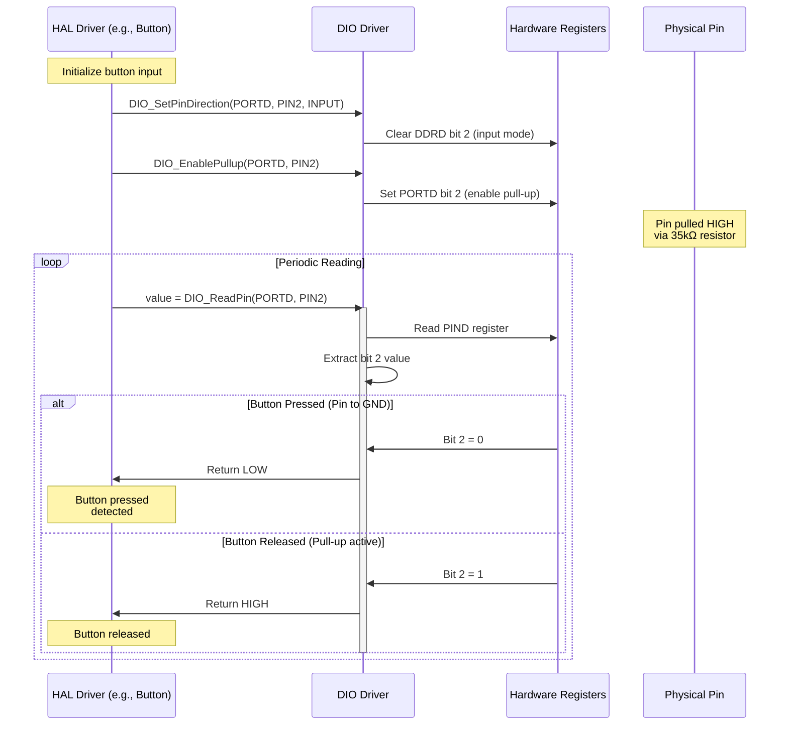
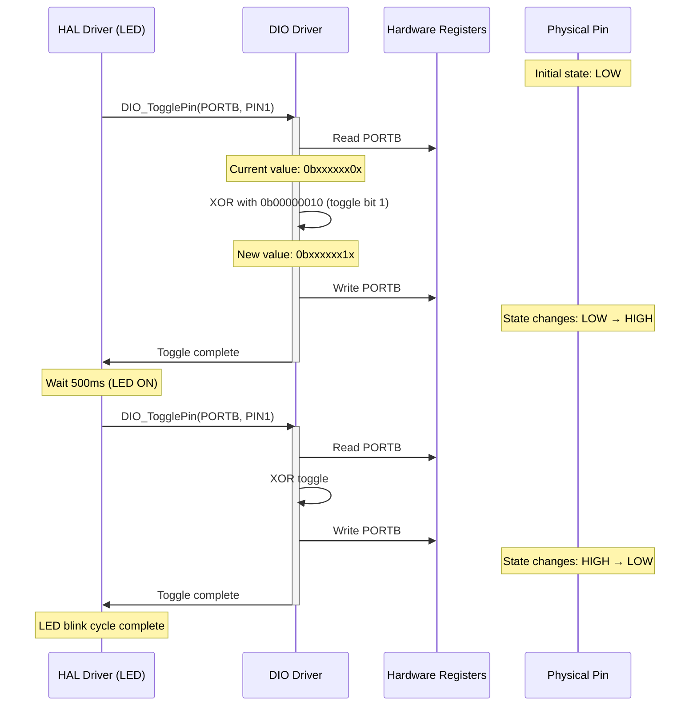
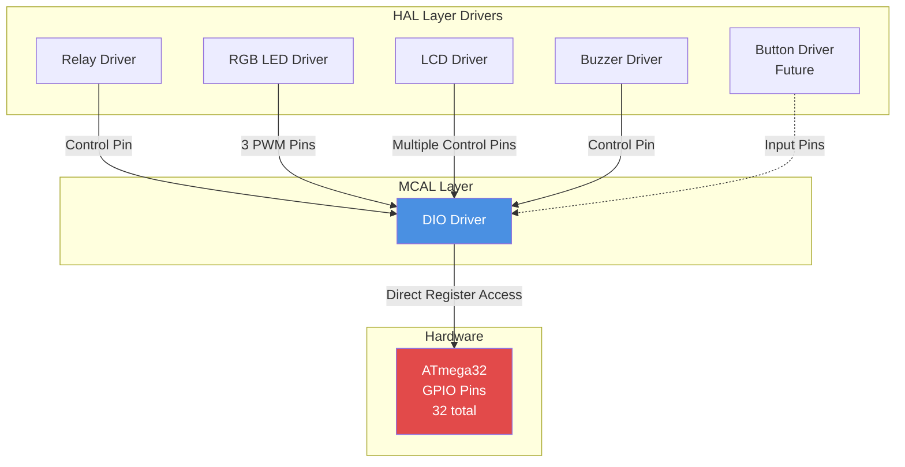
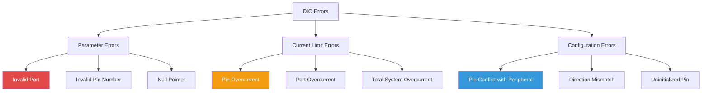

# DIO Driver - Digital Input/Output

**MCU**: ATmega32  
**Purpose**: General-purpose digital pin control for all peripheral interfaces  
**Scope**: Foundation layer for all hardware abstraction layer (HAL) drivers

---

## 1. Module Overview

### Purpose and Role

The DIO (Digital Input/Output) driver provides low-level control of the ATmega32's GPIO (General Purpose Input/Output) pins. It serves as the foundation for all hardware interfaces in the system, enabling higher-level drivers to control LEDs, relays, read buttons, and communicate with peripheral modules.

### Key Responsibilities

- Configure pin direction (input or output)
- Write digital values to output pins (HIGH or LOW)
- Read digital values from input pins
- Toggle pin states
- Port-level operations for efficiency
- Pull-up resistor control for input pins

### Hardware Peripheral

Utilizes ATmega32's four 8-bit I/O ports:

- **Port A (PA0-PA7)**: 8 pins, ADC inputs, general I/O
- **Port B (PB0-PB7)**: 8 pins, SPI, PWM, general I/O
- **Port C (PC0-PC7)**: 8 pins, TWI, JTAG, general I/O
- **Port D (PD0-PD7)**: 8 pins, UART, timers, interrupts, general I/O

Total: 32 GPIO pins available

---

## 2. Architecture Diagram

---

## 3. Hardware Interface

### Pin Assignment Table

**Port A (Analog/Digital):**

| Pin     | Function        | Direction      | Connected To   | Notes            |
| ------- | --------------- | -------------- | -------------- | ---------------- |
| PA0     | ADC Channel 0   | Input (Analog) | Voltage Sensor | ADC dedicated    |
| PA1     | ADC Channel 1   | Input (Analog) | Current Sensor | ADC dedicated    |
| PA2-PA7 | General Purpose | Configurable   | Reserved       | Future expansion |

**Port B (SPI/PWM):**

| Pin | Function           | Direction | Connected To   | Notes          |
| --- | ------------------ | --------- | -------------- | -------------- |
| PB0 | GPIO / XCK / T0    | Output    | Relay Control  | Load switching |
| PB1 | GPIO / T1          | Output    | RGB LED (R)    | PWM capable    |
| PB2 | GPIO / INT2 / AIN0 | Output    | RGB LED (G)    | PWM capable    |
| PB3 | GPIO / OC0 / AIN1  | Output    | RGB LED (B)    | PWM capable    |
| PB4 | GPIO / SS          | Output    | Buzzer         | Alert output   |
| PB5 | SPI MOSI           | Output    | Reserved (SPI) | Future use     |
| PB6 | SPI MISO           | Input     | Reserved (SPI) | Future use     |
| PB7 | SPI SCK            | Output    | Reserved (SPI) | Future use     |

**Port C (TWI/JTAG):**

| Pin     | Function     | Direction    | Connected To   | Notes              |
| ------- | ------------ | ------------ | -------------- | ------------------ |
| PC0     | GPIO / SCL   | Configurable | Reserved (I2C) | Future use         |
| PC1     | GPIO / SDA   | Configurable | Reserved (I2C) | Future use         |
| PC2-PC5 | GPIO / JTAG  | Configurable | Reserved       | General I/O        |
| PC6     | GPIO / TOSC1 | Configurable | Reserved       | RTC crystal option |
| PC7     | GPIO / TOSC2 | Configurable | Reserved       | RTC crystal option |

**Port D (UART/Timers):**

| Pin | Function    | Direction | Connected To         | Notes              |
| --- | ----------- | --------- | -------------------- | ------------------ |
| PD0 | UART RXD    | Input     | HC-05 TX / ESP-01 TX | Serial receive     |
| PD1 | UART TXD    | Output    | HC-05 RX / ESP-01 RX | Serial transmit    |
| PD2 | GPIO / INT0 | Input     | Reserved (Button)    | External interrupt |
| PD3 | GPIO / INT1 | Input     | Reserved (Button)    | External interrupt |
| PD4 | GPIO / OC1B | Output    | Reserved (PWM)       | Future use         |
| PD5 | GPIO / OC1A | Output    | Reserved (PWM)       | Future use         |
| PD6 | GPIO / ICP1 | Input     | Reserved             | Input capture      |
| PD7 | GPIO        | Output    | LCD RS/EN            | LCD control        |

### Register Overview

**DDRx (Data Direction Register):**

- Configures pin direction for each bit
- 0 = Input, 1 = Output
- Default after reset: 0x00 (all inputs)

**PORTx (Port Data Register):**

- For output pins: Sets pin voltage (0=LOW, 1=HIGH)
- For input pins: Controls internal pull-up resistor (0=disabled, 1=enabled)

**PINx (Port Input Pins Register):**

- Reads current state of pins
- Read-only for input monitoring
- Special feature: Writing 1 toggles output pin

### Electrical Characteristics

**Output Pins:**

- Output HIGH voltage: VCC - 0.3V (typically 4.7V @ 5V VCC)
- Output LOW voltage: 0.3V maximum
- Maximum source current per pin: 20 mA (40 mA absolute maximum)
- Maximum sink current per pin: 20 mA (40 mA absolute maximum)
- Maximum total current per port: 100 mA
- Maximum total current all ports: 200 mA

**Input Pins:**

- Input HIGH threshold: 0.6 × VCC (3V @ 5V)
- Input LOW threshold: 0.3 × VCC (1.5V @ 5V)
- Hysteresis: ~0.2V
- Input leakage: ±1 µA maximum
- Pull-up resistor: 20-50 kΩ typical (35 kΩ nominal)

---

## 4. Data Flow Diagram

### Data Flow Description

**Direction Configuration Flow:**

1. System initialization calls direction configuration
2. DIO driver writes to DDRx register
3. Tri-state control configures pin as input or output
4. Output buffer enabled for outputs, input buffer enabled for inputs

**Output Flow:**

1. HAL driver requests pin state change
2. DIO driver sets/clears bit in PORTx register
3. Output buffer drives pin to VCC (HIGH) or GND (LOW)
4. External load receives signal
5. Typical delay: < 1 clock cycle (62.5 ns @ 16 MHz)

**Input Flow:**

1. External signal applied to physical pin
2. Input buffer (Schmitt trigger) filters noise
3. Synchronized to system clock (sampling)
4. Value available in PINx register
5. DIO driver reads and returns value to HAL
6. Reading delay: 1-2 clock cycles

---

## 5. State Machine

### State Descriptions

**Unconfigured:**

- Default state after reset
- DDRx = 0 (input), PORTx = 0 (no pull-up)
- Pin is high-impedance input
- Safe state, no current flow

**ConfiguredAsInput:**

- Pin set as input via DDRx
- High-impedance mode
- Reads external signal state
- Two sub-states based on pull-up

**InputNoPullup:**

- Internal pull-up disabled
- Pin floating if not driven externally
- Susceptible to noise pickup
- Use for driven signals (sensors with push-pull outputs)

**InputWithPullup:**

- Internal pull-up resistor enabled (35 kΩ typical)
- Pin pulled to HIGH (~5V) when not driven
- Ideal for active-LOW button inputs
- LOW when button pressed (connects to GND)

**ConfiguredAsOutput:**

- Pin set as output via DDRx
- Can drive external loads
- Output level determined by PORTx bit

**OutputLow:**

- Pin drives logic LOW (GND, 0V)
- Sink mode: current flows from load to pin
- Can sink up to 20 mA

**OutputHigh:**

- Pin drives logic HIGH (VCC, ~5V)
- Source mode: current flows from pin to load
- Can source up to 20 mA

---

## 6. Sequence Diagrams

### Pin Configuration Sequence

### Input Reading Sequence

### Toggle Pin Sequence

---

## 7. Module Dependencies

### Dependency Diagram

### Dependencies On Other Modules

**None** - DIO is a foundational driver with no dependencies on other software modules. It directly accesses hardware registers.

### Modules That Depend On This Module

**Relay Driver:**

- Uses DIO to control relay activation pin (PB0)
- Output mode: HIGH = relay ON, LOW = relay OFF

**RGB LED Driver:**

- Uses DIO for direct on/off control (non-PWM mode)
- Three pins: PB1 (Red), PB2 (Green), PB3 (Blue)
- Can also configure for PWM mode via Timer1

**LCD Driver:**

- Uses multiple DIO pins for control and data
- Control pins: RS, EN
- Data pins: D4-D7 (4-bit mode) or D0-D7 (8-bit mode)

**Buzzer Driver:**

- Uses DIO to control buzzer pin (PB4)
- Output mode: Toggle for tone generation

**Button Driver (Future):**

- Uses DIO to read button state
- Input mode with pull-up enabled
- Debouncing implemented in HAL layer

**System Initialization:**

- Must initialize DIO before any HAL drivers
- Configures all pin directions during startup

---

## 8. Configuration Parameters

### Pin Direction Constants

| Constant | Value | Description                             |
| -------- | ----- | --------------------------------------- |
| INPUT    | 0     | Pin configured as input (DDRx bit = 0)  |
| OUTPUT   | 1     | Pin configured as output (DDRx bit = 1) |

### Pin State Constants

| Constant | Value | Description                                |
| -------- | ----- | ------------------------------------------ |
| LOW      | 0     | Output: GND level, Input: Pull-up disabled |
| HIGH     | 1     | Output: VCC level, Input: Pull-up enabled  |

### Port Identifiers

| Port  | Base Address | Description                                         |
| ----- | ------------ | --------------------------------------------------- |
| PORTA | 0x3B         | Port A registers (PINA=0x39, DDRA=0x3A, PORTA=0x3B) |
| PORTB | 0x38         | Port B registers (PINB=0x36, DDRB=0x37, PORTB=0x38) |
| PORTC | 0x35         | Port C registers (PINC=0x33, DDRC=0x34, PORTC=0x35) |
| PORTD | 0x32         | Port D registers (PIND=0x30, DDRD=0x31, PORTD=0x32) |

### Pin Number Constants

| Pin  | Value | Bit Mask   |
| ---- | ----- | ---------- |
| PIN0 | 0     | 0b00000001 |
| PIN1 | 1     | 0b00000010 |
| PIN2 | 2     | 0b00000100 |
| PIN3 | 3     | 0b00001000 |
| PIN4 | 4     | 0b00010000 |
| PIN5 | 5     | 0b00100000 |
| PIN6 | 6     | 0b01000000 |
| PIN7 | 7     | 0b10000000 |

### Current Limits

| Parameter                             | Limit  | Notes                               |
| ------------------------------------- | ------ | ----------------------------------- |
| Source current per pin                | 20 mA  | Recommended maximum, 40 mA absolute |
| Sink current per pin                  | 20 mA  | Recommended maximum, 40 mA absolute |
| Total source current per port         | 100 mA | Sum of all 8 pins                   |
| Total sink current per port           | 100 mA | Sum of all 8 pins                   |
| Total source/sink current (all ports) | 200 mA | System-wide limit                   |

---

## 9. Error Handling Strategy

### Error Detection Mechanisms

**Invalid Port/Pin Parameters:**

- DIO functions must validate port and pin numbers
- Port: Must be PORTA, PORTB, PORTC, or PORTD
- Pin: Must be PIN0 through PIN7
- Detection: Parameter range checking

**Overcurrent Risk:**

- Driving too many high-current loads simultaneously
- Exceeds 100 mA per port or 200 mA total
- Detection: Design-time calculation, not runtime

**Pin Conflict:**

- Attempting to use pin configured for peripheral (ADC, UART, etc.)
- Detection: Documentation review, not runtime check

**Direction Mismatch:**

- Reading from output pin (less critical, usually works)
- Writing to input pin (ineffective, controls pull-up instead)
- Detection: Logical error, not hardware error

### Error Classification

### Recovery Procedures

**Invalid Parameters:**

1. Detect out-of-range port or pin
2. Return error code or assert (debug mode)
3. Do not modify hardware registers
4. Application handles error

**Overcurrent Protection:**

1. Hardware design includes current-limiting resistors
2. External loads fused if necessary
3. No software recovery (hardware protection)

**Pin Conflict Resolution:**

1. Documented pin allocation prevents conflicts
2. Initialize peripheral modules in correct order
3. DIO configured before peripherals activated

**Direction Mismatch:**

1. Not critical error in most cases
2. Document expected direction for each pin
3. Initialize all pins at startup

### Fault Tolerance

- **Robust API:** Parameter validation prevents invalid operations
- **Independent Pins:** One pin failure doesn't affect others
- **No State Memory:** Each operation is atomic, no corruption from interrupts
- **Hardware Protection:** Current limits enforced by MCU design

---

## 10. Performance Characteristics

### Timing Characteristics

| Operation           | Execution Time   | Notes                            |
| ------------------- | ---------------- | -------------------------------- |
| Set/Clear Pin       | 1-2 clock cycles | 62.5 - 125 ns @ 16 MHz           |
| Read Pin            | 1-2 clock cycles | 62.5 - 125 ns @ 16 MHz           |
| Toggle Pin          | 3-4 clock cycles | Read-modify-write                |
| Configure Direction | 3-4 clock cycles | Read-modify-write                |
| Maximum Toggle Rate | ~4 MHz           | Theoretical, 2 cycles per toggle |

### Resource Usage

**CPU Utilization:**

- Direct register access: minimal overhead
- No interrupt usage
- Typical operation: < 0.01% CPU

**Memory (SRAM):**

- No global variables required
- Purely functional API
- Total: 0 bytes

**Program Memory (Flash):**

- Pin manipulation functions: ~200 bytes
- Inline macros can reduce to ~50 bytes
- Port-level operations: ~150 bytes
- Total: ~350 bytes (function-based) or ~50 bytes (macro-based)

**Hardware Resources:**

- 32 GPIO pins available
- Currently used: ~10 pins
- Reserved for peripherals: ~6 pins (ADC, UART, SPI, TWI)
- Available for expansion: ~16 pins

### Pin Transition Speed

**Rise Time (LOW → HIGH):**

- Unloaded: ~10-20 ns
- With 10 pF load: ~50-100 ns
- With 100 pF load: ~500 ns
- Slew rate limited by internal drive strength

**Fall Time (HIGH → LOW):**

- Similar to rise time
- Typically 10-20% faster than rise

**Maximum Frequency:**

- Square wave generation: Up to 4 MHz (toggle every 2 cycles)
- Practical limit with software: ~500 kHz
- For higher frequency, use hardware PWM timers

### Limitations

**No Atomic Port Operations:**

- Read-modify-write not atomic without interrupt protection
- Concurrent access from main loop and ISR can cause race conditions
- Solution: Disable interrupts during critical operations

**Pull-up Resistor Strength:**

- 35 kΩ nominal (20-50 kΩ range)
- Maximum pull-up current: ~140 µA (5V / 35kΩ)
- Not suitable for driving loads, only for input pull-up

**No Open-Drain Mode:**

- ATmega32 doesn't support open-drain configuration natively
- Can emulate: alternate between INPUT (high-Z) and OUTPUT LOW
- Not ideal for multi-master buses (use TWI peripheral for I2C)

**Current Sourcing/Sinking:**

- Individual pin limited to 20 mA recommended
- Driving high-current loads (>20 mA) requires external driver (transistor, MOSFET)
- Current limits enforced by silicon, exceeding causes voltage drop and heat

---

## Implementation Notes

### Key Design Decisions

**Why Bit-Level API:**

- Individual pin control more flexible than port-level
- Matches typical usage patterns (one device per pin)
- Easier to understand and maintain
- Port-level operations available for efficiency when needed

**Why No Global State:**

- DIO is stateless, all state in hardware registers
- No initialization function required
- No dependency on sequence of calls
- Thread-safe (with interrupt protection)

**Why Inline Functions/Macros:**

- Single-cycle operations should be inlined
- Reduces function call overhead
- Increases code size slightly but improves performance
- Critical for time-sensitive operations

**Why Parameter Validation (Debug Mode):**

- Catches errors during development
- Removed in release build for performance
- Balance between safety and efficiency

### Optimization Opportunities

**Macro-Based Implementation:**

- Replace functions with macros for zero overhead
- Compile-time constant folding
- Trade-off: Increased code size, decreased debuggability

**Port-Level Operations:**

- Provide APIs for simultaneous multi-pin control
- Useful for parallel interfaces (LCD data bus)
- Single atomic write instead of multiple bit operations

**Compile-Time Configuration:**

- Pre-calculate bit masks at compile time
- Constant port/pin parameters optimize to single instruction
- Modern compilers already perform this optimization

**Direct Register Access:**

- Instead of: PORTB |= (1 << pin_number)
- Use: PORTB |= pin_mask (pre-calculated)
- Saves shift operation

---

**Document Version**: 2.0  
**Last Updated**: January 2026  
**Maintained By**: Gestell Engineering Team  
**Related Documents**: All HAL layer drivers (Relay, LED, LCD, Buzzer, etc.)
