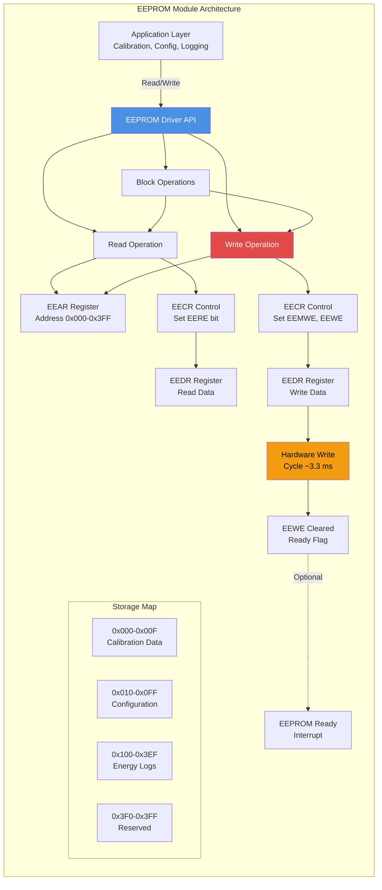
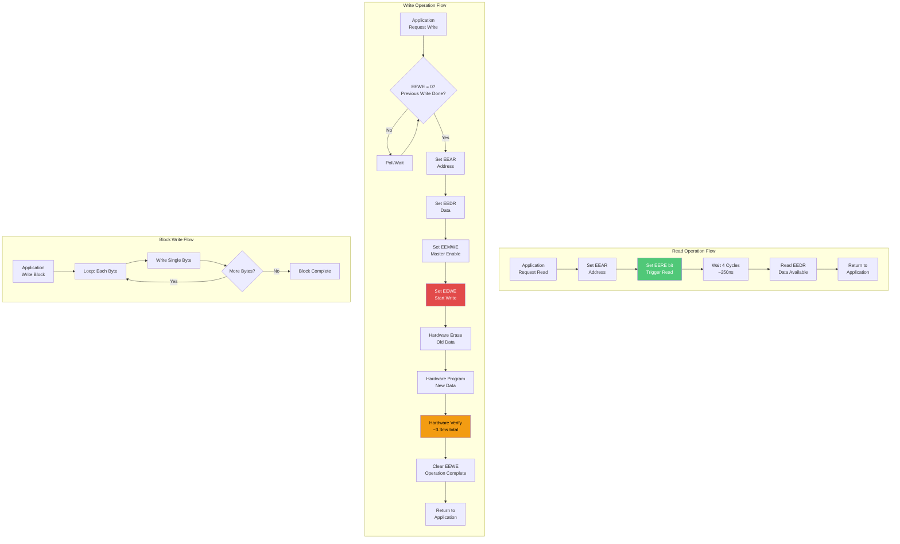
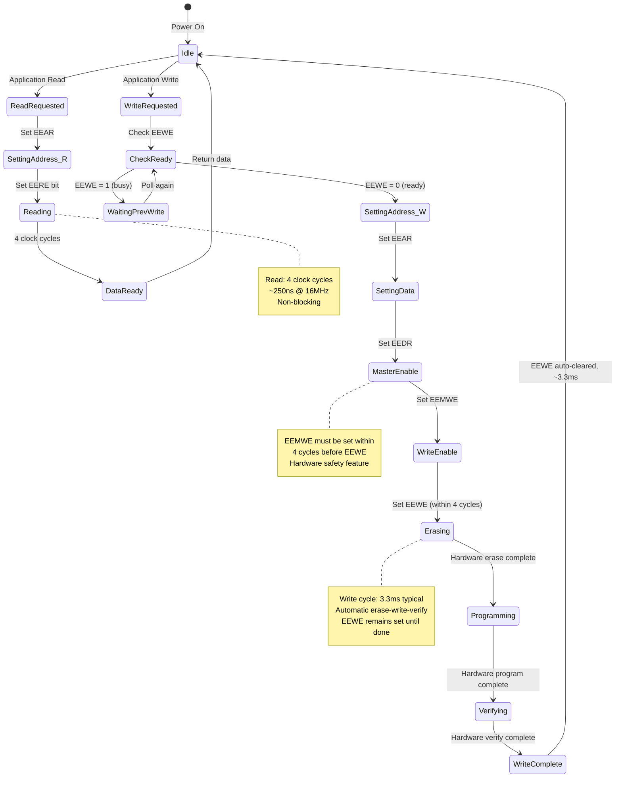
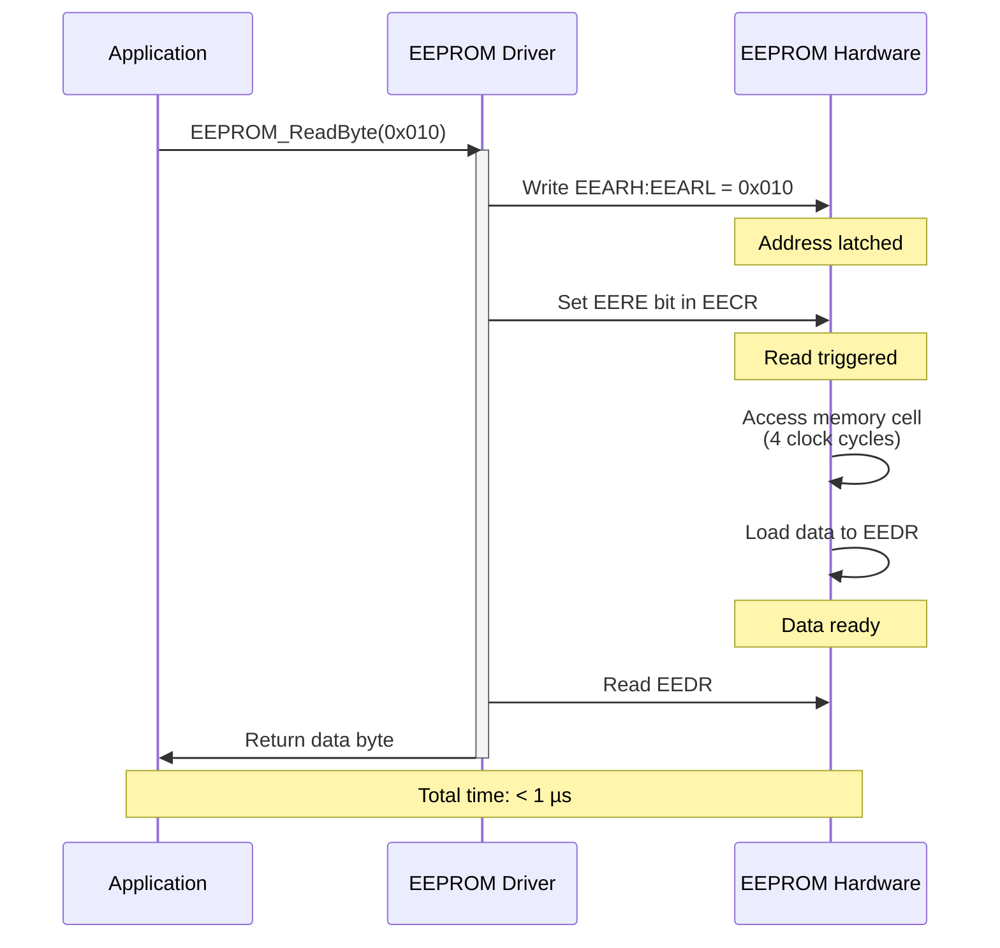
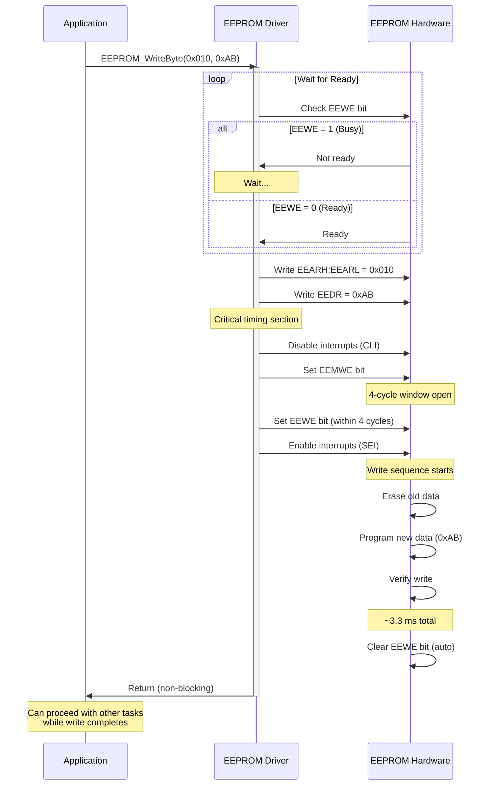
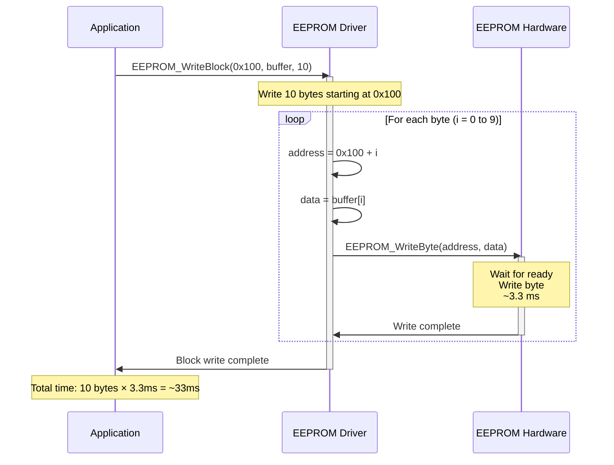
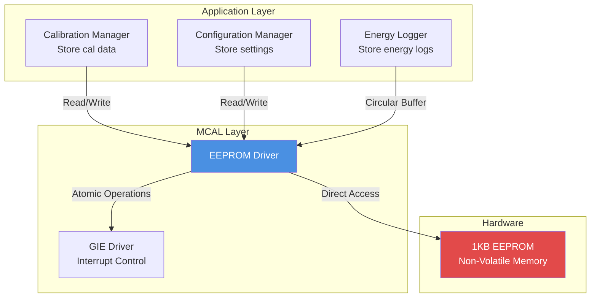
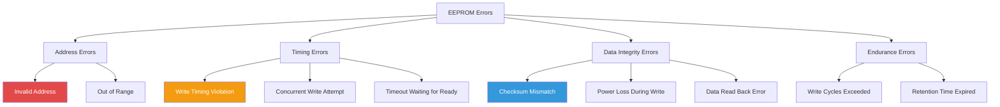

# EEPROM Driver - Non-Volatile Memory

**MCU**: ATmega32  
**Capacity**: 1 KB (1024 bytes)  
**Purpose**: Non-volatile storage for system configuration, calibration data, and energy logs

---

## 1. Module Overview

### Purpose and Role

The EEPROM (Electrically Erasable Programmable Read-Only Memory) driver provides persistent data storage capabilities for the Smart Energy Management System. Unlike RAM, EEPROM retains data even when power is lost, making it ideal for storing configuration parameters, calibration settings, and accumulated energy consumption data.

### Key Responsibilities

- Read and write individual bytes to/from EEPROM
- Block read/write operations for efficient multi-byte transfers
- Manage write timing and completion
- Protect against write operations to invalid addresses
- Handle EEPROM endurance limitations
- Provide atomic operations to prevent corruption

### Hardware Peripheral

Utilizes ATmega32's integrated 1024-byte EEPROM:

- Address range: 0x0000 to 0x03FF (1024 bytes)
- Byte-wide access (8-bit data)
- Separate address and data registers
- Hardware-controlled write timing
- Write complete interrupt support
- 100,000 write/erase cycles guaranteed (per byte)
- Data retention: 20+ years @ 25°C

---

## 2. Architecture Diagram

---

## 3. Hardware Interface

### Register Overview

**EEAR - EEPROM Address Register (16-bit):**

- **EEARH:EEARL**: Address of EEPROM location to access
- Range: 0x0000 to 0x03FF (10 bits used, upper 6 bits ignored)
- Must be set before any read or write operation

**EEDR - EEPROM Data Register (8-bit):**

- For reading: Contains data from address after read operation
- For writing: Hold data to be written before initiating write

**EECR - EEPROM Control Register:**

- **EERIE** (bit 3): EEPROM Ready Interrupt Enable
- **EEMWE** (bit 2): EEPROM Master Write Enable (must set before EEWE)
- **EEWE** (bit 1): EEPROM Write Enable (starts write operation)
- **EERE** (bit 0): EEPROM Read Enable (starts read operation)

### Timing Characteristics

**Read Operation:**

- Setup time: 1 clock cycle to set address
- Read time: 4 clock cycles (250 ns @ 16 MHz)
- Total: < 1 µs

**Write Operation:**

- Setup: Set address and data
- Write cycle: 3.3 ms typical (2.5 to 4.0 ms range)
- Automatic erase-write sequence
- EEWE bit remains set during write, cleared when complete

**Endurance and Retention:**

- Write/erase cycles: 100,000 minimum guaranteed per byte
- Data retention: 20 years @ 25°C
- Retention degrades with temperature (10 years @ 85°C)

### Memory Map

| Address Range | Size      | Purpose                           | Write Frequency             |
| ------------- | --------- | --------------------------------- | --------------------------- | --- |
| 0x000 - 0x00F | 16 bytes  | Calibration Data                  | Low (tens of times)         |
|               |           | - Voltage divider ratio           |                             |
|               |           | - Current sensor offset           |                             |
|               |           | - Power factor                    |                             |
| 0x010 - 0x01F | 16 bytes  | Device Configuration              | Low (tens of times)         |
|               |           | - WiFi credentials                |                             |
|               |           | - Thresholds                      |                             |
|               |           | - Display settings                |                             |
| 0x020 - 0x0FF | 224 bytes | System Settings                   | Medium (hundreds of times)  |
|               |           | - Reserved for future use         |                             |
| 0x100 - 0x3EF | 752 bytes | Energy Logs                       | High (wear leveling needed) |
|               |           | - Circular buffer for energy data |                             |
|               |           | - Timestamps                      | Total energy                |     |
| 0x3F0 - 0x3FF | 16 bytes  | System Reserved                   | Never                       |
|               |           | - Version info                    |                             |
|               |           | - Checksum/CRC                    |                             |

---

## 4. Data Flow Diagram

### Data Flow Description

**Read Path:**

1. Application specifies address (0x000-0x3FF)
2. Driver writes address to EEAR register
3. Driver sets EERE bit in EECR
4. Hardware performs read (4 clock cycles)
5. Data available in EEDR
6. Driver reads and returns data to application
7. Total time: < 1 µs

**Write Path:**

1. Application specifies address and data
2. Driver waits for previous write to complete (poll EEWE)
3. Driver writes address to EEAR
4. Driver writes data to EEDR
5. Driver sets EEMWE bit (atomic operation window: 4 cycles)
6. Driver sets EEWE bit within 4 cycles
7. Hardware automatically erases old data
8. Hardware programs new data
9. Hardware verifies write
10. EEWE bit cleared automatically (~3.3 ms later)
11. Driver returns to application
12. Total time: ~3.3 ms per byte

**Block Operations:**

- Sequentially write/read multiple bytes
- Each byte follows individual read/write timing
- No hardware block mode, software loops
- Write block of 100 bytes: ~330 ms

---

## 5. State Machine

### State Descriptions

**Idle:**

- EEPROM ready for operation
- No read/write in progress
- EEWE = 0 indicates ready

**ReadRequested:**

- Application initiated read operation
- Preparing to set address

**SettingAddress_R:**

- Writing target address to EEAR
- Preparing to trigger read

**Reading:**

- EERE bit set, hardware performing read
- 4 clock cycles duration

**DataReady:**

- Data available in EEDR
- Ready to return to application

**WriteRequested:**

- Application initiated write operation
- Must check if previous write complete

**CheckReady:**

- Polling EEWE bit status
- Ensures no concurrent writes

**WaitingPrevWrite:**

- Previous write still in progress
- Must wait until EEWE clears
- Polling loop

**SettingAddress_W:**

- Writing target address to EEAR
- Preparing for write

**SettingData:**

- Writing data byte to EEDR
- Data ready to be programmed

**MasterEnable:**

- Setting EEMWE bit (master write enable)
- Opens 4-cycle window for EEWE

**WriteEnable:**

- Setting EEWE bit within 4-cycle window
- Triggers write sequence
- Cannot be interrupted once started

**Erasing:**

- Hardware erasing old data from cell
- Part of automatic write sequence

**Programming:**

- Hardware programming new data
- Part of automatic write sequence

**Verifying:**

- Hardware verifying written data
- Ensures data integrity

**WriteComplete:**

- Write cycle finished
- EEWE auto-cleared by hardware
- Ready for next operation

---

## 6. Sequence Diagrams

### Read Operation Sequence

### Write Operation Sequence

### Block Write Sequence

---

## 7. Module Dependencies

### Dependency Diagram

### Dependencies On Other Modules

**Global Interrupt Enable (GIE):**

- Required for atomic write operations
- During EEMWE/EEWE sequence, interrupts must be disabled
- 4-cycle critical window must not be interrupted
- Prevents timing-related write failures

### Modules That Depend On This Module

**Calibration Manager:**

- Stores voltage divider ratio (4 bytes float)
- Stores current sensor zero offset (4 bytes float)
- Stores power factor (4 bytes float)
- Total: ~16 bytes at addresses 0x000-0x00F
- Write frequency: Very low (only during calibration)

**Configuration Manager:**

- WiFi SSID and password (up to 64 bytes)
- Device name and ID
- Threshold settings (voltage, current limits)
- Display preferences
- Total: ~100 bytes at addresses 0x010-0x0FF
- Write frequency: Low (user configuration changes)

**Energy Logger:**

- Circular buffer for energy consumption logs
- Each log entry: timestamp (4 bytes) + energy (4 bytes) = 8 bytes
- Capacity: ~90 log entries (720 bytes)
- Addresses: 0x100-0x3EF
- Write frequency: Medium to high (periodic logging)
- **Requires wear leveling** to prevent EEPROM exhaustion

---

## 8. Configuration Parameters

### Address Space Allocation

| Parameter           | Value      | Description                 |
| ------------------- | ---------- | --------------------------- |
| Total Capacity      | 1024 bytes | 0x000 to 0x3FF              |
| Calibration Start   | 0x000      | Offset for calibration data |
| Configuration Start | 0x010      | Offset for configuration    |
| Log Buffer Start    | 0x100      | Offset for energy logs      |
| Reserved Start      | 0x3F0      | System reserved area        |

### Write Timing

| Parameter            | Value          | Description     |
| -------------------- | -------------- | --------------- |
| Typical Write Time   | 3.3 ms         | Per byte        |
| Minimum Write Time   | 2.5 ms         | Best case       |
| Maximum Write Time   | 4.0 ms         | Worst case      |
| EEMWE to EEWE Window | 4 clock cycles | 250 ns @ 16 MHz |

### Endurance Parameters

| Parameter             | Value     | Description                 |
| --------------------- | --------- | --------------------------- |
| Write/Erase Cycles    | 100,000   | Guaranteed minimum per byte |
| Data Retention @ 25°C | 20+ years | After 100k cycles           |
| Data Retention @ 85°C | 10 years  | After 100k cycles           |

### Wear Leveling Example

**Scenario: Hourly energy logging**

- 1 log entry per hour = 8 bytes
- Available log space: 752 bytes = 94 entries
- Circular buffer: Overwrites oldest after 94 hours
- Writes per year: 8760 hours × 8 bytes = 70,080 byte-writes
- If distributed across 752 bytes: 70,080 / 752 ≈ 93 writes/byte/year
- Endurance: 100,000 writes / 93 writes/year ≈ 1075 years ✓

**Without wear leveling (worst case):**

- Writing to same 8 bytes repeatedly
- 8760 writes/year
- Endurance: 100,000 / 8760 ≈ 11.4 years (acceptable but suboptimal)

---

## 9. Error Handling Strategy

### Error Detection Mechanisms

**Invalid Address:**

- Address must be 0x000 to 0x3FF
- Addresses > 0x3FF wrap around or access undefined memory
- Detection: Parameter validation

**Write Timing Violation:**

- EEWE set before EEMWE cleared automatically
- EEWE set > 4 cycles after EEMWE
- Detection: Hardware ignores invalid write sequence
- Result: Write fails silently

**Concurrent Write Attempt:**

- Attempting to write while EEWE = 1
- Detection: Check EEWE before starting new write
- Prevention: Polling or timeout mechanism

**Data Corruption:**

- Power loss during write operation
- Partial write or corrupted data
- Detection: Checksum or CRC validation
- Not automatically detected by hardware

**Endurance Exceeded:**

- Writing same byte > 100,000 times
- Detection: Wear tracking (software-based)
- Prevention: Wear leveling algorithm

### Error Classification

### Recovery Procedures

**Invalid Address:**

1. Validate address before operation
2. Return error code if out of range
3. Do not access EEPROM hardware
4. Log error for debugging

**Write Timing Violation:**

1. Always check EEWE before write
2. Disable interrupts during EEMWE/EEWE sequence
3. If write fails, retry with proper timing
4. Maximum 3 retry attempts

**Data Corruption:**

1. Implement CRC/checksum for critical data
2. Store redundant copies (e.g., calibration data twice)
3. Validate on read, use backup if primary corrupted
4. Recalibrate if calibration data lost

**Endurance Management:**

1. Implement circular buffer for high-frequency writes
2. Distribute writes across address space
3. Track write counts (in RAM, estimate only)
4. Alert user if nearing endurance limit

**Power Loss Protection:**

1. Use atomic write operations where possible
2. Write data with accompanying "valid" flag
3. Check valid flag before using data
4. Discard incomplete writes on next boot

---

## 10. Performance Characteristics

### Timing Performance

| Operation               | Time     | CPU Blocking     | Notes                  |
| ----------------------- | -------- | ---------------- | ---------------------- |
| Read Byte               | < 1 µs   | Yes              | 4 clock cycles         |
| Write Byte              | ~3.3 ms  | Yes (if polling) | Hardware controlled    |
| Read Block (100 bytes)  | < 100 µs | Yes              | Sequential reads       |
| Write Block (100 bytes) | ~330 ms  | Yes (if polling) | No hardware block mode |

### Resource Usage

**CPU Utilization:**

- Read: negligible (< 1 µs per byte)
- Write (polling): 100% during wait, then idle
- Write (interrupt): 0% after trigger, ISR when complete
- Typical usage: < 0.1% average

**Memory (SRAM):**

- Driver state: ~4 bytes
- No buffering in minimal implementation
- Total: ~4 bytes

**Program Memory (Flash):**

- Read function: ~40 bytes
- Write function: ~80 bytes
- Block operations: ~100 bytes
- Total: ~220 bytes

**Hardware Resources:**

- EEPROM peripheral: 100% dedicated
- Optional interrupt: EEPROM_READY_vect

### Throughput Characteristics

**Maximum Write Throughput:**

- Sequential writes: 1 byte / 3.3 ms ≈ 300 bytes/second
- Sustained rate limited by write timing
- Not suitable for high-speed data logging

**Maximum Read Throughput:**

- Sequential reads: 1 byte / 1 µs = 1 MB/second (theoretical)
- Practical limit: ~100 kB/second due to software overhead
- Much faster than writes

### Limitations

**Write Speed:**

- Fixed 3.3 ms per byte (hardware limitation)
- No buffering or write-behind capability
- Blocking operation if polling

**Endurance:**

- 100,000 write cycles per byte
- High-frequency logging can exhaust endurance
- Requires wear leveling for long lifespan

**No Partial Write:**

- Must write complete byte (8 bits)
- Cannot write individual bits
- Read-modify-write required for bit manipulation

**No Concurrent Operations:**

- Can Either read OR write, not both
- No read during write
- Hardware enforces sequential access

---

## Implementation Notes

### Key Design Decisions

**Why Blocking Writes:**

- Simpler implementation
- EEPROM writes infrequent in this application
- 3.3 ms blocking acceptable for user-initiated calibration/config
- Non-blocking writes complicate error handling

**Why No Software Buffering:**

- EEPROM accesses infrequent enough
- Hardware provides adequate buffering (auto erase-write-verify)
- Reduces RAM usage
- Simplifies driver implementation

**Why Circular Buffer for Logs:**

- Limited EEPROM space (1 KB)
- Wear leveling benefit
- Oldest data automatically overwritten
- Suitable for recent history logging

**Why CRC for Critical Data:**

- Power loss during write can corrupt data
- Calibration data critical to system function
- Small overhead (2 bytes) for important data
- Simple detection of corruption

### Optimization Opportunities

**Interrupt-Driven Writes:**

- Enable EERIE interrupt
- Submit write and return immediately
- ISR notifies completion
- Allows CPU to perform other tasks during 3.3 ms write

**Write Caching:**

- Buffer writes in RAM
- Batch commit to EEPROM
- Reduces write frequency
- Improves endurance

**Wear Leveling Algorithm:**

- Track write counts per block
- Distribute writes evenly
- Extend EEPROM lifespan significantly
- Complexity vs benefit trade-off

**Compression:**

- Compress log data before storage
- Increases effective capacity
- Trade-off: CPU overhead vs EEPROM space

---

**Document Version**: 2.0  
**Last Updated**: January 2026  
**Maintained By**: Gestell Engineering Team  
**Related Documents**: Calibration_Manager.md, Energy_Logger.md, Configuration_Manager.md
