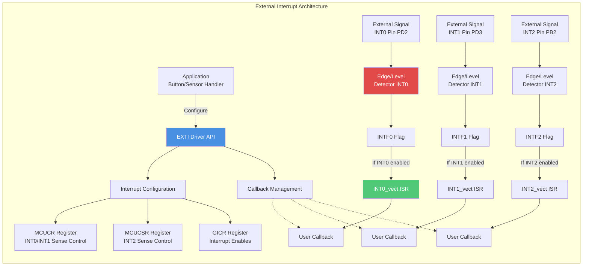
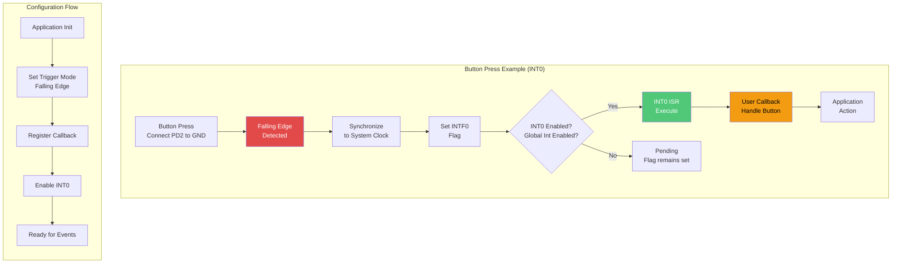
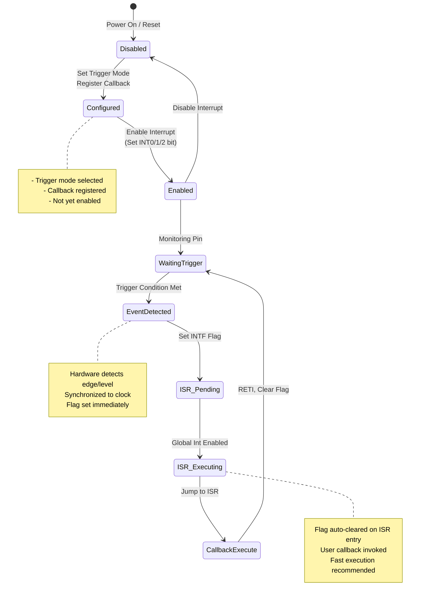
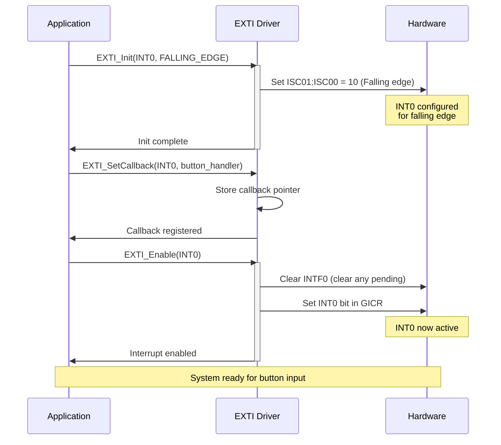
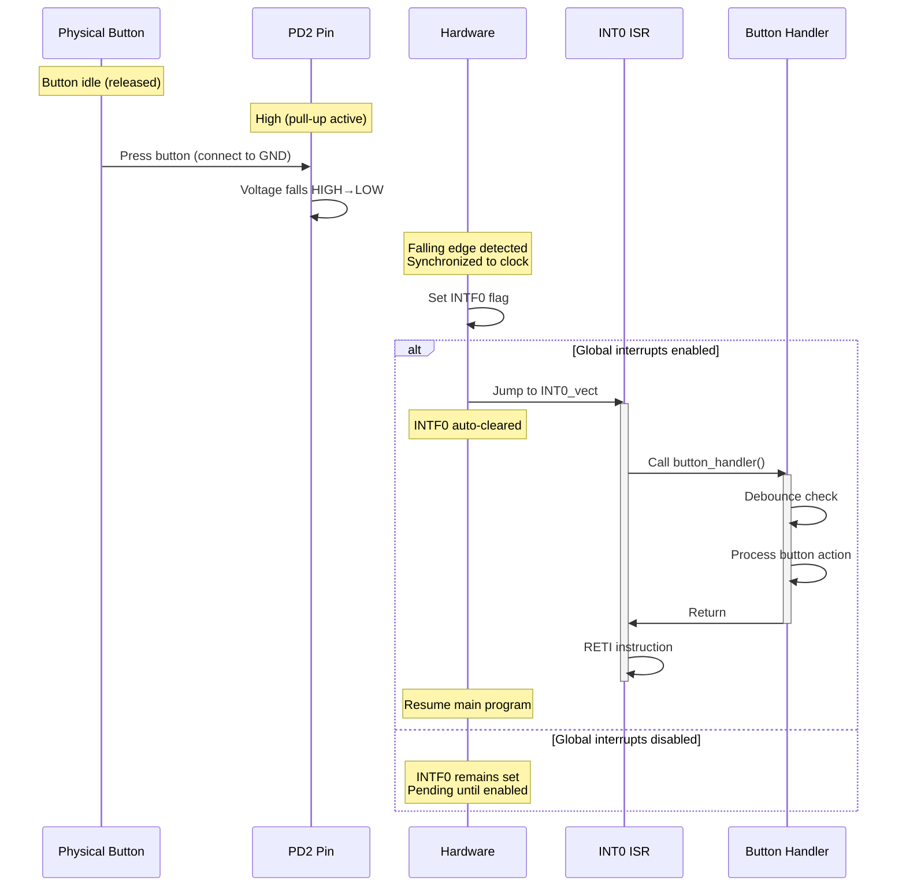
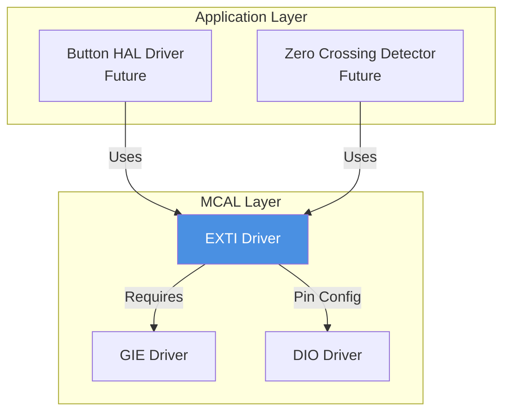

# ⚡ EXTI Driver - External Interrupts

**EXTI Driver**

**Smart Energy Management System - Event Handling**

_Developed by Gestell Company - Professional Embedded Solutions_

---

## 📋 Table of Contents

- [Module Overview](#-1-module-overview)
- [Architecture](#-2-architecture-diagram)
- [Hardware Interface](#-3-hardware-interface)
- [Data Flow](#-4-data-flow-diagram)
- [State Machine](#-5-state-machine)
- [Sequence Diagrams](#-6-sequence-diagrams)
- [Dependencies](#-7-module-dependencies)

---

## 🔗 Related Documentation

| Document                                  | Description | Status       |
| ----------------------------------------- | ----------- | ------------ |
| **[GIE_Driver.md](../GIE/GIE_Driver.md)** | Interrupts  | ✅ Available |
| **[DIO_Driver.md](../DIO/DIO_Driver.md)** | Pin Config  | ✅ Available |

---

## 📋 1. Module Overview

### Purpose and Role

The EXTI (External Interrupt) driver provides hardware-triggered interrupt capability from external signals. Unlike polling-based input reading, external interrupts allow the system to respond immediately to critical events without continuous CPU monitoring. This is essential for time-sensitive inputs like emergency buttons, zero-crossing detection, or pulse counting.

### Key Responsibilities

- Configure external interrupt pins (INT0, INT1, INT2)
- Select trigger condition (rising edge, falling edge, low level, any edge)
- Register user callback functions for interrupt events
- Manage interrupt priority and enabling
- Provide debouncing support (software-based)

### Requirements Traceability (Reserved)

| Requirement ID   | Description         | Implementation                 |
| :--------------- | :------------------ | :----------------------------- |
| **REQ-ARCH-007** | External Interrupts | Support for INT0/INT1/INT2     |
| **REQ-IO-005**   | Button Inputs       | Optional interrupt-driven mode |

### Hardware Peripheral

Utilizes ATmega32's three external interrupt sources:

- **INT0** (PD2): Configurable trigger, highest priority
- **INT1** (PD3): Configurable trigger, medium priority
- **INT2** (PB2): Rising/falling edge only, lower priority
- All can wake MCU from sleep modes

---

## 2. Architecture Diagram

---

## 3. Hardware Interface

### Pin Configuration

| Interrupt | Pin | Alternate Function | Trigger Modes                                  | Priority |
| --------- | --- | ------------------ | ---------------------------------------------- | -------- |
| INT0      | PD2 | GPIO               | Low level, Any edge, Rising edge, Falling edge | Highest  |
| INT1      | PD3 | GPIO               | Low level, Any edge, Rising edge, Falling edge | Medium   |
| INT2      | PB2 | AIN0               | Rising edge, Falling edge                      | Lower    |

### Register Overview

**MCUCR (MCU Control Register) - INT0/INT1 Configuration:**

- **ISC11:ISC10**: INT1 Sense Control
  - 00 = Low level triggers
  - 01 = Any edge triggers
  - 10 = Falling edge triggers
  - 11 = Rising edge triggers
- **ISC01:ISC00**: INT0 Sense Control (same encoding)

**MCUCSR (MCU Control and Status Register) - INT2 Configuration:**

- **ISC2**: INT2 Sense Control
  - 0 = Falling edge triggers
  - 1 = Rising edge triggers

**GICR (General Interrupt Control Register) - Enable Bits:**

- **INT2**: INT2 Enable
- **INT0**: INT0 Enable
- **INT1**: INT1 Enable

**GIFR (General Interrupt Flag Register) - Status Flags:**

- **INTF2**: INT2 Flag (set on trigger)
- **INTF0**: INT0 Flag (set on trigger)
- **INTF1**: INT1 Flag (set on trigger)
- Flags automatically cleared when ISR executes

---

## 4. Data Flow Diagram

---

## 5. State Machine

---

## 6. Sequence Diagrams

### Initialization and Configuration

### Button Press Handling (INT0 Example)

---

## 7. Module Dependencies

### Dependency Diagram

### Dependencies

**GIE Driver:**

- Global interrupts must be enabled
- Required for ISR execution

**DIO Driver:**

- Pins must be configured as inputs
- Pull-up resistors may be enabled via DIO

### Dependent Modules (Future)

**Button Driver:**

- Emergency stop button
- User input buttons
- Mode selection switches

**Zero-Crossing Detector:**

- AC phase synchronization
- Power measurement accuracy
- Dimmer control (future)

---

## 8. Configuration Parameters

### Trigger Modes

| Mode         | ISC bits    | Description            | Use Case                    |
| ------------ | ----------- | ---------------------- | --------------------------- |
| Low Level    | 00          | Triggers while pin LOW | Level-sensitive detection   |
| Any Edge     | 01          | Triggers on both edges | Toggle detection            |
| Falling Edge | 10          | Triggers on HIGH→LOW   | Button press (active-LOW)   |
| Rising Edge  | 11 / ISC2=1 | Triggers on LOW→HIGH   | Button release, pulse start |

### Priority

| Interrupt | Vector Address | Priority | Notes                              |
| --------- | -------------- | -------- | ---------------------------------- |
| INT0      | 0x0002         | Highest  | Executes first if multiple pending |
| INT1      | 0x0004         | Medium   |                                    |
| INT2      | 0x0006         | Lower    | Limited trigger modes              |

---

## 9. Error Handling Strategy

### Bounce Handling

**Problem:** Mechanical switches bounce (multiple edges during single press)

- Duration: 5-20 ms typically
- Causes multiple interrupts from one press

**Solutions:**

1. Software debouncing in ISR
2. Ignore interrupts within debounce window
3. Hardware RC filter (100Ω + 100nF typical)

### Missed Interrupts

**Problem:** Event occurs while interrupts disabled

- Flag set but ISR doesn't execute

**Solution:** Check flag manually after re-enabling

---

## 10. Performance Characteristics

### Timing

| Metric              | Value      | Notes                |
| ------------------- | ---------- | -------------------- |
| ISR Entry Latency   | 4-5 cycles | ~250-312 ns @ 16 MHz |
| Minimum Pulse Width | ~3 cycles  | For edge detection   |
| Debounce Time (SW)  | 10-50 ms   | Configurable         |

### Resource Usage

- RAM: ~12 bytes (3 callback pointers)
- Flash: ~200 bytes
- Pins: PD2, PD3, PB2

---

## Implementation Notes

### Typical Usage (Future)

**Emergency Stop Button:**

- INT0 on PD2
- Falling edge trigger (button press)
- Highest priority
- Immediately cuts relay power

**Mode Button:**

- INT1 on PD3
- Falling edge trigger
- Debounced in ISR
- Changes display mode

---

---

## 📞 Support & Contact

**Project Information**:

- **Project Name**: Smart Energy Management System
- **Development Company**: Gestell - Professional Embedded Solutions

**Technical Support**: Hisham4Ahmed@gmail.com

---

## 📄 Document Control

| Attribute            | Value                     |
| -------------------- | ------------------------- |
| **Document Type**    | EXTI Driver Documentation |
| **Document Status**  | Reserved                  |
| **Document Version** | 2.0                       |
| **Last Updated**     | January 2026              |
| **Prepared By**      | Gestell Engineering Team  |

---

**Built with ❤️ by Gestell Team**

_Professional Embedded Systems Engineering_

**Copyright © 2025-2026 Gestell Company - All Rights Reserved**

