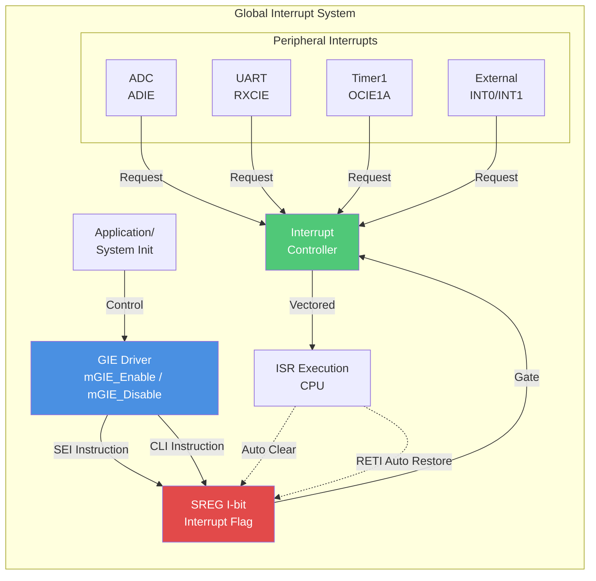
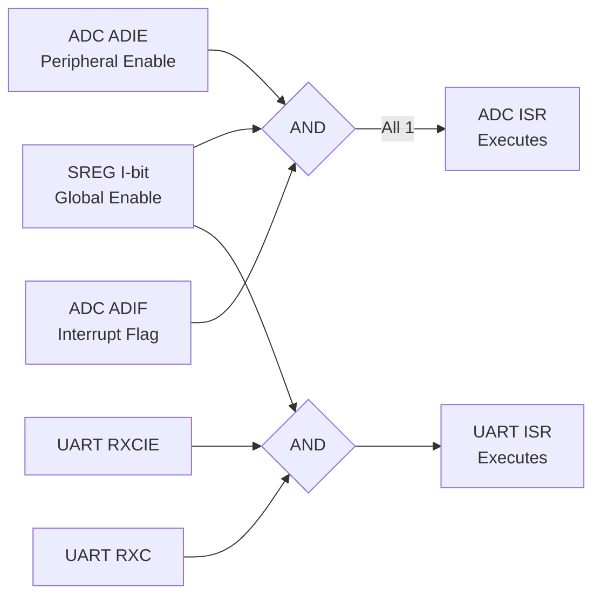
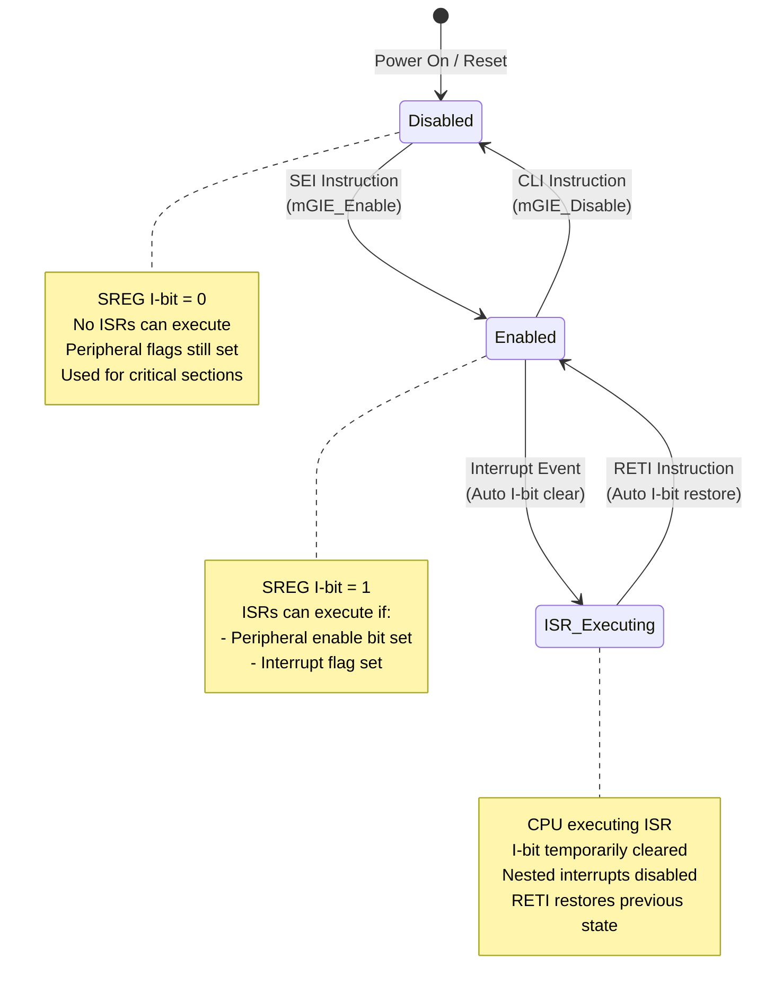
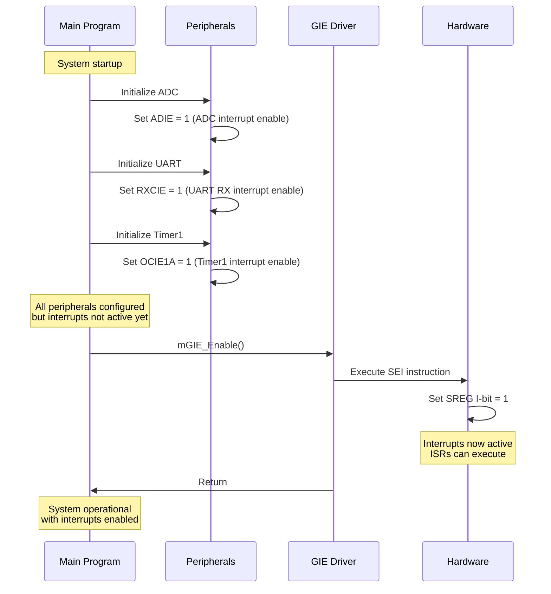
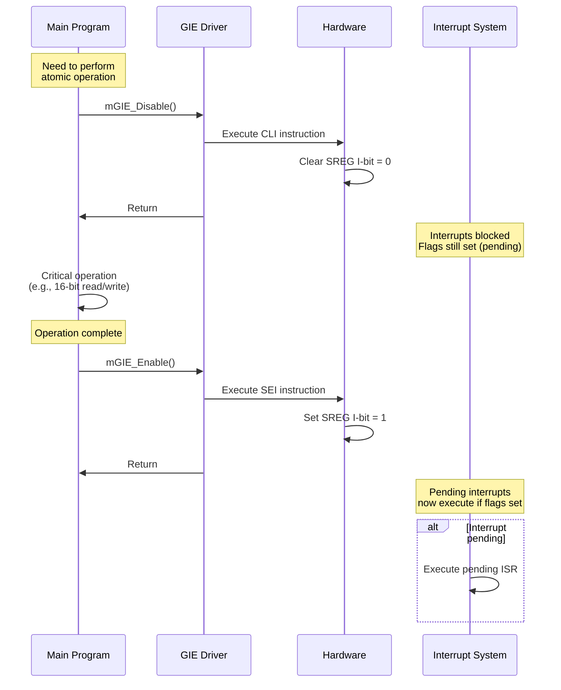
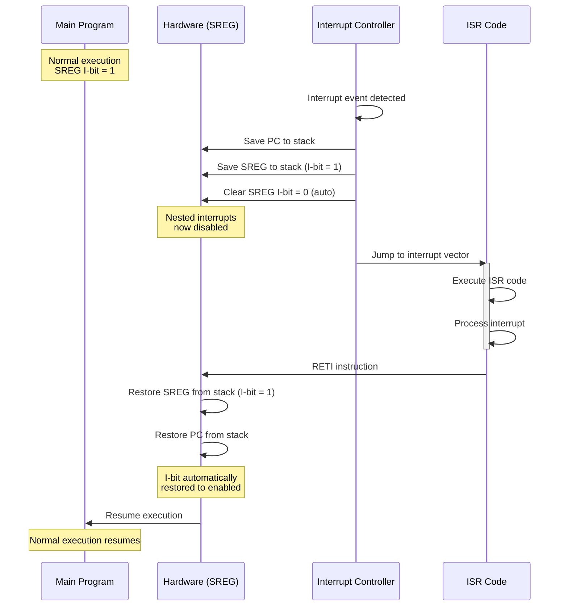
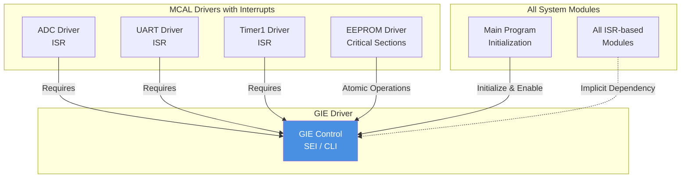

# GIE Driver - Global Interrupt Enable

**MCU**: ATmega32  
**Purpose**: Master interrupt system control  
**Scope**: System-wide interrupt enable/disable mechanism

---

## 1. Module Overview

### Purpose and Role

The GIE (Global Interrupt Enable) driver provides centralized control over the ATmega32's interrupt system. It acts as a master switch that can enable or disable ALL interrupts simultaneously, regardless of individual peripheral interrupt settings. This is critical for implementing atomic operations and protecting critical code sections.

### Key Responsibilities

- Enable global interrupt system (allow ISR execution)
- Disable global interrupt system (prevent ISR execution)
- Protect critical code sections from interruption
- Coordinate with peripheral interrupt enables
- Provide atomic operation support

### Hardware Peripheral

Utilizes the Status Register (SREG) I-bit (Interrupt Enable Flag):

- Single bit control (bit 7 of SREG)
- Master enable for all interrupts
- Set by SEI (Set Interrupt Enable) instruction
- Cleared by CLI (Clear Interrupt) instruction
- Automatically cleared on interrupt entry, restored on RETI

---

## 2. Architecture Diagram



---

## 3. Hardware Interface

### SREG (Status Register)

**Bit 7: I (Global Interrupt Enable)**

- **0**: All interrupts disabled (masked)
- **1**: Interrupts enabled (individual peripheral flags control actual execution)
- Default after reset: 0 (interrupts disabled)

**Related Instructions:**

- **SEI**: Set Interrupt Enable (sets I-bit to 1)
- **CLI**: Clear Interrupt (clears I-bit to 0)
- **RETI**: Return from Interrupt (automatically restores I-bit from stack)

### Interaction with Peripheral Interrupts



**Interrupt Execution Conditions:**
All three must be true for ISR to execute:

1. **Global enable**: SREG I-bit = 1
2. **Peripheral enable**: Individual interrupt enable bit set (e.g., ADIE, RXCIE)
3. **Interrupt flag**: Event occurred, flag set (e.g., ADIF, RXC)

---

## 4. Data Flow Diagram

```mermaid
flowchart TB
    subgraph "Interrupt Enable Flow"
        INIT[System Initialization] --> PERIPH[Initialize Peripherals<br/>Set individual enables]
        PERIPH --> GIE_EN[mGIE_Enable()<br/>Execute SEI instruction]
        GIE_EN --> I_SET[SREG I-bit = 1]
        I_SET --> SYS_RDY[System Ready<br/>Interrupts Active]
    end

    subgraph "Interrupt Disable Flow (Critical Section)"
        CRIT_START[Enter Critical Section] --> GIE_DIS[mGIE_Disable()<br/>Execute CLI instruction]
        GIE_DIS --> I_CLR[SREG I-bit = 0]
        I_CLR --> ATOMIC[Atomic Operation<br/>No ISR can run]
        ATOMIC --> GIE_EN2[mGIE_Enable()<br/>Execute SEI instruction]
        GIE_EN2 --> CRIT_END[Exit Critical Section]
    end

    subgraph "ISR Execution Flow"
        EVENT[Peripheral Event] --> FLAG[Set Interrupt Flag]
        FLAG --> CHECK{I-bit = 1?<br/>Peripheral EN = 1?}
        CHECK -->|Yes| SAVE_I[Auto Clear I-bit<br/>Save SREG to stack]
        CHECK -->|No| IGNORE[Ignore Interrupt]
        SAVE_I --> EXEC_ISR[Execute ISR]
        EXEC_ISR --> RETI[RETI Instruction]
        RETI --> RESTORE_I[Restore I-bit from stack]
        RESTORE_I --> CONT[Continue Main Program]
    end

    style I_SET fill:#50C878,color:#fff
    style I_CLR fill:#E24A4A,color:#fff
    style ATOMIC fill:#F39C12,color:#000
```

---

## 5. State Machine



### State Descriptions

**Disabled:**

- SREG I-bit = 0
- All interrupts masked globally
- Peripheral interrupt flags still set (pending)
- ISRs cannot execute
- Used for atomic operations

**Enabled:**

- SREG I-bit = 1
- Interrupts allowed based on peripheral settings
- ISRs execute when conditions met
- Normal operation mode

**ISR_Executing:**

- CPU executing interrupt service routine
- I-bit automatically cleared on ISR entry
- Prevents nested interrupts (default behavior)
- I-bit automatically restored by RETI

---

## 6. Sequence Diagrams

### System Initialization Sequence



### Critical Section Protection Sequence



### ISR Execution with Automatic I-bit Control



---

## 7. Module Dependencies

### Dependency Diagram



### Dependencies On Other Modules

**None** - GIE is a foundational module with no dependencies. It directly controls hardware (SREG) via CPU instructions.

### Modules That Depend On This Module

**All Interrupt-Based Modules:**

- ADC Driver (interrupt-driven sampling)
- UART Driver (RX interrupt)
- Timer1 Driver (compare match interrupt, optional)
- EEPROM Driver (atomic write operations)
- External Interrupts (if used)

**System Initialization:**

- Must call `mGIE_Enable()` after all peripheral setup
- Last step in initialization sequence
- Enables interrupt-driven operation

**Critical Section Protection:**

- Any code requiring atomic operations
- 16-bit register access (TCNT1, OCR1A, etc.)
- EEPROM write timing-critical sequence
- Shared variable access between main loop and ISR

---

## 8. Configuration Parameters

### Constants and Macros

| Macro          | Implementation                | Purpose                   |
| -------------- | ----------------------------- | ------------------------- |
| mGIE_Enable()  | sei() or asm volatile ("sei") | Enable global interrupts  |
| mGIE_Disable() | cli() or asm volatile ("cli") | Disable global interrupts |

### Usage Guidelines

**When to Enable:**

- After all peripheral initialization
- At end of system startup sequence
- After exiting critical section

**When to Disable:**

- Before critical sections (atomic operations)
- During 16-bit register access
- During timing-sensitive sequences
- Temporarily for quick operations (< 10 µs recommended)

**Duration of Disable:**

- Keep disabled time minimal
- Long disables cause interrupt latency
- Maximum recommended: < 100 µs
- ADC/UART may miss events if disabled too long

---

## 9. Error Handling Strategy

### Potential Issues

**Forgot to Re-enable:**

- Disabling interrupts without re-enabling
- System hangs if interrupt-driven
- Detection: Watchdog timeout, no ISR activity

**Nested Critical Sections:**

- Calling mGIE_Disable() twice
- Inner enable prematurely restores interrupts
- Detection: Logic error, testing required

**Long Critical Sections:**

- Holding interrupts disabled too long
- Missed interrupts, lost data
- Detection: Monitoring interrupt latency

### Solutions

**Save/Restore Pattern:**
Instead of blind enable/disable, save and restore previous state.

**Timeout Monitoring:**

- Watchdog detect if interrupts never enabled
- System reset as recovery

**Code Review:**

- Ensure every disable has matching enable
- Verify critical section duration minimal

---

## 10. Performance Characteristics

### Execution Time

| Operation          | Cycles | Time @ 16 MHz | Notes                      |
| ------------------ | ------ | ------------- | -------------------------- |
| SEI instruction    | 1      | 62.5 ns       | Enable interrupts          |
| CLI instruction    | 1      | 62.5 ns       | Disable interrupts         |
| ISR entry overhead | 4-5    | 250-312 ns    | Save PC, SREG, clear I-bit |
| RETI overhead      | 4-5    | 250-312 ns    | Restore SREG, PC           |

### Resource Usage

**Memory:**

- No RAM usage
- No global variables
- Program memory: ~10 bytes (inline macros)

**Hardware:**

- Uses SREG I-bit only
- No dedicated peripheral

---

## Implementation Notes

### Typical Usage Pattern

**System Initialization:**

1. Initialize all peripherals (ADC, UART, etc.)
2. Configure peripheral interrupt enables
3. Call mGIE_Enable() as **last step**
4. System now interrupt-driven

**Critical Section:**

1. Call mGIE_Disable()
2. Perform atomic operation (< 10 µs)
3. Call mGIE_Enable()
4. Interrupts restored

**Best Practice:**

- Keep critical sections short
- Document why interrupts disabled
- Use save/restore for nested contexts

---

**Document Version**: 2.0  
**Last Updated**: January 2026  
**Maintained By**: Gestell Engineering Team  
**Related Documents**: All interrupt-based drivers
