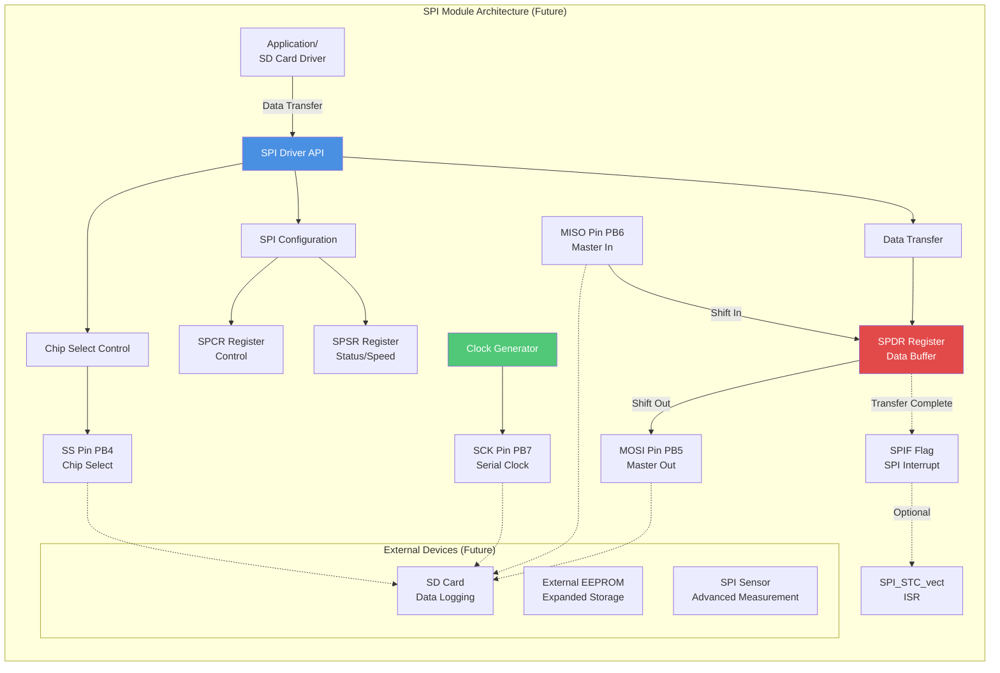
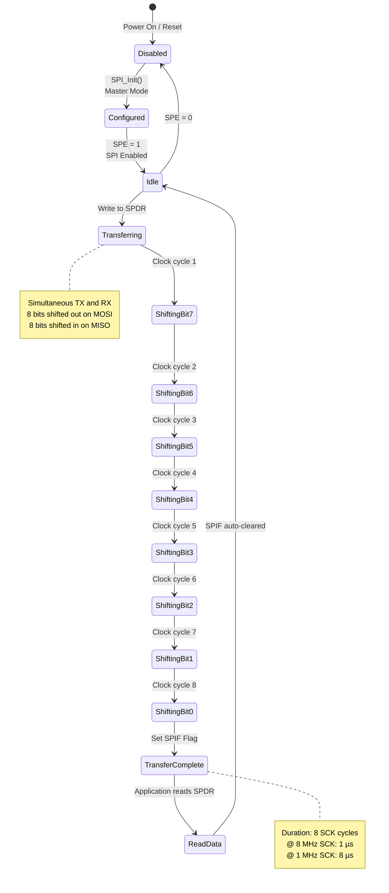
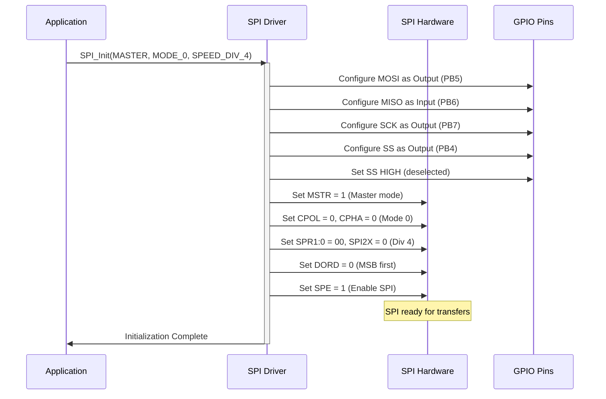
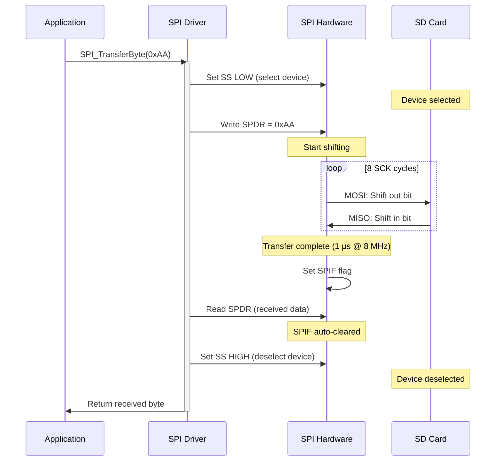
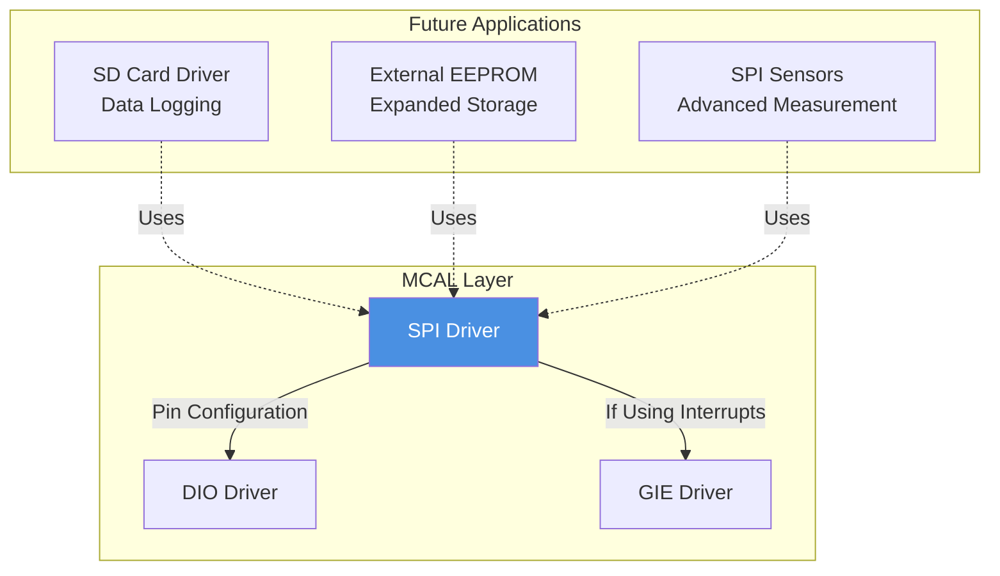

# 🔄 SPI Driver - Serial Peripheral Interface

<div align="center">


**SPI Driver**

**Smart Energy Management System - High-Speed Serial Communication**

_Developed by Gestell Company - Professional Embedded Solutions_

</div>

---

## 📋 Table of Contents

- [Module Overview](#-1-module-overview)
- [Architecture](#-2-architecture-diagram)
- [Hardware Interface](#-3-hardware-interface)
- [Data Flow](#-4-data-flow-diagram)
- [State Machine](#-5-state-machine)
- [Sequence Diagrams](#-6-sequence-diagrams)
- [Dependencies](#-7-module-dependencies)

---

## 🔗 Related Documentation

| Document                                  | Description | Status       |
| ----------------------------------------- | ----------- | ------------ |
| **[DIO_Driver.md](../DIO/DIO_Driver.md)** | Pin Config  | ✅ Available |
| **[GIE_Driver.md](../GIE/GIE_Driver.md)** | Interrupts  | ✅ Available |

---

## 📋 1. Module Overview

### Purpose and Role

The SPI (Serial Peripheral Interface) driver provides high-speed, full-duplex synchronous serial communication capability. While currently unused, SPI is reserved for future system expansion that may include SD card logging, external EEPROM, SPI-based sensors, or display modules. SPI's high data rate (up to 8 Mbps on ATmega32) makes it ideal for data-intensive peripherals.

### Key Responsibilities (Future)

- Configure SPI as master or slave
- High-speed data transmission/reception (up to 8 Mbps)
- Multi-device support via chip select (SS) management
- SPI mode configuration (clock polarity and phase)
- Interrupt-driven or polling-based operation
- Buffer management for bulk transfers

### Requirements Traceability (Future)

| Requirement ID   | Description          | Implementation                          |
| :--------------- | :------------------- | :-------------------------------------- |
| **REQ-ARCH-002** | Layered Architecture | Module implemented for future expansion |
| **REQ-MOD-001**  | Module Breakdown     | Reserved in SRS                         |

### Hardware Peripheral

Utilizes ATmega32's SPI peripheral:

- **Full-duplex** communication (simultaneous TX and RX)
- **Master or slave** operation
- **Configurable clock**: Up to F_CPU/2 (8 MHz @ 16 MHz system)
- **Four SPI modes**: Different clock polarity/phase combinations
- **Hardware SS management**: Automatic slave select control
- **Double-buffered**: Improved throughput

---

## 2. Architecture Diagram



---

## 3. Hardware Interface

### Pin Configuration

| Pin | Function                   | Direction (Master)       | Direction (Slave) | Connected To (Future)    |
| --- | -------------------------- | ------------------------ | ----------------- | ------------------------ |
| PB4 | SS (Slave Select)          | Output (manual) or Input | Input             | SD card CS / Device CS   |
| PB5 | MOSI (Master Out Slave In) | Output                   | Input             | SD card DI / EEPROM DI   |
| PB6 | MISO (Master In Slave Out) | Input                    | Output            | SD card DO / EEPROM DO   |
| PB7 | SCK (Serial Clock)         | Output                   | Input             | SD card CLK / EEPROM CLK |

### Register Overview

**SPCR (SPI Control Register):**

- **SPIE** (bit 7): SPI Interrupt Enable
- **SPE** (bit 6): SPI Enable
- **DORD** (bit 5): Data Order (0=MSB first, 1=LSB first)
- **MSTR** (bit 4): Master/Slave Select (1=Master, 0=Slave)
- **CPOL** (bit 3): Clock Polarity
- **CPHA** (bit 2): Clock Phase
- **SPR1:SPR0** (bits 1-0): Clock Rate Select (with SPI2X)

**SPSR (SPI Status Register):**

- **SPIF** (bit 7): SPI Interrupt Flag (transfer complete)
- **WCOL** (bit 6): Write Collision Flag
- **SPI2X** (bit 0): Double Speed Mode

**SPDR (SPI Data Register):**

- Read: Receive buffer
- Write: Transmit buffer
- Writing initiates transfer

---

## 4. Data Flow Diagram

```mermaid
flowchart TB
    subgraph "Master Transmit/Receive (Future)"
        direction LR
        APP_TX[Application<br/>Send Byte] --> SS_LOW[Assert SS<br/>(Pin LOW)]
        SS_LOW --> WRITE[Write to SPDR]
        WRITE --> SHIFT[Hardware Shift<br/>8 clock cycles]
        SHIFT --> MOSI[MOSI: TX Data Out<br/>MSB first]
        SHIFT --> MISO[MISO: RX Data In<br/>Simultaneous]
        MOSI --> SLAVE[Slave Device]
        SLAVE --> MISO
        SHIFT --> WAIT{SPIF Set?}
        WAIT -->|No| WAIT
        WAIT -->|Yes| READ[Read SPDR<br/>Received Data]
        READ --> SS_HIGH[Deassert SS<br/>(Pin HIGH)]
        SS_HIGH --> APP_RX[Return Data<br/>to Application]
    end

    subgraph "Clock Timing"
        direction TB
        CLK_SRC[System Clock<br/>16 MHz] --> DIV[Divider<br/>/2, /4, /8, /16, /32, /64, /128]
        DIV --> SCK_OUT[SCK Output<br/>Up to 8 MHz]
    end

    style SHIFT fill:#E24A4A,color:#fff
    style MOSI fill:#50C878,color:#fff
    style MISO fill:#F39C12,color:#000
```

---

## 5. State Machine



---

## 6. Sequence Diagrams

### Master Mode Initialization (Future)



### Data Transfer Sequence (Future)



---

## 7. Module Dependencies

### Dependency Diagram



---

## 8. Configuration Parameters

### Clock Speed Options

| SPR1 | SPR0 | SPI2X | Divider | SCK Frequency @ 16 MHz | Use Case          |
| ---- | ---- | ----- | ------- | ---------------------- | ----------------- |
| 0    | 0    | 0     | 4       | 4 MHz                  | Fast transfer     |
| 0    | 0    | 1     | 2       | **8 MHz**              | **Maximum speed** |
| 0    | 1    | 0     | 16      | 1 MHz                  | Standard speed    |
| 0    | 1    | 1     | 8       | 2 MHz                  | Medium-fast       |
| 1    | 0    | 0     | 64      | 250 kHz                | Slow, robust      |
| 1    | 0    | 1     | 32      | 500 kHz                | Medium-slow       |
| 1    | 1    | 0     | 128     | 125 kHz                | Very slow         |
| 1    | 1    | 1     | 64      | 250 kHz                | Same as (1,0,0)   |

### SPI Modes (Clock Polarity and Phase)

| Mode | CPOL | CPHA | Clock Idle State | Sample Edge        | Use Case                  |
| ---- | ---- | ---- | ---------------- | ------------------ | ------------------------- |
| 0    | 0    | 0    | LOW              | Rising (leading)   | **Most common** (SD card) |
| 1    | 0    | 1    | LOW              | Falling (trailing) |                           |
| 2    | 1    | 0    | HIGH             | Falling (leading)  |                           |
| 3    | 1    | 1    | HIGH             | Rising (trailing)  |                           |

---

## 9. Error Handling Strategy

### Potential Issues (Future)

**Write Collision (WCOL):**

- Writing to SPDR while transfer in progress
- Previous data lost
- Detection: WCOL flag set

**SS Pin Conflict (Master Mode):**

- If SS configured as input and driven LOW, SPI switches to slave mode
- Prevention: Always configure SS as output in master mode

**Clock Speed Too High:**

- Slave device cannot keep up
- Data corruption
- Solution: Reduce SCK frequency

---

## 10. Performance Characteristics

### Throughput

| SCK Frequency | Byte Transfer Time | Maximum Throughput |
| ------------- | ------------------ | ------------------ |
| 8 MHz         | 1 µs               | 1 MB/s             |
| 4 MHz         | 2 µs               | 500 kB/s           |
| 1 MHz         | 8 µs               | 125 kB/s           |
| 250 kHz       | 32 µs              | 31.25 kB/s         |

### Resource Usage (Future)

- RAM: ~20 bytes (buffers, state)
- Flash: ~300 bytes (driver functions)
- Pins: 4 (MOSI, MISO, SCK, SS)

---

## Implementation Notes

### Future Use Cases

**1. SD Card Data Logging:**

- Store energy consumption history
- Timestamps and measurements
- FAT filesystem support
- SPI Mode 0, up to 8 MHz

**2. External EEPROM Expansion:**

- Larger non-volatile storage
- Faster than internal EEPROM
- SPI Mode 0 or 3

**3. SPI-Based Sensors:**

- High-precision ADCs
- Digital temperature sensors
- Accelerometers for vibration monitoring

---

---

## 📞 Support & Contact

**Project Information**:

- **Project Name**: Smart Energy Management System
- **Development Company**: Gestell - Professional Embedded Solutions

**Technical Support**: Hisham4Ahmed@gmail.com

---

## 📄 Document Control

| Attribute            | Value                    |
| -------------------- | ------------------------ |
| **Document Type**    | SPI Driver Documentation |
| **Document Status**  | Reserved                 |
| **Document Version** | 2.0                      |
| **Last Updated**     | January 2026             |
| **Prepared By**      | Gestell Engineering Team |

---

<div align="center">

**Built with ❤️ by Gestell Team**

_Professional Embedded Systems Engineering_

**Copyright © 2025-2026 Gestell Company - All Rights Reserved**

</div>
