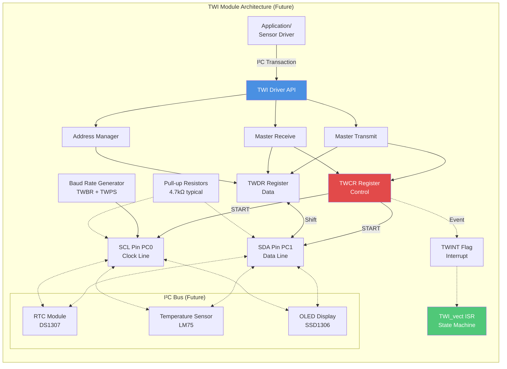
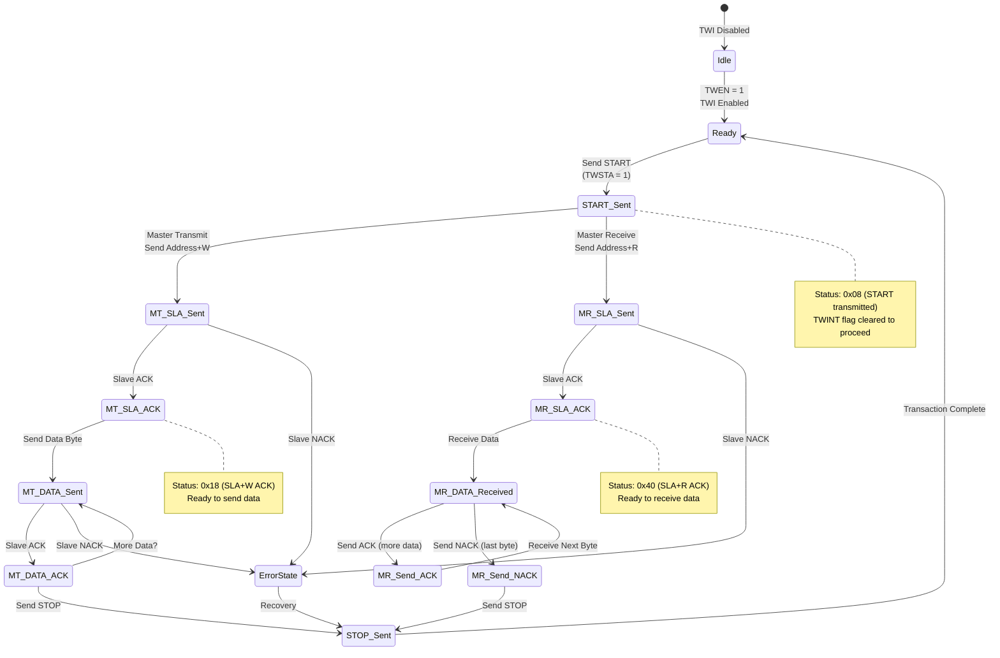
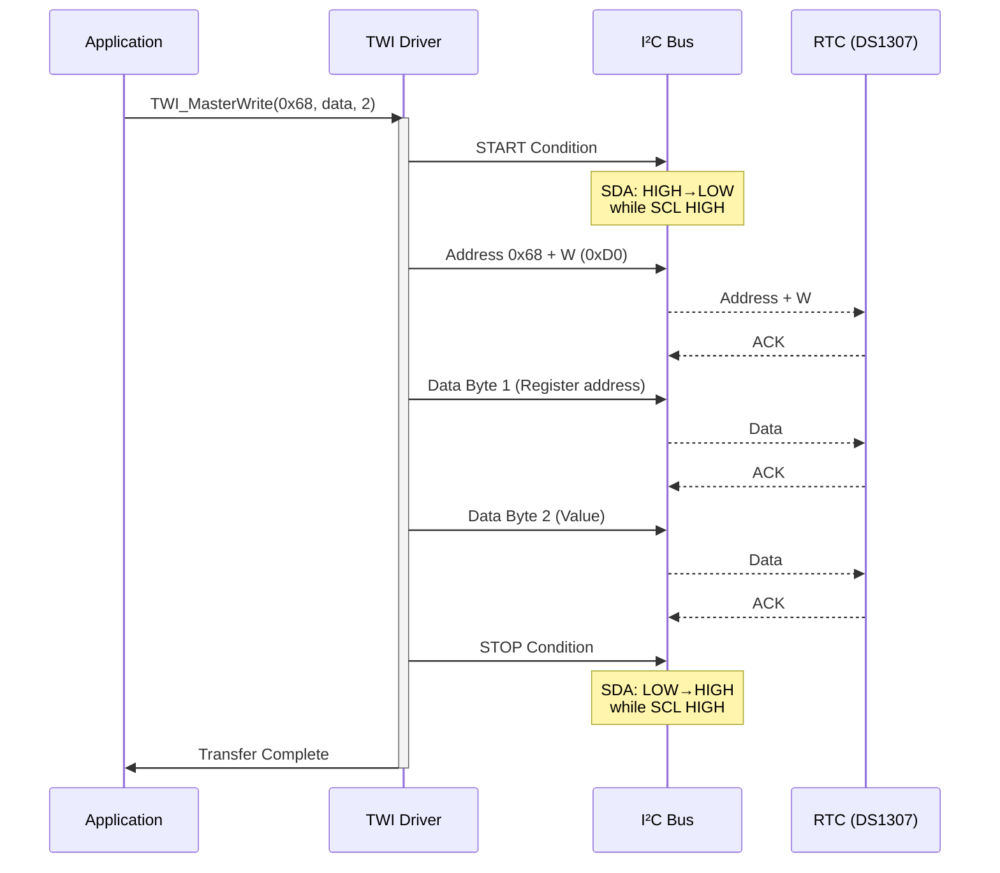
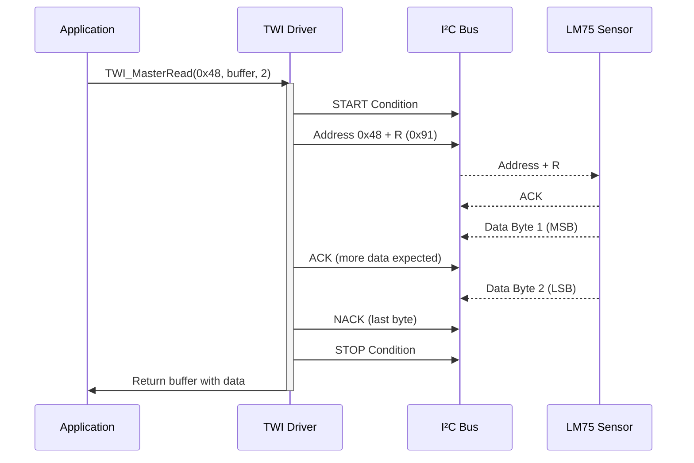
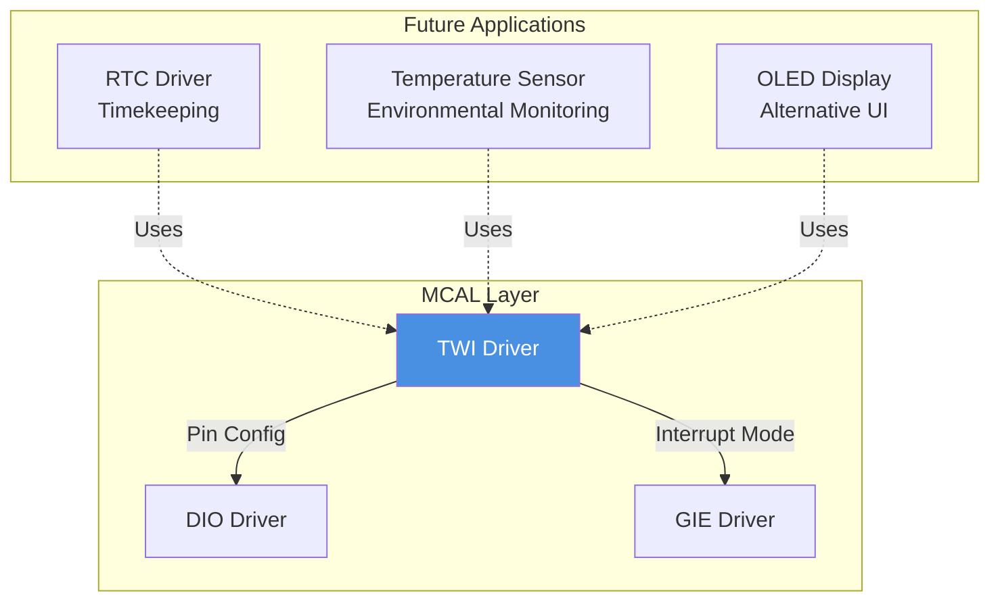

# 🕸️ TWI Driver - Two-Wire Interface (I²C)

<div align="center">


**TWI Driver**

**Smart Energy Management System - I²C Communication Bus**

_Developed by Gestell Company - Professional Embedded Solutions_

</div>

---

## 📋 Table of Contents

- [Module Overview](#-1-module-overview)
- [Architecture](#-2-architecture-diagram)
- [Hardware Interface](#-3-hardware-interface)
- [Data Flow](#-4-data-flow-diagram)
- [State Machine](#-5-state-machine)
- [Sequence Diagrams](#-6-sequence-diagrams)
- [Dependencies](#-7-module-dependencies)

---

## 🔗 Related Documentation

| Document                                  | Description | Status       |
| ----------------------------------------- | ----------- | ------------ |
| **[DIO_Driver.md](../DIO/DIO_Driver.md)** | Pin Config  | ✅ Available |
| **[GIE_Driver.md](../GIE/GIE_Driver.md)** | Interrupts  | ✅ Available |

---

## 📋 1. Module Overview

### Purpose and Role

The TWI (Two-Wire Interface) driver, also known as I²C (Inter-Integrated Circuit), provides a robust two-wire serial communication protocol for connecting multiple devices on a shared bus. While currently unused, TWI is reserved for future expansion that may include real-time clocks (RTC), temperature sensors, I²C OLED displays, or environmental sensors. TWI's bus architecture allows multiple devices with only two shared wires (SDA and SCL).

### Key Responsibilities (Future)

- Multi-master and multi-slave bus communication
- Device addressing and arbitration
- START/STOP condition generation
- Acknowledge (ACK/NACK) handling
- 7-bit and 10-bit addressing support
- Clock stretching and bus recovery
- Up to 400 kHz (Fast Mode) communication

### Requirements Traceability (Future)

| Requirement ID   | Description          | Implementation                          |
| :--------------- | :------------------- | :-------------------------------------- |
| **REQ-ARCH-002** | Layered Architecture | Module implemented for future expansion |
| **REQ-MOD-001**  | Module Breakdown     | Reserved in SRS                         |

### Hardware Peripheral

Utilizes ATmega32's TWI peripheral:

- **Two-wire bus**: SDA (data) and SCL (clock)
- **Multi-master capable**: Bus arbitration supported
- **7-bit addressing**: 128 possible device addresses
- **Clock rates**: 100 kHz (Standard) or 400 kHz (Fast Mode)
- **Interrupt-driven**: TWI interrupt for each bus event
- **Hardware support**: START, STOP, ACK generation

---

## 2. Architecture Diagram



---

## 3. Hardware Interface

### Pin Configuration

| Pin | Function           | Type                                       | Notes                                     |
| --- | ------------------ | ------------------------------------------ | ----------------------------------------- |
| PC1 | SDA (Serial Data)  | Open-drain bidirectional                   | Requires external pull-up (4.7kΩ typical) |
| PC0 | SCL (Serial Clock) | Open-drain output (master) / input (slave) | Requires external pull-up (4.7kΩ typical) |

### Register Overview

**TWBR (TWI Bit Rate Register):**

- Sets SCL frequency in master mode
- Formula: SCL = F_CPU / (16 + 2 × TWBR × Prescaler)

**TWCR (TWI Control Register):**

- **TWINT** (bit 7): Interrupt Flag (must be cleared to proceed)
- **TWEA** (bit 6): Enable Acknowledge
- **TWSTA** (bit 5): START Condition
- **TWSTO** (bit 4): STOP Condition
- **TWWC** (bit 3): Write Collision Flag
- **TWEN** (bit 2): TWI Enable
- **TWIE** (bit 0): TWI Interrupt Enable

**TWSR (TWI Status Register):**

- **TWS7:3** (bits 7-3): Status code (indicates current bus state)
- **TWPS1:0** (bits 1-0): Prescaler (1, 4, 16, 64)

**TWDR (TWI Data Register):**

- Holds address or data byte being transmitted/received

**TWAR (TWI (Slave) Address Register):**

- Slave mode own address (not used in master-only mode)

---

## 4. Data Flow Diagram

```mermaid
flowchart TB
    subgraph "Master Write Transaction (Future)"
        direction TB
        START_W[Send START<br/>Condition] --> ADDR_W[Send Device Address<br/>+ Write Bit (0)]
        ADDR_W --> ACK_A{ACK<br/>Received?}
        ACK_A -->|Yes| DATA1_W[Send Data Byte 1]
        ACK_A -->|No| ERR_W[NACK Error<br/>Device not responding]
        DATA1_W --> ACK_D1{ACK?}
        ACK_D1 -->|Yes| DATA2_W[Send Data Byte 2]
        ACK_D1 -->|No| ERR_WD[NACK Error<br/>Write failed]
        DATA2_W --> STOP_W[Send STOP<br/>Condition]
        STOP_W --> DONE_W[Transaction Complete]
    end

    subgraph "Master Read Transaction (Future)"
        direction TB
        START_R[Send START<br/>Condition] --> ADDR_R[Send Device Address<br/>+ Read Bit (1)]
        ADDR_R --> ACK_AR{ACK?}
        ACK_AR -->|Yes| READ1[Read Data Byte 1]
        ACK_AR -->|No| ERR_R[NACK Error]
        READ1 --> SEND_ACK[Send ACK<br/>(More data)]
        SEND_ACK --> READ2[Read Data Byte 2]
        READ2 --> SEND_NACK[Send NACK<br/>(Last byte)]
        SEND_NACK --> STOP_R[Send STOP]
        STOP_R --> DONE_R[Transaction Complete]
    end

    style START_W fill:#E24A4A,color:#fff
    style ACK_A fill:#50C878,color:#fff
    style STOP_W fill:#F39C12,color:#000
```

---

## 5. State Machine



---

## 6. Sequence Diagrams

### I²C Write to RTC (Future Example)



### I²C Read from Temperature Sensor (Future Example)



---

## 7. Module Dependencies

### Dependency Diagram



---

## 8. Configuration Parameters

### Clock Speed Configuration

**Formula:**

```
SCL_Frequency = F_CPU / (16 + 2 × TWBR × Prescaler)
```

**Common Configurations @ 16 MHz:**

| Mode     | Target Frequency | TWBR | TWPS   | Actual Frequency |
| -------- | ---------------- | ---- | ------ | ---------------- |
| Standard | 100 kHz          | 72   | 1 (00) | 100 kHz          |
| Fast     | 400 kHz          | 12   | 1 (00) | 400 kHz          |
| Slow     | 50 kHz           | 152  | 1 (00) | 50 kHz           |

### I²C Addressing

**7-bit Address Format:**

- Bits 7-1: Device address (0-127)
- Bit 0: R/W bit (0=Write, 1=Read)
- Transmitted as single byte

**Reserved Addresses:**

- 0x00: General call
- 0x01-0x07: Reserved
- 0x78-0x7F: Reserved

---

## 9. Error Handling Strategy

### Common Issues (Future)

**Bus Arbitration Loss:**

- Multi-master conflict
- Detection: Status code 0x38
- Recovery: Retry after delay

**Slave NACK:**

- Device not present or busy
- Detection: Status code 0x20, 0x30, 0x48
- Recovery: Retry or report error

**Bus Lockup:**

- SDA or SCL stuck LOW
- Detection: Timeout
- Recovery: Bus reset (clock pulses with STOP)

---

## 10. Performance Characteristics

### Throughput

| Mode     | SCL Frequency | Byte Transfer Time | Typical Use                 |
| -------- | ------------- | ------------------ | --------------------------- |
| Standard | 100 kHz       | ~90 µs             | RTC, basic sensors          |
| Fast     | 400 kHz       | ~22 µs             | OLED displays, fast sensors |

### Resource Usage (Future)

- RAM: ~30 bytes (buffers, state machine)
- Flash: ~400 bytes (driver + state machine)
- Pins: 2 (SDA, SCL) + pull-up resistors required

---

## Implementation Notes

### Future Use Cases

**1. RTC Module (DS1307):**

- I²C address: 0x68
- Standard mode (100 kHz)
- Timekeeping and timestamps
- Battery backup

**2. Temperature Sensor (LM75):**

- I²C address: 0x48-0x4F (configurable)
- Standard mode
- Environmental monitoring
- Overheating detection

**3. OLED Display (SSD1306):**

- I²C address: 0x3C or 0x3D
- Fast mode (400 kHz)
- Alternative to LCD
- Graphical capabilities

### Hardware Requirements

- **Pull-up resistors**: 4.7kΩ on SDA and SCL (external, not internal)
- **Bus capacitance**: < 400 pF for Fast Mode
- **Supply voltage**: All devices must share common ground

---

---

## 📞 Support & Contact

**Project Information**:

- **Project Name**: Smart Energy Management System
- **Development Company**: Gestell - Professional Embedded Solutions

**Technical Support**: Hisham4Ahmed@gmail.com

---

## 📄 Document Control

| Attribute            | Value                    |
| -------------------- | ------------------------ |
| **Document Type**    | TWI Driver Documentation |
| **Document Status**  | Reserved                 |
| **Document Version** | 2.0                      |
| **Last Updated**     | January 2026             |
| **Prepared By**      | Gestell Engineering Team |

---

<div align="center">

**Built with ❤️ by Gestell Team**

_Professional Embedded Systems Engineering_

**Copyright © 2025-2026 Gestell Company - All Rights Reserved**

</div>
