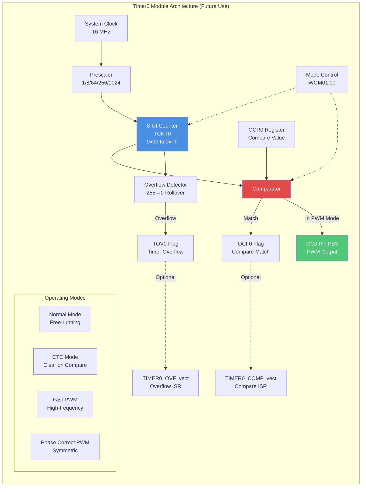
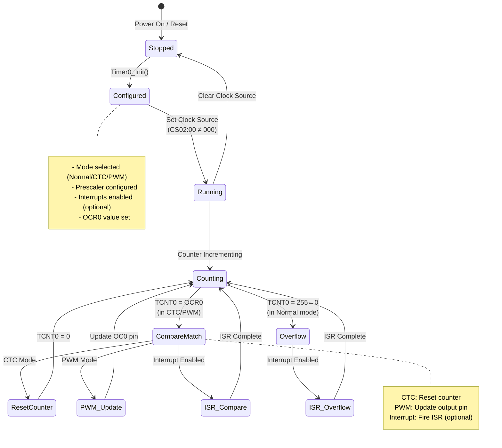
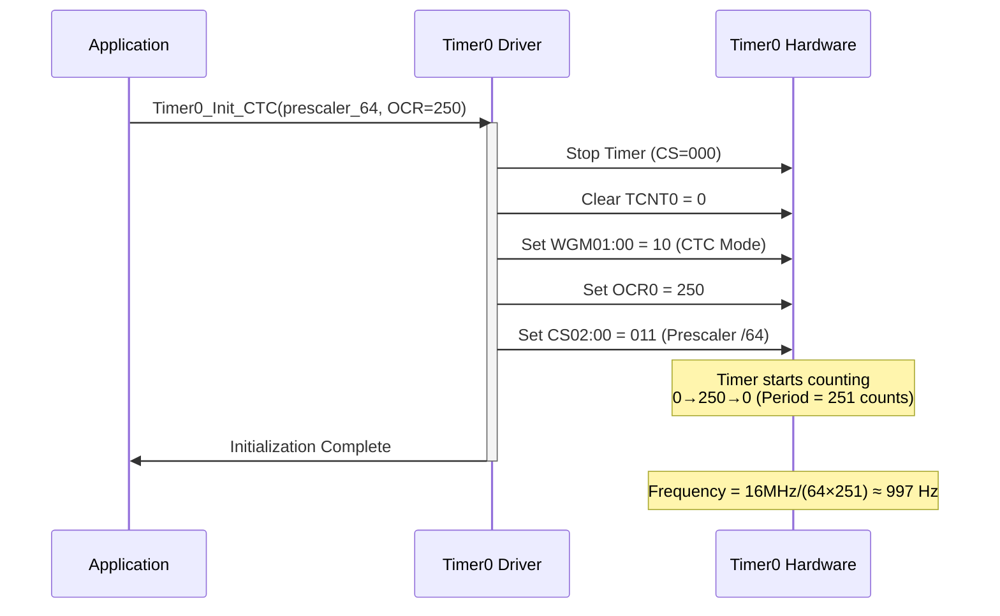
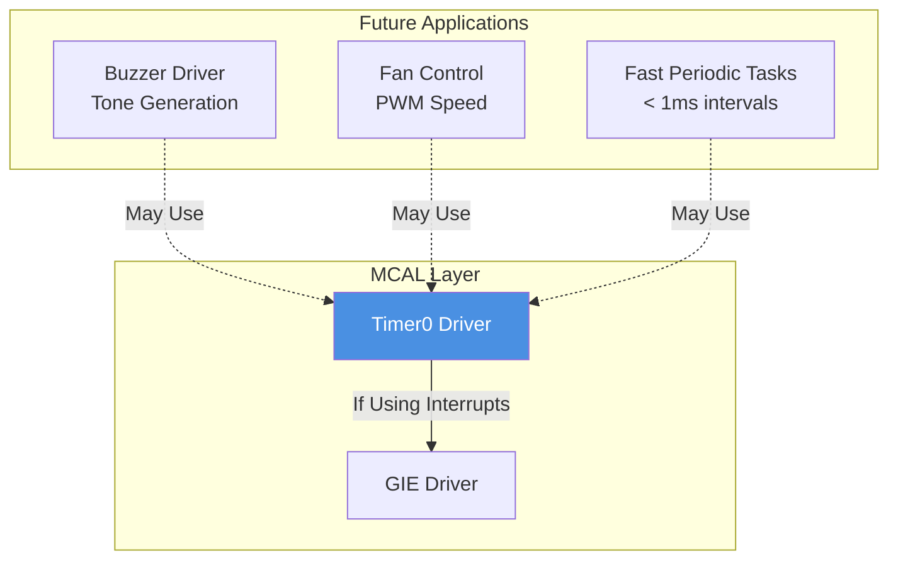

# Timer0 Driver - 8-bit Timer/Counter

**MCU**: ATmega32  
**Type**: 8-bit Timer/Counter  
**Purpose**: Reserved for software PWM, general timing, and auxiliary functions  
**Status**: Currently unused, available for future expansion

---

## 1. Module Overview

### Purpose and Role

Timer0 is an 8-bit general-purpose timer/counter peripheral that complements Timer1 (16-bit) by providing additional timing and PWM capabilities. While currently unused in the Smart Energy Management System, Timer0 is reserved for future features such as software PWM generation, additional periodic tasks, or precise timing measurements that don't require 16-bit resolution.

### Key Responsibilities (Future)

- Generate software PWM signals (e.g., buzzer tones, fan control)
- Provide fast periodic interrupts for housekeeping tasks
- Implement timeout mechanisms
- Measure short time intervals
- Support phase-correct PWM for motor control (future)

### Hardware Peripheral

Utilizes ATmega32's Timer0:

- **8-bit resolution**: Counter range 0-255
- **Multiple operating modes**: Normal, CTC, PWM (Fast/Phase-Correct)
- **Prescaler options**: 1, 8, 64, 256, 1024
- **Two interrupts**: Overflow and Compare Match
- **One PWM output**: OC0 (PB3) for hardware PWM

---

## 2. Architecture Diagram

---

## 3. Hardware Interface

### Register Overview

**TCNT0 (Timer/Counter Register):**

- 8-bit counter value (0-255)
- Increments every timer clock cycle
- Can be read/written directly

**OCR0 (Output Compare Register):**

- 8-bit compare value
- Triggers compare match when TCNT0 = OCR0
- Used for CTC timing or PWM duty cycle

**TCCR0 (Timer/Counter Control Register):**

- **FOC0** (bit 7): Force Output Compare (non-PWM modes)
- **WGM00, WGM01** (bits 6, 3): Waveform Generation Mode
- **COM01:00** (bits 5-4): Compare Output Mode (OC0 pin behavior)
- **CS02:00** (bits 2-0): Clock Select (prescaler)

**TIMSK (Timer Interrupt Mask Register):**

- **OCIE0** (bit 1): Output Compare Match Interrupt Enable
- **TOIE0** (bit 0): Overflow Interrupt Enable

**TIFR (Timer Interrupt Flag Register):**

- **OCF0** (bit 1): Output Compare Match Flag
- **TOV0** (bit 0): Timer Overflow Flag

### Pin Configuration

| Pin | Function | Mode   | Future Use                                 |
| --- | -------- | ------ | ------------------------------------------ |
| PB3 | OC0      | Output | Hardware PWM for buzzer tones, LED dimming |

---

## 4. Data Flow Diagram

```mermaid
flowchart TB
    subgraph "Normal Mode (Future)"
        SYSCLK_N[System Clock] --> PS_N[Prescaler]
        PS_N --> CNT_N[TCNT0 Increment<br/>0→255]
        CNT_N --> OVF_N{Overflow?<br/>255→0}
        OVF_N -->|Yes| ISR_OVF[Overflow ISR<br/>Every 256 counts]
        OVF_N -->|No| CNT_N
        ISR_OVF -->|Optional| APP_OVF[Application<br/>Periodic Task]
    end

    subgraph "CTC Mode (Future)"
        SYSCLK_C[System Clock] --> PS_C[Prescaler]
        PS_C --> CNT_C[TCNT0 Increment]
        CNT_C --> CMP_C{TCNT0=OCR0?}
        CMP_C -->|Yes| RESET_C[Reset TCNT0=0]
        CMP_C -->|Yes| ISR_CMP[Compare ISR<br/>Precise Timing]
        CMP_C -->|No| CNT_C
        RESET_C --> CNT_C
        ISR_CMP -->|Optional| APP_CMP[Application<br/>Timed Event]
    end

    subgraph "PWM Mode (Future)"
        SYSCLK_P[System Clock] --> PS_P[Prescaler]
        PS_P --> PWM_GEN[PWM Generator]
        OCR0_P[OCR0<br/>Duty Cycle] --> PWM_GEN
        PWM_GEN --> OC0[OC0 Pin PB3<br/>PWM Signal]
        OC0 --> BUZZER[Buzzer<br/>Tone Generation]
    end

    style ISR_OVF fill:#E24A4A,color:#fff
    style ISR_CMP fill:#50C878,color:#fff
    style OC0 fill:#F39C12,color:#000
```

---

## 5. State Machine

---

## 6. Sequence Diagrams

### Future CTC Mode Initialization

---

## 7. Module Dependencies

### Dependency Diagram

---

## 8. Configuration Parameters

### Prescaler Options

| CS02:00 | Prescaler     | Timer Clock @ 16MHz | Max Period (8-bit) | Use Case       |
| ------- | ------------- | ------------------- | ------------------ | -------------- |
| 000     | Timer stopped | 0 Hz                | -                  | Disabled       |
| 001     | 1             | 16 MHz              | 16 µs              | High-speed PWM |
| 010     | 8             | 2 MHz               | 128 µs             | Fast timing    |
| 011     | 64            | 250 kHz             | 1.024 ms           | Medium timing  |
| 100     | 256           | 62.5 kHz            | 4.096 ms           | Slow timing    |
| 101     | 1024          | 15.625 kHz          | 16.384 ms          | Very slow      |

### Operating Modes

| WGM01:00 | Mode              | Description          | TOP  | Update OCR |
| -------- | ----------------- | -------------------- | ---- | ---------- |
| 00       | Normal            | Free-running counter | 0xFF | Immediate  |
| 01       | PWM Phase Correct | Symmetric PWM        | 0xFF | On TOP     |
| 10       | CTC               | Clear on Compare     | OCR0 | Immediate  |
| 11       | Fast PWM          | High-frequency PWM   | 0xFF | On BOTTOM  |

---

## 9. Error Handling Strategy

### Potential Issues (Future)

**Frequency Aliasing (PWM):**

- 8-bit resolution limits PWM frequency range
- Too high frequency reduces duty cycle resolution
- Too low frequency creates visible flicker

**Overflow Too Fast:**

- High-speed clock with no prescaler overflows every 16 µs
- ISR overhead may exceed period
- Solution: Use prescaler

---

## 10. Performance Characteristics

### Timing Capabilities

**Maximum Frequency:**

- Prescaler 1: 16 MHz / 256 = 62.5 kHz overflow rate
- Fast PWM: Up to 62.5 kHz

**Minimum Frequency:**

- Prescaler 1024: 16 MHz / (1024 × 256) ≈ 61 Hz

**Resolution:**

- 8 bits = 256 discrete levels
- PWM duty cycle: 0-100% in 256 steps (0.39% per step)

### Resource Usage (Future)

- RAM: ~4 bytes (callback pointers)
- Flash: ~150 bytes (minimal driver)
- CPU: < 0.1% (periodic ISR @ moderate rate)

---

## Implementation Notes

### Future Use Cases

**1. Buzzer Tone Generation:**

- Fast PWM mode on OC0 (PB3)
- Frequency = 16 MHz / (prescaler × 256)
- Example: Prescaler 64 → 2 kHz tone
- Duty cycle 50% via OCR0 = 128

**2. Software PWM:**

- CTC mode with compare match ISR
- Manually toggle GPIO pins
- Supports multiple PWM channels (software-based)

**3. Timeout Watchdog:**

- Normal mode with overflow interrupt
- Reset counter on activity
- Overflow indicates timeout

**4. Fast Housekeeping Tasks:**

- CTC mode for precise intervals
- Fast periodic checks (< 1 ms)
- Complements Timer1's 10 ms rate

### Comparison: Timer0 vs Timer1

| Feature        | Timer0 (8-bit)            | Timer1 (16-bit)          |
| -------------- | ------------------------- | ------------------------ |
| Resolution     | 256 levels                | 65,536 levels            |
| Maximum Period | 16.38 ms @ prescaler 1024 | 4.19 s @ prescaler 1024  |
| PWM Outputs    | 1 (OC0)                   | 2 (OC1A, OC1B)           |
| Complexity     | Simple                    | Advanced features        |
| Current Use    | **Reserved**              | **Active (ADC trigger)** |

---

**Document Version**: 2.0  
**Last Updated**: January 2026  
**Status**: Reserved for Future Use  
**Maintained By**: Gestell Engineering Team  
**Related Documents**: Timer1_Driver.md, Buzzer_Driver.md
