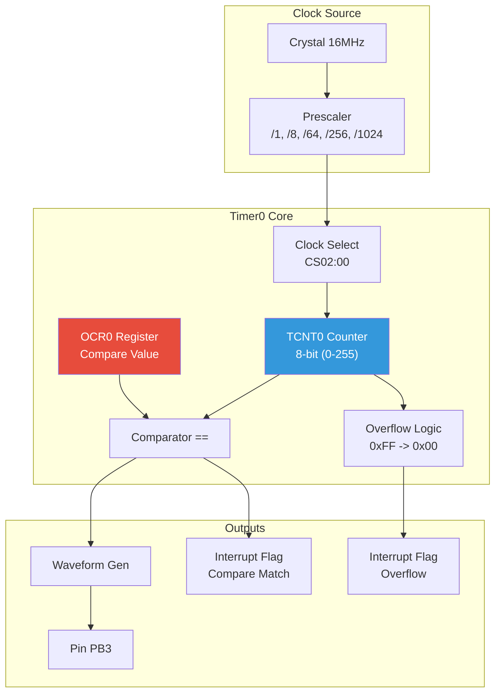
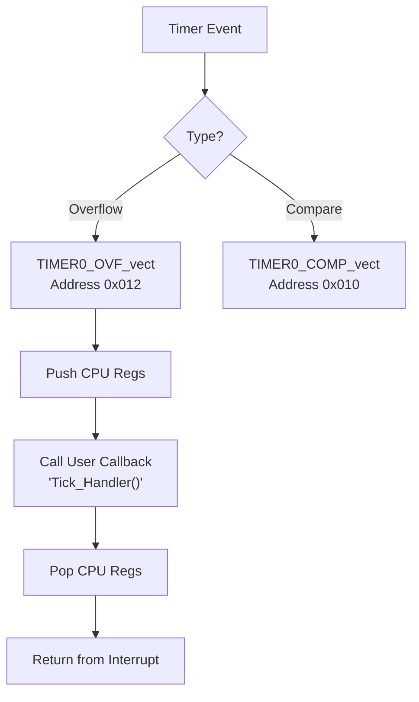
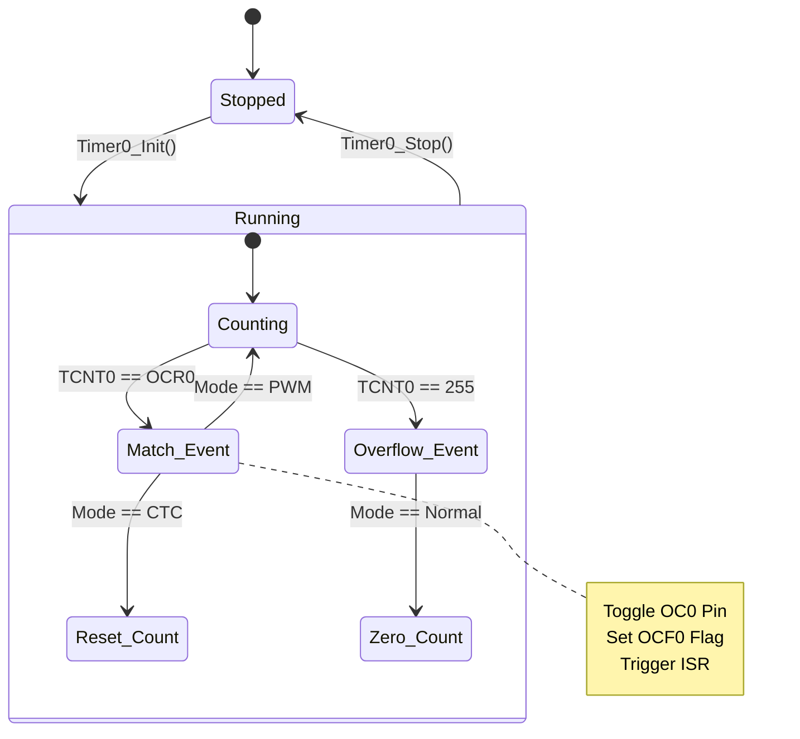
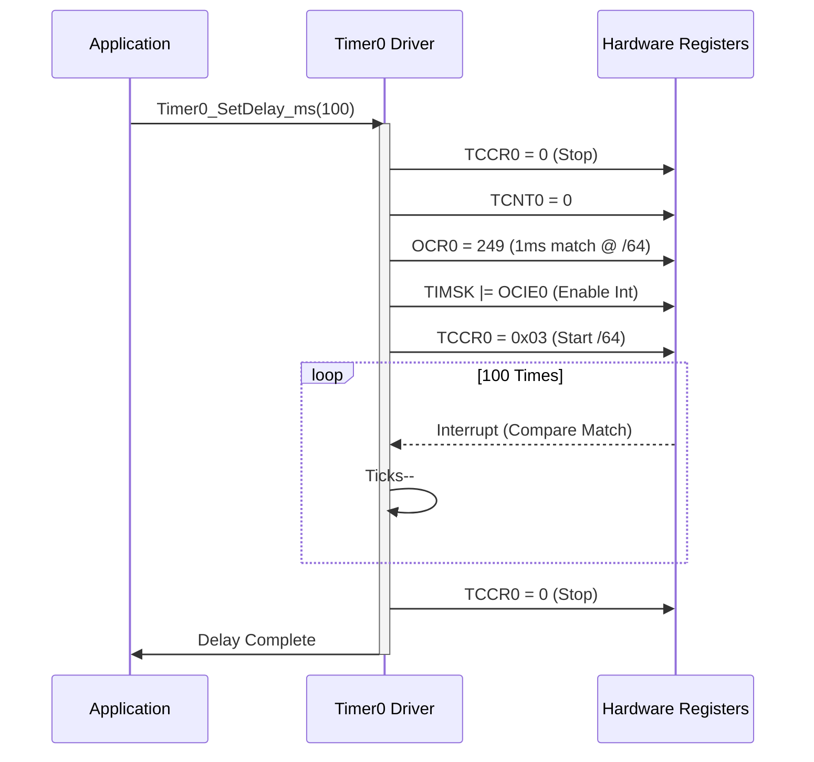
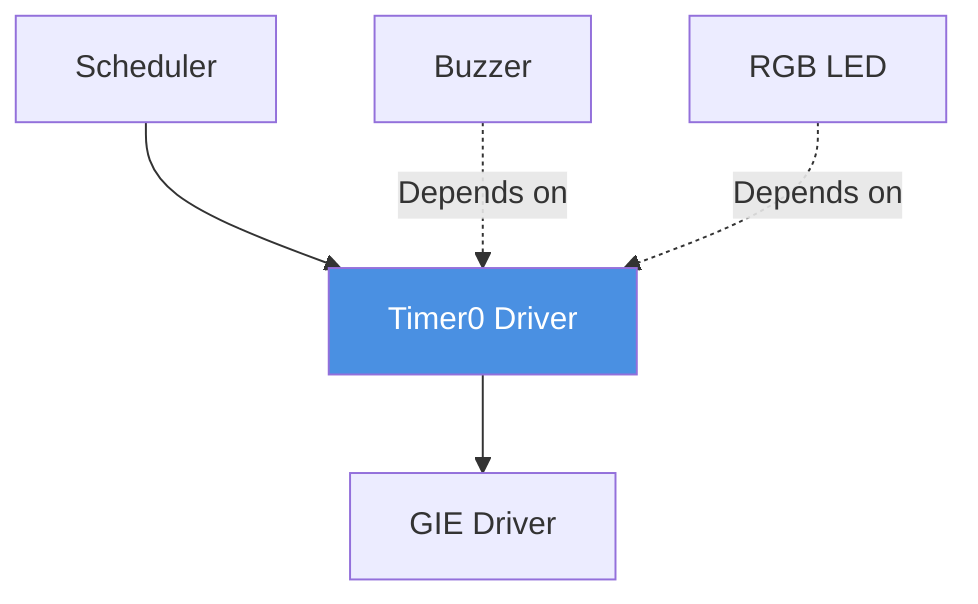

# ⏱️ Timer0 Driver - 8-bit Timer/Counter

**Timer0 Driver**

**Smart Energy Management System - Precision Timing & PWM Generation**

_Developed by Gestell Company - Professional Embedded Solutions_

---

## 📋 Table of Contents

- [Module Overview](#-1-module-overview)
- [Hardware Architecture](#-2-hardware-architecture)
- [Operating Modes](#-3-operating-modes)
- [PWM Frequency Tables](#-4-pwm-frequency-calculation-tables)
- [Interrupt Handling](#-5-interrupt-handling)
- [State Machine](#-6-state-machine)
- [Sequence Diagrams](#-7-sequence-diagrams)
- [Configuration](#-8-configuration-parameters)
- [Dependencies](#-9-module-dependencies)

---

## 🔗 Related Documentation

| Document                                                           | Description | Status       |
| ------------------------------------------------------------------ | ----------- | ------------ |
| **[Buzzer_Driver.md](../../HAL_Layer/Buzzer/Buzzer_Driver.md)**    | Uses PWM    | ✅ Available |
| **[RGB_LED_Driver.md](../../HAL_Layer/RGB_LED/RGB_LED_Driver.md)** | Uses PWM    | ✅ Available |
| **[GIE_Driver.md](../GIE/GIE_Driver.md)**                          | Interrupts  | ✅ Available |

---

## 📋 1. Module Overview

### Purpose and Role

Timer0 is an 8-bit general-purpose timer/counter peripheral on the ATmega32. It is the workhorse for generating accurate time bases and Pulse Width Modulation (PWM) signals. In the Smart Energy System, Timer0 is primarily dedicated to **Waveform Generation** (for the Buzzer or Red LED channel) or **System Ticking** (if Timer1 is busy).

### Key Responsibilities

- **Precision Delays**: Generating hardware-timed delays independent of software execution.
- **PWM Output**: Driving Pin PB3 (OC0) with Phase Correct or Fast PWM signals.
- **Event Counting**: Counting external events on Pin T0 (PB0) (Alternative mode).
- **System Heartbeat**: Generating a 1ms or 10ms OS tick interrupt.

### Requirements Traceability

| Requirement ID   | Description            | Implementation             |
| :--------------- | :--------------------- | :------------------------- |
| **REQ-IO-007**   | Buzzer Control Pin PB4 | PWM / Frequency Generation |
| **REQ-DISP-013** | Buzzer Duration Config | Timer Delay functions      |
| **REQ-DISP-010** | RGB LED PWM (PB3)      | Timer0 OC0 Output          |

---

## 2. Hardware Architecture

### 2.1 Block Diagram

### 2.2 Register Map

- **TCNT0**: The actual counter value.
- **OCR0**: The "trigger" value. When TCNT0 matches this, an event occurs.
- **TCCR0**: Control register (Mode Selection, Prescaler, Output behavior).
- **TIMSK**: Interrupt Mask (Enable/Disable ISRs).
- **TIFR**: Interrupt Flags (Status).

---

## 3. Operating Modes

### 3.1 Normal Mode

- Counter runs 0 to 255, then rolls over.
- Used for: Generating Overflow Interrupts (System Tick).
- frequency: $f_{OVF} = f_{clk} / (256 \times N)$

### 3.2 CTC (Clear Timer on Compare)

- Counter runs 0 to OCR0, then resets to 0.
- Used for: Precise frequency generation (e.g., 2.5kHz for Buzzer).
- frequency: $f_{OC0} = f_{clk} / (2 \times N \times (1+OCR0))$

### 3.3 Fast PWM

- Counter runs 0 to 255.
- Output transitions High/Low at match.
- Used for: Motor Control, LED Brightness.
- frequency: $f_{PWM} = f_{clk} / (256 \times N)$

### 3.4 Phase Correct PWM

- Counter counts Up (0->255) then Down (255->0).
- Used for: High-precision motor control (less noise).
- frequency: $f_{PWM} = f_{clk} / (510 \times N)$

---

## 4. PWM Frequency Calculation Tables

For $F_{CPU} = 16 MHz$.

### 4.1 Fast PWM Mode (Modulus 256)

| Prescaler (N) | Calculation   | Output Frequency | Suitable For                |
| ------------- | ------------- | ---------------- | --------------------------- |
| **1**         | $16M / 256$   | **62.50 kHz**    | DC-DC Converters            |
| **8**         | $2M / 256$    | **7.81 kHz**     | LED Dimming (High Speed)    |
| **64**        | $250k / 256$  | **976 Hz**       | Motor Control, LED Standard |
| **256**       | $62.5k / 256$ | **244 Hz**       | Relays (Avoid)              |
| **1024**      | $15.6k / 256$ | **61 Hz**        | Visual Blink                |

### 4.2 CTC Mode (Variable Modulus)

_Example Target: 2500 Hz (Buzzer)_

1.  Try N=64.
2.  $2500 = 16000000 / (2 \times 64 \times (1+OCR))$
3.  $1+OCR = 125000 / 2500 = 50$
4.  $OCR = 49$.
5.  **Perfect Match**.

---

## 5. Interrupt Handling

Timer0 provides two interrupt vectors.

**Latency Warning**: An ISR executes every $1/f_{freq}$. At 62.5kHz, the ISR fires every 16µs. If the ISR takes 20µs to run, the system hangs (Starvation). **Always use Prescalers to keep ISR rate manageable (< 5kHz).**

---

## 6. State Machine

---

## 7. Sequence Diagrams

### 7.1 Software Delay Implementation

---

## 8. Configuration Parameters

Configured in `Timer0_Config.h`.

| Parameter          | Options                                  | Default        | Description               |
| ------------------ | ---------------------------------------- | -------------- | ------------------------- |
| `TIMER0_MODE`      | `NORMAL`, `CTC`, `FAST_PWM`, `PHASE_PWM` | `CTC`          | Waveform generation mode. |
| `TIMER0_PRESCALER` | `1`, `8`, `64`, `256`, `1024`            | `64`           | Clock division factor.    |
| `TIMER0_OC0_MODE`  | `DISCONNECTED`, `TOGGLE`, `CLEAR`, `SET` | `DISCONNECTED` | Pin PB3 behavior.         |
| `TIMER0_INTERRUPT` | `ENABLE`, `DISABLE`                      | `DISABLE`      | Global interrupt usage.   |

---

## 9. Module Dependencies

### 9.1 Conflict Resolution

Since Timer0 is shared hardware, it cannot simultaneously be a System Tick (Normal Mode) AND a Buzzer Driver (Fast PWM Mode).
**Solution**:

- **System Tick**: Use Timer1 (16-bit) or Watchdog Timer.
- **Buzzer/LED**: Give exclusive access of Timer0 to them.
- **Driver Lock**: The driver implements an internal `IsBusy` flag to prevent overwriting configuration while active.

---

**Built with ❤️ by Gestell Team**

_Professional Embedded Systems Engineering_

**Copyright © 2025-2026 Gestell Company - All Rights Reserved**

