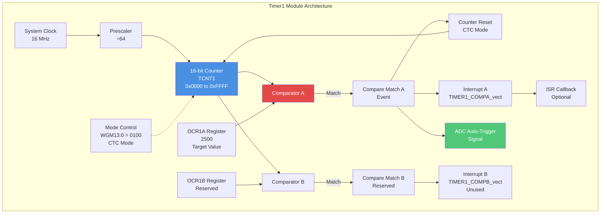
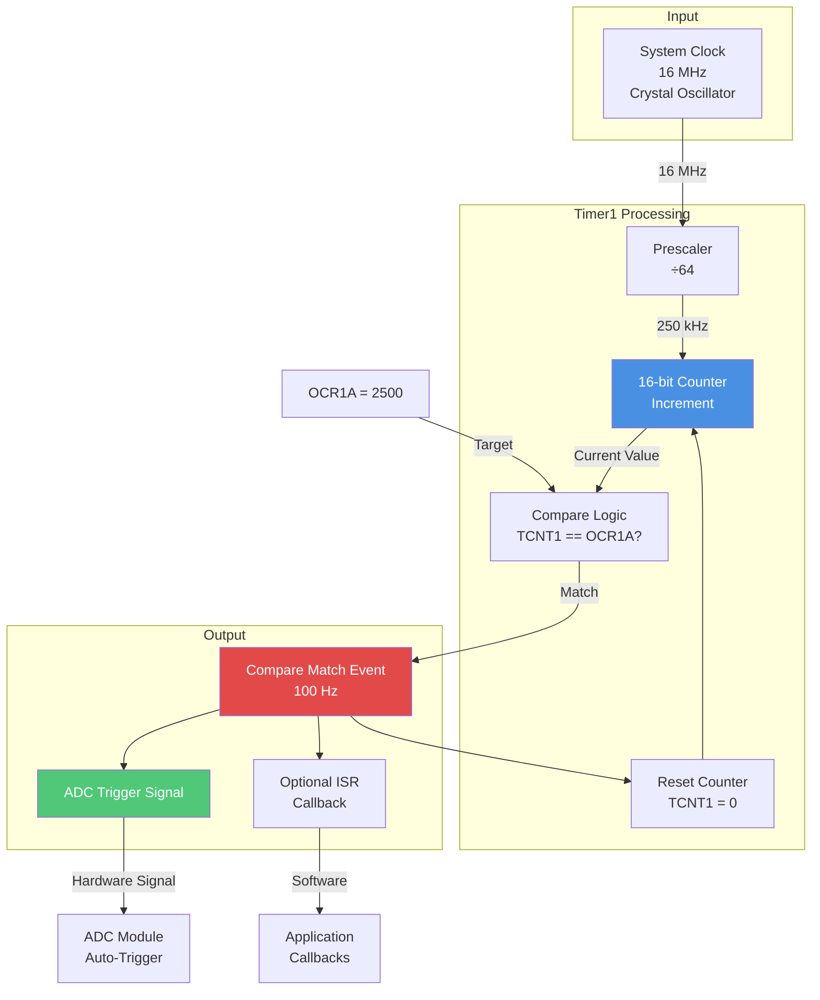
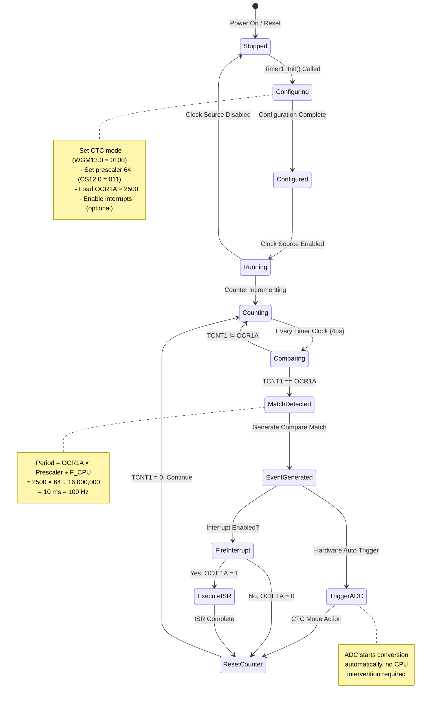
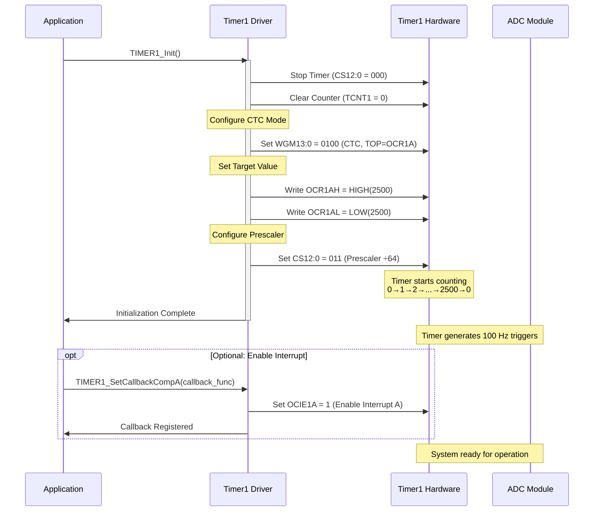
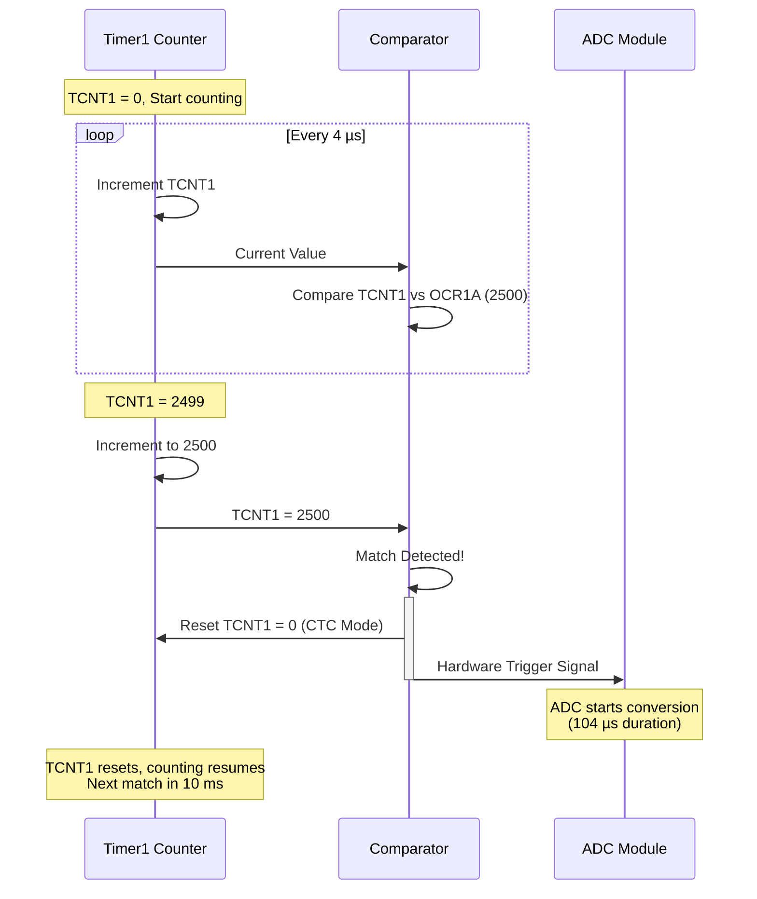
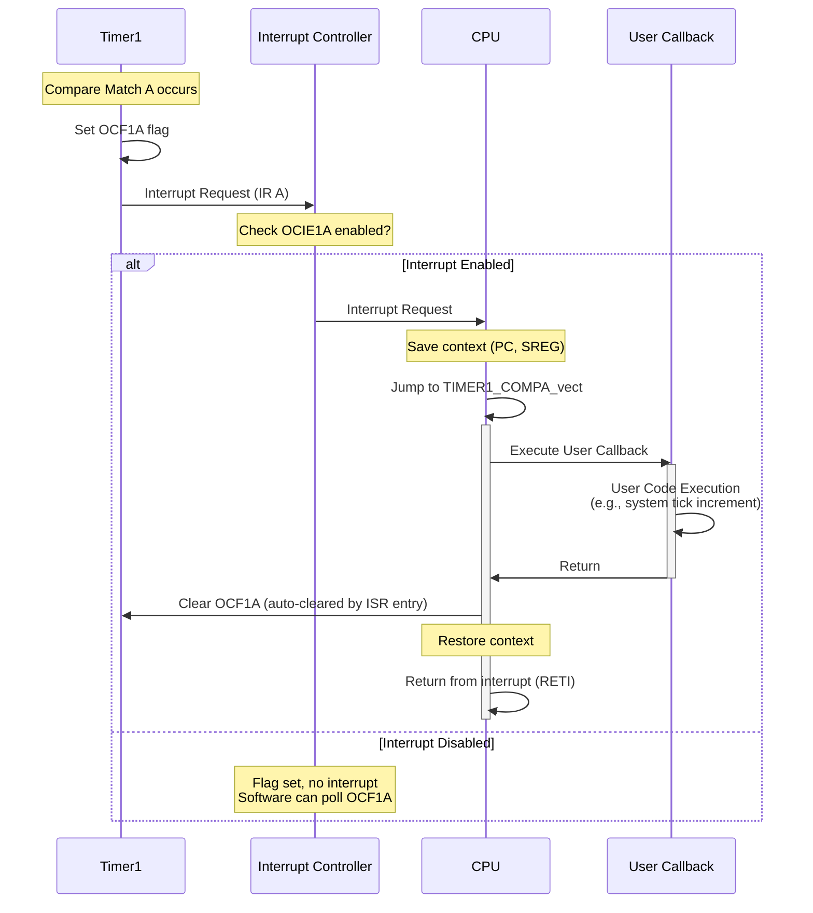
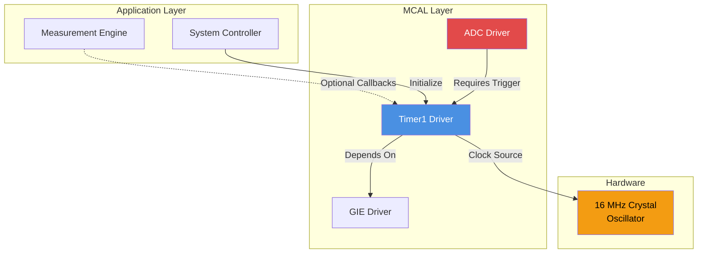
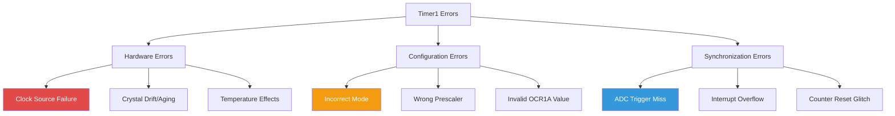

# 🕒 Timer1 Driver - 16-bit Timer/Counter

<div align="center">


**Timer1 Driver**

**Smart Energy Management System - Precision System Timing**

_Developed by Gestell Company - Professional Embedded Solutions_

</div>

---

## 📋 Table of Contents

- [Module Overview](#-1-module-overview)
- [Architecture](#-2-architecture-diagram)
- [Hardware Interface](#-3-hardware-interface)
- [Data Flow](#-4-data-flow-diagram)
- [State Machine](#-5-state-machine)
- [Sequence Diagrams](#-6-sequence-diagrams)
- [Dependencies](#-7-module-dependencies)

---

## 🔗 Related Documentation

| Document                                  | Description    | Status       |
| ----------------------------------------- | -------------- | ------------ |
| **[ADC_Driver.md](../ADC/ADC_Driver.md)** | Trigger Target | ✅ Available |
| **[GIE_Driver.md](../GIE/GIE_Driver.md)** | Interrupts     | ✅ Available |

---

## 📋 1. Module Overview

### Purpose and Role

Timer1 is a versatile 16-bit hardware timer peripheral that serves as the heartbeat of the Smart Energy Management System's data acquisition subsystem. Its primary role is to generate precise, periodic trigger signals at 100 Hz that synchronize ADC sampling operations.

### Key Responsibilities

- Generate precise 100 Hz timing signals for ADC auto-trigger
- Provide system tick for time-based operations
- Support PWM generation for RGB LED (optional future feature)
- Maintain accurate timing independent of CPU load
- Enable interrupt-driven periodic task execution

### Requirements Traceability

| Requirement ID   | Description              | Implementation                     |
| :--------------- | :----------------------- | :--------------------------------- |
| **REQ-IO-001**   | ADC SCAN 100 Hz          | CTC Mode, OCR1A=2499, Prescaler 64 |
| **REQ-ARCH-007** | Timer-based ADC Sampling | Hardware Auto-Trigger set          |
| **REQ-MEAS-003** | 100 Samples/sec          | Matches 100Hz Trigger              |

### Hardware Peripheral

Utilizes ATmega32's Timer1 16-bit timer/counter with:

- 16-bit resolution (0-65535 count range)
- Multiple operating modes (Normal, CTC, PWM)
- Programmable prescaler (1, 8, 64, 256, 1024)
- Two independent output compare units (A and B)
- Two PWM channels
- Input capture capability
- Multiple interrupt sources

---

## 2. Architecture Diagram



---

## 3. Hardware Interface

### Register Overview

**Counter Registers:**

- **TCNT1H:TCNT1L** (16-bit): Current counter value, increments each timer clock cycle
- **OCR1AH:OCR1AL** (16-bit): Output Compare Register A, target value for compare match
- **OCR1BH:OCR1BL** (16-bit): Output Compare Register B, reserved for future use

**Control Registers:**

- **TCCR1A** (Timer/Counter Control Register A): Waveform generation mode, output compare behavior
- **TCCR1B** (Timer/Counter Control Register B): Clock source selection, prescaler, upper WGM bits
- **TIMSK** (Timer/Counter Interrupt Mask): Interrupt enable flags
- **TIFR** (Timer/Counter Interrupt Flag Register): Interrupt status flags

### Pin Configuration

| Pin | Function             | Current Use   | Future Use                 |
| --- | -------------------- | ------------- | -------------------------- |
| PD4 | OC1B (PWM Output B)  | Not connected | RGB LED PWM (Blue channel) |
| PD5 | OC1A (PWM Output A)  | Not connected | RGB LED PWM (Red channel)  |
| PD6 | ICP1 (Input Capture) | Not connected | Frequency measurement      |

### Electrical Characteristics

**Timing Specifications:**

- Counter resolution: 16 bits (65,536 counts)
- Maximum count frequency: CPU clock (16 MHz max)
- Minimum period: 1 CPU clock cycle (62.5 ns @ 16 MHz)
- Maximum period: 65,536 × 1024 prescaler ÷ 16 MHz = 4.194 seconds

**Accuracy:**

- Crystal accuracy: ±20 ppm typical (±0.002%)
- Temperature drift: ±30 ppm over -40°C to +85°C
- Aging: ±5 ppm per year
- Total system accuracy: ±0.01% typical

---

## 4. Data Flow Diagram



### Data Flow Description

**Input Stage:**

1. 16 MHz system clock from crystal oscillator
2. Prescaler divides by 64 → 250 kHz timer clock
3. Counter increments every 4 µs

**Processing Stage:**

1. 16-bit counter (TCNT1) increments from 0
2. Comparator continuously checks TCNT1 against OCR1A (2500)
3. When match occurs, event generated

**Output Stage:**

1. Counter automatically resets to 0 (CTC mode)
2. Hardware trigger signal sent to ADC peripheral
3. Optional interrupt fires for software callback
4. Cycle repeats: 2500 counts × 4 µs = 10 ms period = 100 Hz

---

## 5. State Machine



### State Descriptions

**Stopped:**

- Timer peripheral inactive
- No clock source selected
- Counter frozen at current value
- Minimal power consumption

**Configuring:**

- Registers being written
- Mode selection in progress
- Prescaler configuration
- Compare values being loaded

**Configured:**

- All registers set correctly
- Ready to start counting
- Waiting for clock source enable

**Running:**

- Clock source active
- Timer operational
- Counter incrementing

**Counting:**

- TCNT1 incrementing every timer clock cycle
- Normal operation between compare matches

**Comparing:**

- Hardware continuously compares TCNT1 with OCR1A
- No CPU involvement
- Single clock cycle operation

**MatchDetected:**

- TCNT1 value equals OCR1A
- Compare match flag (OCF1A) set
- Triggers multiple simultaneous actions

**EventGenerated:**

- Compare match event distributed to multiple destinations
- Hardware trigger to ADC
- Interrupt request (if enabled)

**TriggerADC:**

- Hardware signal sent to ADC peripheral
- ADC starts conversion automatically
- No software delay or jitter

**FireInterrupt:**

- Conditional based on OCIE1A bit
- If enabled, ISR executes
- If disabled, flag still set but no interrupt

**ExecuteISR:**

- CPU executing TIMER1_COMPA_vect
- User callback invoked (if registered)
- Can perform additional tasks

**ResetCounter:**

- CTC mode automatically resets TCNT1 to 0
- Cycle begins again immediately
- Ensures precise periodic behavior

---

## 6. Sequence Diagrams

### Initialization Sequence



### Normal Operation - ADC Triggering



### Optional ISR Callback Sequence



### Timing Diagram - 100 Hz Operation

```mermaid
gantt
    title Timer1 100Hz Timing (10ms Period)
    dateFormat X
    axisFormat %L ms

    section Counter
    Count 0→2500 :active, 0, 10ms
    Count 0→2500 :active, 10, 10ms
    Count 0→2500 :active, 20, 10ms

    section Events
    Compare Match :milestone, crit, 10, 10ms
    Compare Match :milestone, crit, 20, 20ms
    Compare Match :milestone, crit, 30, 30ms

    section ADC Trigger
    Trigger Pulse :crit, 10, 0.001ms
    Trigger Pulse :crit, 20, 0.001ms
    Trigger Pulse :crit, 30, 0.001ms
```



---

## 7. Module Dependencies

### Dependency Diagram



### Dependencies On Other Modules

**Global Interrupt Enable (GIE):**

- If using Timer1 interrupts for callbacks, global interrupts must be enabled
- Not required if using Timer1 only for ADC triggering without ISR
- Must be initialized before enabling Timer1 interrupts

**System Clock (Hardware):**

- Requires stable 16 MHz crystal oscillator
- Clock accuracy directly affects Timer1 timing precision
- Clock must be configured during system initialization

### Modules That Depend On This Module

**ADC Driver:**

- Critically depends on Timer1 for auto-trigger functionality
- Requires precise 100 Hz trigger signal
- ADC cannot operate in auto-trigger mode without Timer1
- Timing synchronization is essential for RMS calculations

**Measurement Engine:**

- Indirectly depends on Timer1 through ADC
- Relies on consistent sampling rate for energy calculations
- May optionally register callback for periodic processing tasks

**System Controller:**

- May use Timer1 compare match as system tick
- Can register callback for periodic state machine updates
- Optional dependency for time-based scheduling

**RGB LED Driver (Future):**

- Could use Timer1 PWM channels for color control
- OC1A/OC1B pins available for hardware PWM
- Would require reconfiguration from CTC to PWM mode

---

## 8. Configuration Parameters

### Timing Calculation

**Formula for CTC Mode Period:**

```
Period = (OCR1A + 1) × Prescaler ÷ F_CPU
Frequency = F_CPU ÷ (Prescaler × (OCR1A + 1))
```

**Current Configuration:**

| Parameter             | Value         | Calculation                |
| --------------------- | ------------- | -------------------------- |
| CPU Frequency (F_CPU) | 16,000,000 Hz | System clock               |
| Prescaler             | 64            | CS12:0 = 011               |
| OCR1A Value           | 2499          | Loaded in register         |
| Period                | 10 ms         | (2499+1) × 64 ÷ 16,000,000 |
| Frequency             | 100 Hz        | 16,000,000 ÷ (64 × 2500)   |
| Timer Clock           | 250 kHz       | 16 MHz ÷ 64                |
| Count Increment       | 4 µs          | 1 ÷ 250 kHz                |

### Mode Configuration

| Mode              | WGM13:0  | TOP       | Update OCR1A  | TOV1 Flag Set |
| ----------------- | -------- | --------- | ------------- | ------------- |
| **CTC (Used)**    | **0100** | **OCR1A** | **Immediate** | **On MAX**    |
| Normal            | 0000     | 0xFFFF    | Immediate     | On MAX        |
| PWM Phase Correct | 0001     | 0x00FF    | On TOP        | On BOTTOM     |
| Fast PWM          | 0101     | OCR1A     | On BOTTOM     | On TOP        |

**Why CTC Mode:**

- Provides precise periodic timing
- Automatic counter reset eliminates software overhead
- OCR1A define exact frequency
- No need to manually reload counter
- Ideal for triggering periodic events

### Prescaler Options

| CS12:0  | Prescaler     | Timer Clock @ 16MHz | Max Period | Use Case               |
| ------- | ------------- | ------------------- | ---------- | ---------------------- |
| 000     | Timer stopped | 0 Hz                | -          | Disabled               |
| 001     | 1             | 16 MHz              | 4.096 ms   | High-speed PWM         |
| 010     | 8             | 2 MHz               | 32.768 ms  | Fast timing            |
| **011** | **64**        | **250 kHz**         | **262 ms** | **ADC trigger (used)** |
| 100     | 256           | 62.5 kHz            | 1.048 s    | Slow timing            |
| 101     | 1024          | 15.625 kHz          | 4.194 s    | Very slow timing       |

**Selection Rationale:**

- Prescaler 64 chosen for 100 Hz output
- Provides good resolution (4 µs per count)
- OCR1A = 2500 is well within 16-bit range
- Allows easy frequency adjustment if needed

### Interrupt Configuration

| Interrupt Source | Enable Bit | Flag Bit | Vector            | Current Use       |
| ---------------- | ---------- | -------- | ----------------- | ----------------- |
| Compare Match A  | OCIE1A     | OCF1A    | TIMER1_COMPA_vect | Optional callback |
| Compare Match B  | OCIE1B     | OCF1B    | TIMER1_COMPB_vect | Unused            |
| Overflow         | TOIE1      | TOV1     | TIMER1_OVF_vect   | Unused            |
| Input Capture    | TICIE1     | ICF1     | TIMER1_CAPT_vect  | Unused            |

---

## 9. Error Handling Strategy

### Error Detection Mechanisms

**Clock Source Failure:**

- Timer stops incrementing if oscillator fails
- Watchdog can detect lack of periodic activity
- System hangs if critical timing lost

**Configuration Error:**

- Incorrect WGM bits lead to wrong mode
- Wrong prescaler causes incorrect frequency
- Mismatched OCR1A value gives wrong period

**Overflow Risk:**

- In non-CTC modes, counter can overflow unexpectedly
- Register access during counting may cause glitches
- 16-bit read/write must be atomic

**Synchronization Loss:**

- ADC may miss triggers if not properly configured
- Timing drift if prescaler changed while running
- Phase shifts if counter reset manually

### Error Classification



### Recovery Procedures

**Clock Source Monitoring:**

- Watchdog timer monitors system activity
- If no ADC samples received, assume clock failure
- System reset required for recovery
- Hardware design should include clock monitoring circuit

**Configuration Validation:**

- Verify registers after initialization
- Read back WGM, CS, and OCR1A values
- Compare with expected configuration
- Re-initialize if mismatch detected

**Synchronization Recovery:**

- If ADC misses trigger, check Timer1 status
- Verify OCF1A flag toggling periodically
- Reset both Timer1 and ADC if desynchronized
- Clear all flags and restart

**Atomic Access Protection:**

- Disable interrupts during 16-bit register access
- Read TCNT1L before TCNT1H
- Write TCNT1H before TCNT1L
- Hardware automatically handles access locking

### Fault Tolerance

**Graceful Degradation:**

- If ISR callback fails, timer continues triggering ADC
- ADC operation independent of software callback
- Critical function (ADC trigger) hardware-based

**Redundancy:**

- Backup timing via software polling if interrupt fails
- Alternative trigger sources available for ADC
- System can detect and switch to software triggering

**Recovery Time:**

- Re-initialization takes < 1 ms
- Minimal data loss (1-2 samples)
- System resumes normal operation quickly

---

## 10. Performance Characteristics

### Timing Accuracy

| Metric             | Value                | Notes                            |
| ------------------ | -------------------- | -------------------------------- |
| Designed Frequency | 100.0000 Hz          | Target                           |
| Actual Frequency   | 100.0000 Hz ± 0.002% | Crystal accuracy limited         |
| Period             | 10.000 ms ± 0.2 µs   | ±20 ppm crystal                  |
| Jitter             | < 62.5 ns            | Single clock cycle precision     |
| Long-term Drift    | < 0.01%              | Over operating temperature range |

### Resource Usage

**CPU Utilization:**

- Hardware operation: 0% CPU (no software intervention)
- ISR callback (if used): < 10 µs per interrupt = 0.1% @ 100 Hz
- Initialization overhead: ~50 µs (one-time)

**Memory (SRAM):**

- Driver state: ~4 bytes (callback pointer)
- No buffers required
- Total: ~4 bytes

**Program Memory (Flash):**

- Initialization code: ~80 bytes
- ISR wrapper: ~40 bytes
- Helper functions: ~60 bytes
- Total: ~180 bytes

**Hardware Resources:**

- Timer1 peripheral: 100% dedicated
- One interrupt vector: TIMER1_COMPA_vect (if used)
- No GPIO pins consumed (unless using PWM outputs)

### Frequency Range Capabilities

**Minimum Frequency:**

- Prescaler 1024, OCR1A = 65535
- F_min = 16,000,000 ÷ (1024 × 65536) = 0.238 Hz (4.2 second period)

**Maximum Frequency:**

- Prescaler 1, OCR1A = 1 (minimum practical)
- F_max = 16,000,000 ÷ (1 × 2) = 8,000,000 Hz = 8 MHz

**Practical Range:**

- Recommended: 1 Hz to 100 kHz
- ADC application: 50-200 Hz (current: 100 Hz)

### Limitations

**Resolution Constraints:**

- 16-bit counter limits maximum count to 65,535
- Frequency/period granularity depends on prescaler choice
- Cannot achieve all arbitrary frequencies precisely

**Mode Conflicts:**

- Cannot use CTC mode and PWM mode simultaneously
- OCR1A used as TOP in CTC mode, unavailable for PWM
- Must choose between timing or PWM functionality

**Pin Usage:**

- OC1A/OC1B pins reserved if PWM needed
- Current design: pins available, not used
- Future PWM feature would require pin allocation

**Interrupt Latency:**

- ISR callback introduces jitter if callback duration varies
- Maximum ISR duration should be < 10 ms to avoid next trigger
- Recommended ISR duration: < 100 µs

**Power Consumption:**

- Timer runs continuously, no automatic sleep
- ~100 µA additional current (estimate)
- Can be disabled during low-power modes if not needed

---

## Implementation Notes

### Key Design Decisions

**Why CTC Mode:**

- Automatic counter reset provides precise periodic operation
- No software intervention needed for frequency generation
- Hardware trigger to ADC eliminates jitter
- Simple configuration and predictable behavior

**Why 100 Hz:**

- Satisfies Nyquist for 50/60 Hz AC measurement (>2× signal frequency)
- Provides sufficient samples for accurate RMS calculation (128 samples = 1.28s)
- Balances timing precision with CPU/memory overhead
- Standard rate for power monitoring applications

**Why Prescaler 64:**

- Gives convenient OCR1A = 2500 for 100 Hz
- Provides 4 µs count resolution for fine adjustments
- Middle-range prescaler allows easy frequency scaling
- Good balance between range and resolution

**Why Hardware Auto-Trigger:**

- Zero software jitter (timing precision in nanoseconds)
- Zero CPU overhead for triggering
- Deterministic, repeatable behavior
- Immune to interrupt latency and CPU load

### Optimization Opportunities

**Future Enhancements:**

- Add runtime frequency adjustment API
- Implement dual-channel PWM for RGB LED control
- Add input capture for frequency measurement
- Support multiple callback registration

**Power Optimization:**

- Disable timer during system sleep modes
- Use Timer0 or Timer2 for wake-up timing
- Gate timer clock when ADC not needed

**Flexibility Improvements:**

- Make frequency configurable at runtime
- Support multiple trigger rates for different sensors
- Add phase-locked loop for external synchronization

---

---

## 📞 Support & Contact

**Project Information**:

- **Project Name**: Smart Energy Management System
- **Development Company**: Gestell - Professional Embedded Solutions

**Technical Support**: Hisham4Ahmed@gmail.com

---

## 📄 Document Control

| Attribute            | Value                       |
| -------------------- | --------------------------- |
| **Document Type**    | Timer1 Driver Documentation |
| **Document Status**  | Active                      |
| **Document Version** | 2.0                         |
| **Last Updated**     | January 2026                |
| **Prepared By**      | Gestell Engineering Team    |

---

<div align="center">

**Built with ❤️ by Gestell Team**

_Professional Embedded Systems Engineering_

**Copyright © 2025-2026 Gestell Company - All Rights Reserved**

</div>
