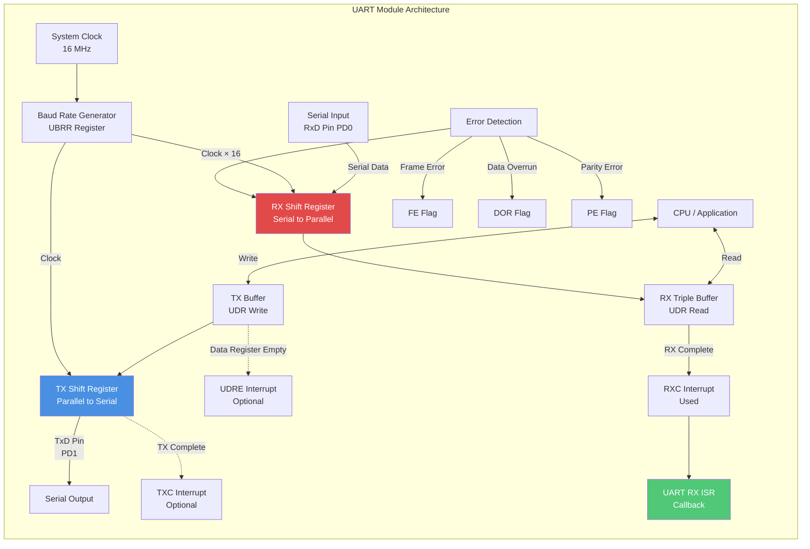
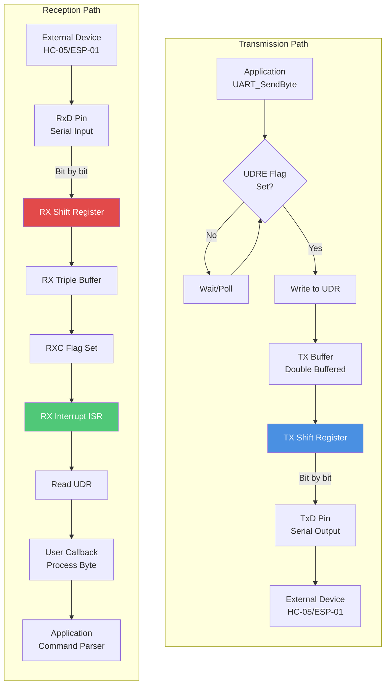
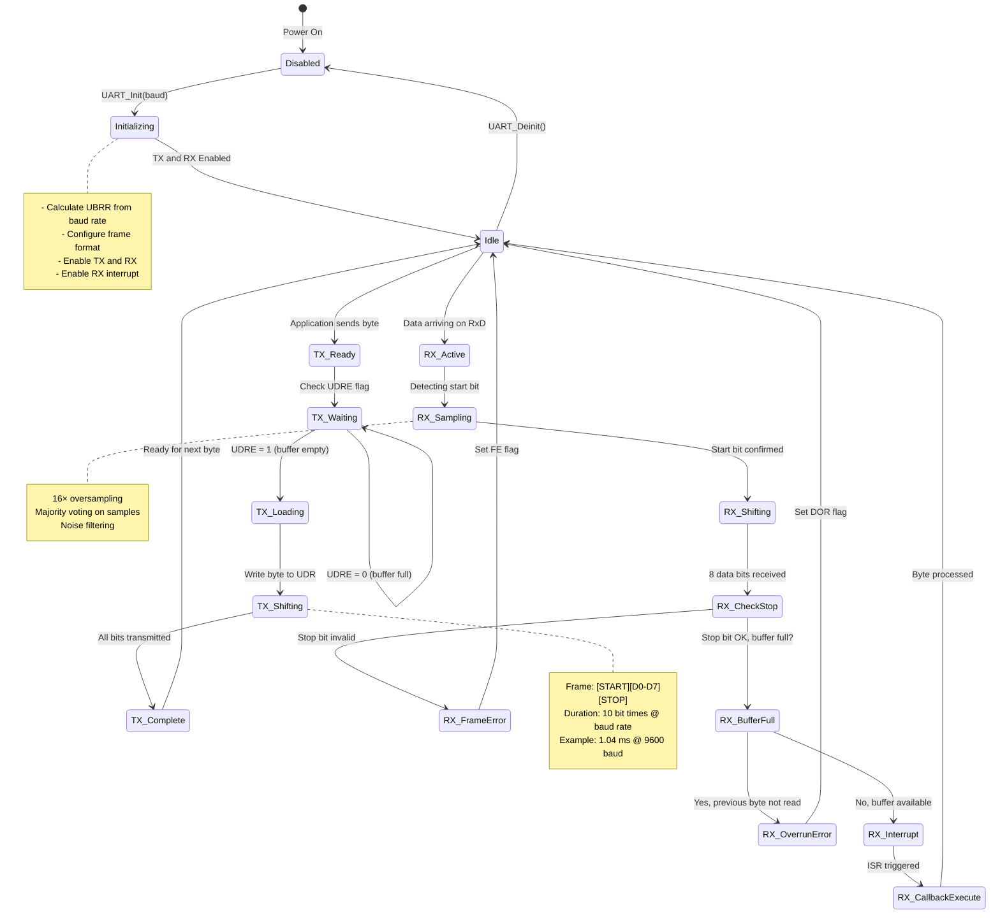
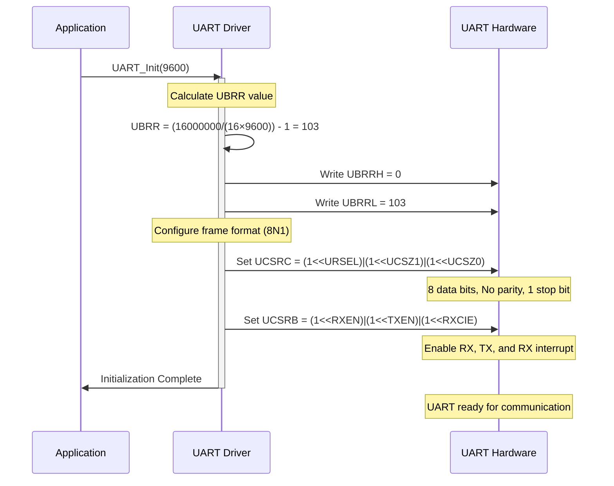
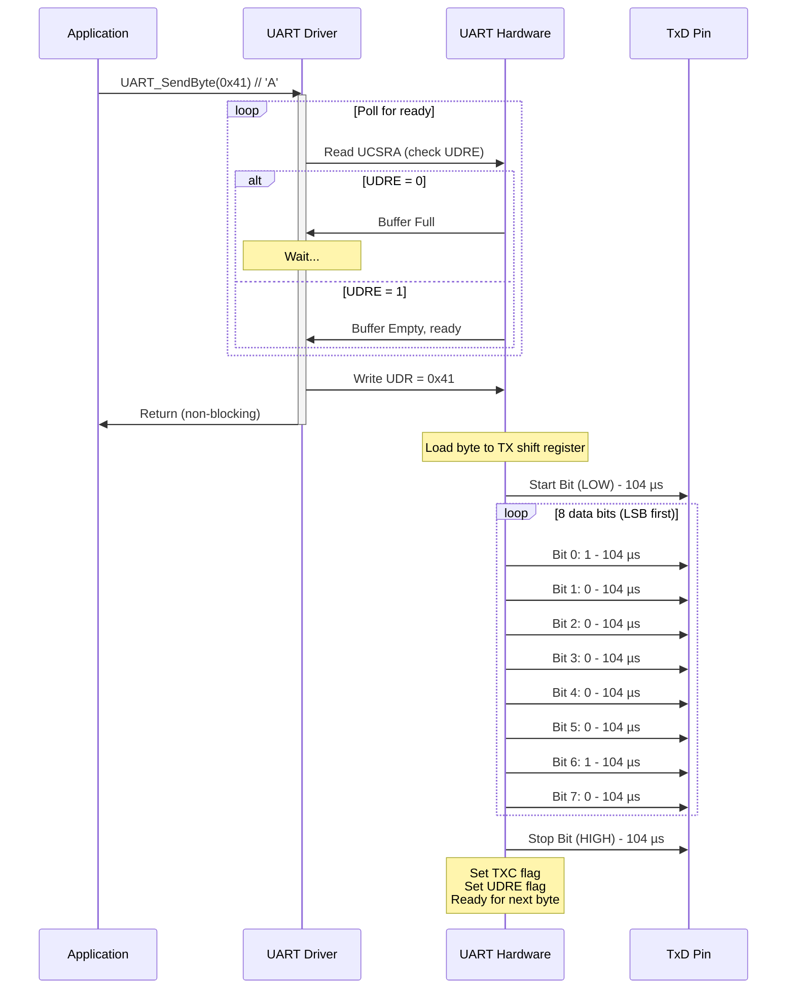
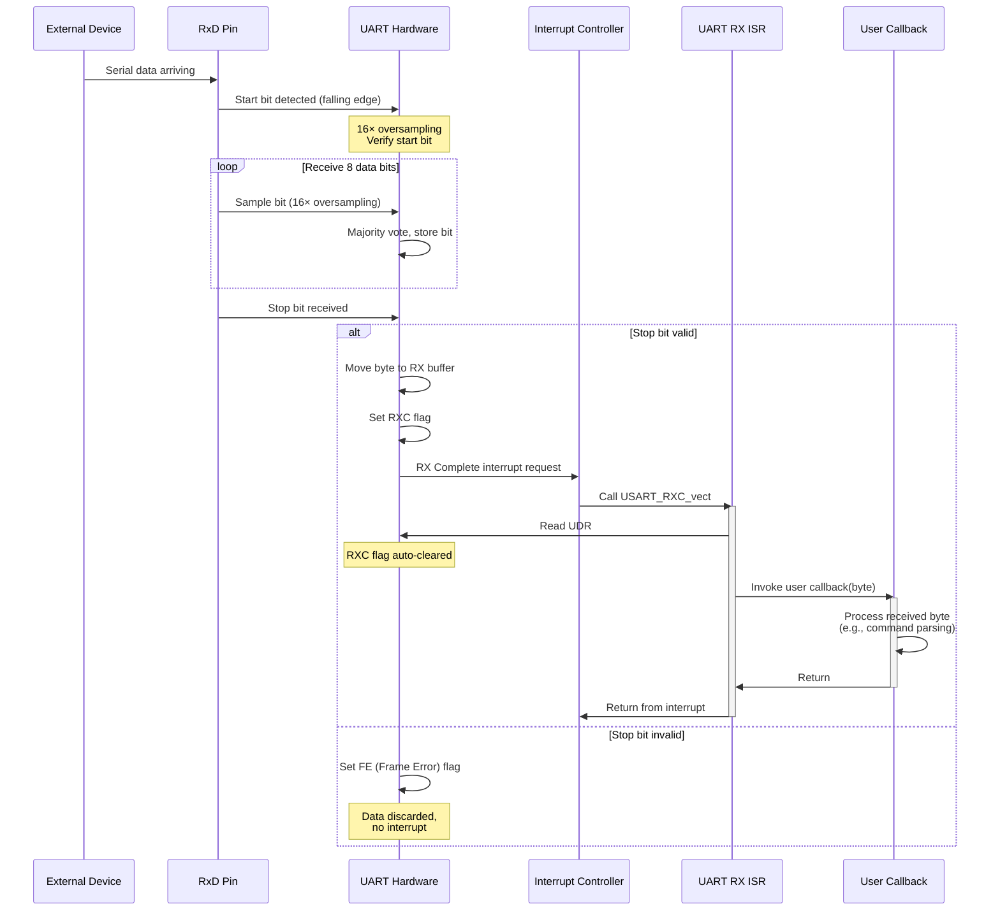
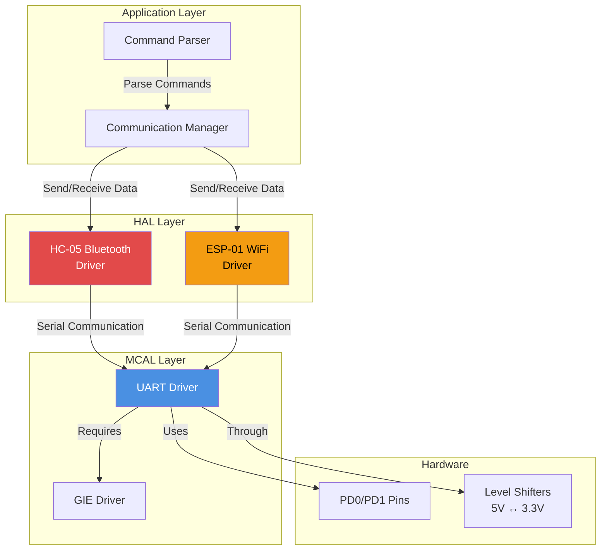
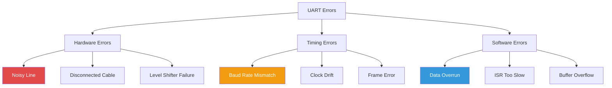

# UART Driver - Universal Asynchronous Receiver/Transmitter

**MCU**: ATmega32  
**Purpose**: Serial communication with external modules (HC-05 Bluetooth, ESP-01 WiFi)  
**Protocol**: Asynchronous serial communication

---

## 1. Module Overview

### Purpose and Role

The UART (Universal Asynchronous Receiver/Transmitter) driver provides bidirectional serial communication capability for the Smart Energy Management System. It serves as the primary communication interface for wireless connectivity modules, enabling the system to transmit energy measurement data to mobile devices and cloud platforms.

### Key Responsibilities

- Asynchronous serial data transmission and reception
- Configurable baud rate for compatibility with different modules
- Interrupt-driven reception for responsive communication
- Blocking and non-blocking transmission modes
- Frame formatting (start bit, data bits, parity, stop bits)
- Error detection (framing, parity, overrun)

### Hardware Peripheral

Utilizes ATmega32's built-in USART (Universal Synchronous and Asynchronous Receiver Transmitter):

- Full-duplex operation (simultaneous TX and RX)
- Programmable baud rate generator
- 5 to 9 data bit support
- Optional parity (even, odd, none)
- 1 or 2 stop bits
- Three separate interrupts (TX complete, RX complete, Data Register Empty)
- Double-buffered transmission and triple-buffered reception

---

## 2. Architecture Diagram



---

## 3. Hardware Interface

### Pin Configuration

| Pin | Function            | Direction | Connected To                             |
| --- | ------------------- | --------- | ---------------------------------------- |
| PD0 | RxD (Receive Data)  | Input     | HC-05 TX / ESP-01 TX                     |
| PD1 | TxD (Transmit Data) | Output    | HC-05 RX / ESP-01 RX (via level shifter) |

### Level Shifting Requirements

**ATmega32 (5V) ↔ ESP-01 (3.3V):**

- **RxD (ATmega input)**: Direct connection OK (3.3V HIGH recognized as logic 1)
- **TxD (ATmega output)**: Voltage divider required (5V → 3.3V)
  - R1 = 1kΩ (to TxD)
  - R2 = 2kΩ (to GND)
  - Output = 5V × (2kΩ / 3kΩ) = 3.3V

**ATmega32 (5V) ↔ HC-05 (3.3V):**

- Same level shifting as ESP-01
- HC-05 typically more tolerant but shifter recommended

### Electrical Characteristics

**Signal Levels:**

- Logic HIGH (transmit): 4.2V - VCC (5V system)
- Logic LOW (transmit): 0V - 0.8V
- Input threshold: ~2.5V (typical)

**Timing:**

- Baud rate accuracy: ±2% tolerance for reliable communication
- Start bit: One bit time of logic LOW
- Stop bit: One or two bit times of logic HIGH
- Oversampling: 16× clock for noise immunity

### Register Overview

**UDR (USART Data Register):**

- Shared register for TX and RX
- Writing to UDR: Loads TX buffer
- Reading from UDR: Reads RX buffer

**UCSRA (USART Control and Status Register A):**

- RXC: RX Complete flag
- TXC: TX Complete flag
- UDRE: Data Register Empty flag
- FE: Frame Error flag
- DOR: Data OverRun flag
- PE: Parity Error flag
- U2X: Double speed mode

**UCSRB (USART Control and Status Register B):**

- RXCIE: RX Complete Interrupt Enable
- TXCIE: TX Complete Interrupt Enable
- UDRIE: Data Register Empty Interrupt Enable
- RXEN: Receiver Enable
- TXEN: Transmitter Enable
- UCSZ2: 9th data bit (character size)

**UCSRC (USART Control and Status Register C):**

- UMSEL: Mode Select (async/sync)
- UPM1:0: Parity Mode
- USBS: Stop Bit Select
- UCSZ1:0: Character Size
- UCPOL: Clock Polarity (sync mode only)

**UBRRH:UBRRL (Baud Rate Registers):**

- 12-bit value determining baud rate
- UBRR = (F_CPU / (16 × Baud)) - 1

---

## 4. Data Flow Diagram



### Data Flow Description

**Transmission Flow:**

1. Application calls UART transmit function with byte to send
2. Driver polls UDRE (Data Register Empty) flag
3. When UDRE set, byte written to UDR
4. Hardware copies byte to TX shift register
5. Shift register serializes data bit by bit
6. Data transmitted via TxD pin with start/stop framing
7. External device receives data on its RX pin

**Reception Flow:**

1. External device transmits serial data
2. Data arrives at ATmega32 RxD pin
3. RX shift register deserializes bits
4. Complete frame moved to RX buffer (triple buffered)
5. RXC (RX Complete) flag set automatically
6. Interrupt generated, ISR executes
7. ISR reads UDR (clears RXC flag)
8. User callback invoked with received byte
9. Application processes command/data

---

## 5. State Machine



### State Descriptions

**Disabled:**

- UART peripheral powered down
- TX and RX disabled
- Pins in high-impedance

**Initializing:**

- Calculating and loading UBRR value
- Configuring frame format (8N1)
- Enabling transmitter and receiver
- Setting up RX interrupt

**Idle:**

- UART ready for TX and RX
- No active transmission
- Listening for incoming data

**TX_Ready:**

- Application requested byte transmission
- Preparing to send

**TX_Waiting:**

- Polling UDRE flag
- Waiting for TX buffer availability
- May block if buffer full

**TX_Loading:**

- Writing byte to UDR register
- Hardware takes over from here

**TX_Shifting:**

- Shift register serializing data
- Transmitting frame bit by bit
- Duration: 10 bit times (8N1 format)

**TX_Complete:**

- All bits transmitted successfully
- TXC flag set
- Ready for next byte

**RX_Active:**

- Monitoring RxD pin for start bit
- 16× oversampling active
- Continuous operation

**RX_Sampling:**

- Start bit detected (falling edge)
- Verifying start bit validity
- Synchronizing to bit timing

**RX_Shifting:**

- Receiving data bits sequentially
- Building complete byte

**RX_CheckStop:**

- Verifying stop bit presence
- Framing validation

**RX_FrameError:**

- Stop bit missing or incorrect
- FE (Frame Error) flag set
- Data likely corrupted

**RX_BufferFull:**

- Checking if previous byte was read
- Overrun detection

**RX_OverrunError:**

- Previous byte not read before new byte arrived
- DOR (Data OverRun) flag set
- Data lost

**RX_Interrupt:**

- Valid byte received
- RXC flag set
- Interrupt triggered

**RX_CallbackExecute:**

- ISR reading UDR
- Invoking user callback
- Processing received data

---

## 6. Sequence Diagrams

### Initialization Sequence



### Byte Transmission Sequence



### Byte Reception Sequence (Interrupt-Driven)



### Timing Diagram - 9600 Baud Frame

```mermaid
gantt
    title UART Frame Transmission @ 9600 baud (byte 0x55 = 'U' = 01010101b)
    dateFormat X
    axisFormat %L µs

    section Frame
    Idle (HIGH) :done, 0, 104
    Start Bit (LOW) :crit, 104, 104
    Bit 0 = 1 (HIGH) :active, 208, 104
    Bit 1 = 0 (LOW) :crit, 312, 104
    Bit 2 = 1 (HIGH) :active, 416, 104
    Bit 3 = 0 (LOW) :crit, 520, 104
    Bit 4 = 1 (HIGH) :active, 624, 104
    Bit 5 = 0 (LOW) :crit, 728, 104
    Bit 6 = 1 (HIGH) :active, 832, 104
    Bit 7 = 0 (LOW) :crit, 936, 104
    Stop Bit (HIGH) :done, 1040, 104
    Idle (HIGH) :done, 1144, 104
```



---

## 7. Module Dependencies

### Dependency Diagram



### Dependencies On Other Modules

**Global Interrupt Enable (GIE):**

- RX interrupt requires global interrupts enabled
- Must be initialized before UART RX can function in interrupt mode
- TX can work without interrupts (polling mode)

**Level Shifter Hardware:**

- Required for interfacing with 3.3V devices
- Protects ESP-01 and HC-05 from 5V damage
- Must be present in hardware design

### Modules That Depend On This Module

**HC-05 Bluetooth Driver:**

- Uses UART for AT command communication
- Sends data via UART_SendByte/String
- Receives responses via UART RX callback
- Requires 9600 baud rate (default)

**ESP-01 WiFi Driver:**

- Uses UART for AT command communication
- Typical baud: 115200 or 9600
- More demanding on timing accuracy due to higher baud rates

**Communication Manager:**

- High-level abstraction over HC-05/ESP-01
- Routes messages through UART
- Implements protocol handling (JSON, binary)

**Command Parser:**

- Processes incoming UART data
- Interprets commands from mobile app
- Sends responses back through UART

---

## 8. Configuration Parameters

### Baud Rate Configuration

**Formula:**

```
UBRR = (F_CPU / (16 × Baud)) - 1     [Normal mode]
UBRR = (F_CPU / (8 × Baud)) - 1      [Double speed mode, U2X=1]
```

**Common Baud Rates @ 16 MHz:**

| Baud Rate  | UBRR Value | Actual Baud | Error %    | Use Case                   |
| ---------- | ---------- | ----------- | ---------- | -------------------------- |
| 2400       | 416        | 2399        | -0.04%     | Very slow, robust          |
| 4800       | 207        | 4808        | +0.16%     | Slow, reliable             |
| **9600**   | **103**    | **9615**    | **+0.16%** | **HC-05 default**          |
| 14400      | 68         | 14493       | +0.64%     | Medium speed               |
| 19200      | 51         | 19231       | +0.16%     | Fast                       |
| 38400      | 25         | 38462       | +0.16%     | Very fast                  |
| 57600      | 16         | 58824       | +2.12%     | High speed (marginal)      |
| **115200** | **8**      | **111111**  | **-3.55%** | **ESP-01 default (risky)** |

> **Note:** Error > ±2% can cause unreliable communication. 115200 baud at 16 MHz is marginal.

**Current Configuration:**

- Baud rate: 9600 bps
- UBRR: 103
- Actual: 9615 bps
- Error: +0.16% ✓ (well within tolerance)

### Frame Format

**Current Configuration (8N1):**

| Parameter | Value | UCSRC Bits    | Description                 |
| --------- | ----- | ------------- | --------------------------- |
| Data Bits | 8     | UCSZ2:0 = 011 | Standard byte communication |
| Parity    | None  | UPM1:0 = 00   | No parity bit               |
| Stop Bits | 1     | USBS = 0      | One stop bit                |

**Frame Structure:**

- Total bits per frame: 10 (1 start + 8 data + 1 stop)
- Frame time @ 9600: 10 ÷ 9600 = 1.04 ms
- Maximum throughput: 960 bytes/second

**Alternative Formats (not used):**

- 7E1: 7 data, even parity, 1 stop (legacy ASCII)
- 8E1: 8 data, even parity, 1 stop (error detection)
- 8N2: 8 data, no parity, 2 stop (slow devices)

### Buffer Configuration

**Hardware Buffers:**

- TX buffer depth: 2 bytes (UDR + shift register)
- RX buffer depth: 3 bytes (shift register + 2-level FIFO)

**Software Buffers (optional, not implemented):**

- Can add circular buffers in driver for larger capacity
- Reduces blocking time for application
- Increases memory usage

### Interrupt Configuration

**Enabled Interrupts:**

- **RXCIE** (RX Complete): Enabled for interrupt-driven reception
- **TXCIE** (TX Complete): Disabled (polling used)
- **UDRIE** (Data Register Empty): Disabled (polling used)

**ISR Priority:**

- UART RX has moderate priority
- Should execute quickly (< 50 µs) to avoid overruns
- Copy byte and return, defer processing to main loop

---

## 9. Error Handling Strategy

### Error Detection Mechanisms

**Frame Error (FE):**

- Stop bit not detected at expected time
- Indicates:
  - Baud rate mismatch
  - Noise on line
  - Sender malfunction
- Detection: FE flag set in UCSRA

**Data Overrun (DOR):**

- New byte received before previous byte read from UDR
- Indicates:
  - ISR not servicing quickly enough
  - CPU overloaded
  - Interrupt disabled too long
- Detection: DOR flag set in UCSRA
- Consequence: Previous byte lost

**Parity Error (PE):**

- Parity bit doesn't match data (if parity enabled)
- Indicates:
  - Bit corruption during transmission
  - Noise interference
- Detection: PE flag set in UCSRA
- Not used in current 8N1 configuration

### Error Classification



### Recovery Procedures

**Frame Error Recovery:**

1. Detect FE flag set after reading UDR
2. Discard corrupted byte
3. Log error for diagnostics
4. Request retransmission if protocol supports it
5. If persistent, check baud rate configuration

**Data Overrun Recovery:**

1. Detect DOR flag set
2. Previous byte lost (unrecoverable)
3. Log error for diagnostics
4. Optimize ISR to reduce execution time
5. Consider adding software buffer
6. If persistent, reduce baud rate or increase CPU speed

**General Recovery Strategy:**

- Error flags cleared automatically on next UDR read
- Implement retry logic at protocol level
- Add CRC/checksum for critical messages
- Timeout mechanism for incomplete messages

### Error Reporting

**Proposed Error Counter Structure:**

| Error Type   | Counter           | Action on Threshold                           |
| ------------ | ----------------- | --------------------------------------------- |
| Frame Errors | frame_error_count | Re-init UART if > 10 in 1 second              |
| Overruns     | overrun_count     | Add software buffer if > 5 in 1 second        |
| Timeouts     | timeout_count     | Reset communication module if > 3 consecutive |

---

## 10. Performance Characteristics

### Timing Characteristics

**@ 9600 baud:**

| Metric               | Value          | Notes                            |
| -------------------- | -------------- | -------------------------------- |
| Bit time             | 104.17 µs      | 1 / 9600                         |
| Byte time            | 1.042 ms       | 10 bits (8N1)                    |
| Maximum throughput   | 960 bytes/sec  | Assuming continuous transmission |
| Practical throughput | ~800 bytes/sec | Accounting for protocol overhead |
| ISR latency          | < 10 µs        | Time to enter ISR from RXC       |
| ISR execution        | < 50 µs        | Read byte + callback             |

**@ 115200 baud (if used with ESP-01):**

| Metric             | Value            | Notes                      |
| ------------------ | ---------------- | -------------------------- |
| Bit time           | 8.68 µs          | 1 / 115200                 |
| Byte time          | 86.8 µs          | 10 bits (8N1)              |
| Maximum throughput | 11,520 bytes/sec | Theoretical                |
| ISR period         | < 87 µs          | Critical timing constraint |

### Resource Usage

**CPU Utilization:**

- TX operation (blocking): 100% during UDRE polling (typically < 10 µs wait)
- RX ISR: ~50 µs per byte
- At 9600 baud, max 960 bytes/sec → 48 ms/sec = 0.48% CPU @ max throughput

**Memory (SRAM):**

- Driver state: ~8 bytes (callback pointer, config)
- No software buffers in minimal implementation
- Total: ~8 bytes

**Program Memory (Flash):**

- Initialization: ~100 bytes
- Send function: ~40 bytes
- Receive ISR: ~60 bytes
- Total: ~200 bytes

**Hardware Resources:**

- USART peripheral: 100% dedicated
- Two GPIO pins: PD0, PD1
- One interrupt vector: USART_RXC_vect

### Limitations

**Baud Rate Constraints:**

- Maximum reliable baud @ 16 MHz: ~57600
- 115200 has -3.55% error (marginal, may be unreliable)
- Higher bauds require crystal with better divisibility

**Buffer Depth:**

- Only 3-byte RX buffer in hardware
- Overruns possible if ISR delayed > ~3 byte times
- At 9600: safe if ISR latency < 3 ms
- At 115200: safe if ISR latency < 260 µs (tight!)

**Half-Duplex Limitations:**

- Can transmit and receive simultaneously (full-duplex capable)
- But practical systems often use half-duplex protocols
- Turnaround time depends on module (HC-05, ESP-01)

**Communication Range:**

- Limited by module capabilities, not UART
- HC-05: ~10 meters (Bluetooth range)
- ESP-01: ~50-100 meters (WiFi range)

**Error Detection:**

- No parity in 8N1 configuration
- No built-in CRC or checksum
- Application layer must implement error detection

---

## Implementation Notes

### Key Design Decisions

**Why 9600 Baud:**

- Standard default for HC-05 Bluetooth module
- Excellent error tolerance (+0.16% @ 16 MHz)
- Sufficient speed for energy monitoring data (< 100 bytes/second typical)
- Robust against noise and timing variations

**Why Interrupt-Driven RX:**

- Responsive to incoming commands
- No polling overhead
- Allows CPU to perform other tasks
- Critical for asynchronous communication with mobile app

**Why Polled TX:**

- Simpler implementation
- Low overhead (blocking time negligible at 9600 baud)
- Transmission initiated by application, not time-critical
- Avoids complexity of TX interrupt handling

**Why 8N1 Frame Format:**

- Universal standard, compatible with all modules
- No parity bit reduces overhead (10 bits instead of 11)
- One stop bit sufficient for reliable communication at 9600
- Maximum throughput for given baud rate

### Optimization Opportunities

**Future Enhancements:**

- Implement circular RX/TX buffers for higher throughput
- Add DMA support for zero-copy data transfer (advanced MCUs)
- Support runtime baud rate switching
- Implement flow control (RTS/CTS) for large data transfers
- Add error recovery protocols

**Power Optimization:**

- Disable UART when not in use
- Use sleep mode between RX events
- Reduce baud rate during idle periods

**Performance Improvements:**

- Enable U2X (double speed) mode for better baud rate accuracy at higher speeds
- Implement TX interrupt mode for non-blocking large transfers
- Add multi-level buffering for burst traffic

---

**Document Version**: 2.0  
**Last Updated**: January 2026  
**Maintained By**: Gestell Engineering Team  
**Related Documents**: HC05_Driver.md, ESP01_Driver.md, Communication_Manager.md
