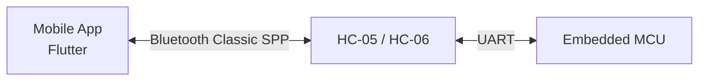
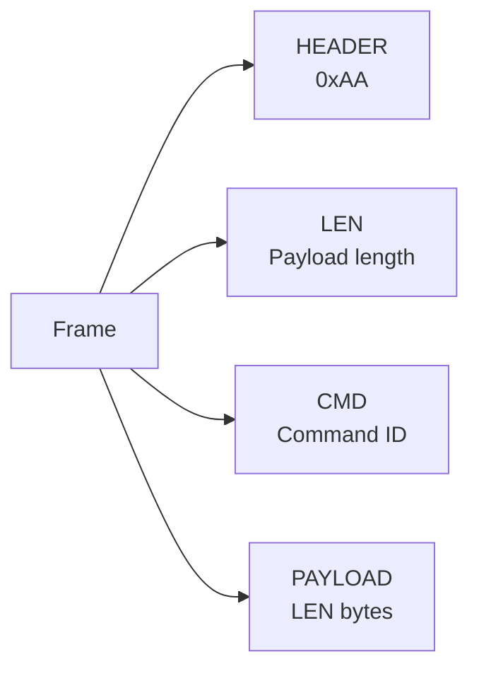
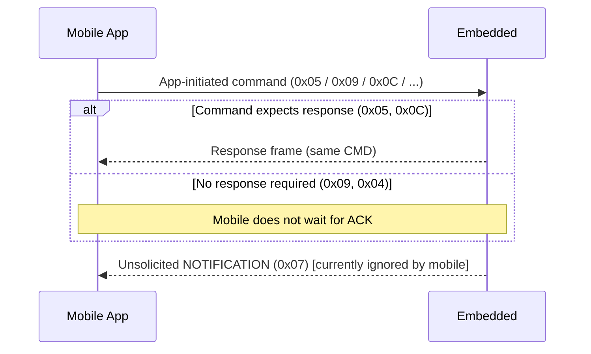
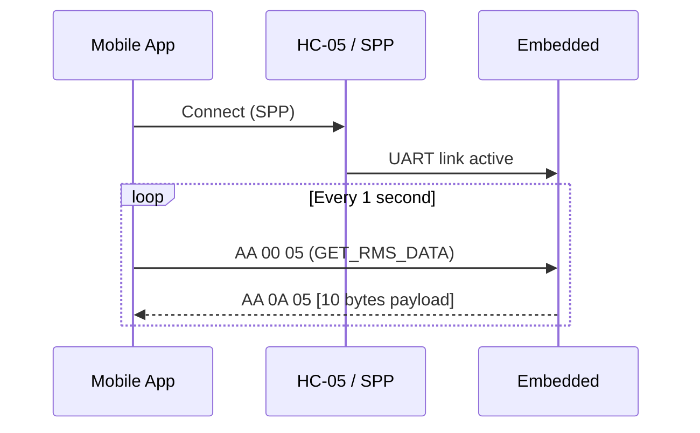

# Smart Energy Management System - Mobile ↔ Embedded Communication Protocol (As Implemented in Mobile App)

**Document Version:** 1.0  
**Last Updated:** 30 January 2026  
**Source of Truth (Mobile):** `Firmware/Mobile/Src/mobile_app/lib/services/bluetooth_service.dart`, `Firmware/Mobile/Src/mobile_app/lib/config/constants.dart`  

---

## 1) Overview

This document describes the communication protocol **actually implemented in the Flutter mobile application** for exchanging data with the embedded system.

### 1.1 Transport

- **Transport:** Bluetooth Classic **SPP** (Serial Port Profile)
- **Typical module:** HC-05 / HC-06 (UART bridge)
- **Link type:** Stream (bytes may arrive split/merged; framing is required)



### 1.2 Encoding / Data Type

- **Encoding:** **Binary frames** (raw bytes).
- **Not ASCII strings. Not CSV**.
- Fields are transmitted as **unsigned integers** packed into bytes.

### 1.3 Byte Order (Endianness)

- **Big-endian** for multi-byte values.
  - 16-bit value is sent as `[MSB][LSB]`.
  - 32-bit value is sent as `[B3][B2][B1][B0]` (MSB first).

---

## 2) Frame Structure

### 2.1 Frame Format

Each frame has the following structure:

```text
[HEADER][LEN][CMD][PAYLOAD...]
 1 byte 1 byte 1 byte  LEN bytes
```



### 2.2 Field Definitions

| Field | Size | Description |
| --- | --- | --- |
| `HEADER` | 1 byte | Fixed start marker: `0xAA` (`AppConstants.frameHeader`) |
| `LEN` | 1 byte | Number of bytes in `PAYLOAD` (0..255) |
| `CMD` | 1 byte | Command identifier (`AppConstants.cmd...`) |
| `PAYLOAD` | `LEN` bytes | Command-specific data |

### 2.3 Validation & Streaming Rules

The mobile app implements a streaming parser:

- It buffers all received bytes in an internal buffer.
- It searches for the header byte `0xAA`.
- It discards any garbage bytes before the header.
- It waits until `3 + LEN` bytes are available before processing the frame.
- **No checksum/CRC is implemented in the mobile code** (frame integrity relies on the transport + header/length framing).

```mermaid
flowchart TD
  R[Receive bytes chunk] --> B[Append to frame buffer]
  B --> F{Header 0xAA found?}
  F -- No --> CL[Clear buffer]\n(no valid header)
  F -- Yes --> TR[Trim bytes before header]
  TR --> S{Buffer length >= 3?}
  S -- No --> W1[Wait for more bytes]
  S -- Yes --> LEN[Read LEN + CMD]
  LEN --> C{Buffer length >= 3 + LEN?}
  C -- No --> W2[Wait for more bytes]
  C -- Yes --> X[Extract payload]\nprocess command
  X --> RM[Remove processed frame]\nfrom buffer
  RM --> F
```

---

## 3) Command Reference (Mobile App)

> Notes:
>
> - The mobile app uses the same `CMD` value in request and response (echoed command ID).
> - Some command IDs exist in constants but are not fully implemented on the mobile side yet.
> - `0x09` is used for relay control (in code it is also named `cmdCuttOFF`).
>

### 3.1 Command ID Table

| Command ID | Name in Mobile Constants | Initiator | Response Expected by Mobile | Implemented in Mobile | Purpose |
| --- | --- | --- | --- | --- | --- |
| `0x03` | `cmdReadEeprom` | App → Embedded | TBD | Send only | Request reading EEPROM (payload/response TBD) |
| `0x04` | `cmdWriteEeprom` | App → Embedded | No | Send only | Write EEPROM / reset energy counter (see section 4.3) |
| `0x05` | `cmdGetRmsData` | App → Embedded | Yes (must respond) | Yes | Request & receive RMS measurements (see section 4.1) |
| `0x06` | `cmdGetLoggedData` | App → Embedded | TBD | Not used | Request logged data (not parsed in mobile code) |
| `0x07` | `cmdNotification` | Embedded → App | Unsolicited | Not parsed | Notifications/alerts (mobile currently ignores) |
| `0x08` | `cmdUpdateEeprom` | App → Embedded | TBD | Not used | Update EEPROM parameters (not implemented in mobile logic) |
| `0x09` | `cmdControlRelay` / `cmdCuttOFF` | App → Embedded | No | Yes | Control relay output (see section 4.2) |
| `0x0A` | `cmdProtectionSafe` | App → Embedded | TBD | Not used | Reset protection state (not implemented in mobile logic) |
| `0x0B` | `cmdCalibrateSensors` | App → Embedded | TBD | Not used | Calibration command (not implemented in mobile logic) |
| `0x0C` | `cmdGetDeviceInfo` | App → Embedded | Yes (must respond) | Yes | Request & receive device limits/info (see section 4.4) |

### 3.2 Who Sends What (Direction Summary)

#### 3.2.1 Commands sent by the App

The mobile app is the **master** (initiator) for most operations.

| Command | ID | App sends | Embedded should do | Embedded sends back |
| --- | --- | --- | --- | --- |
| GET_RMS_DATA | `0x05` | Periodically (every 1s) | Sample/prepare RMS data and pack payload | Response frame (same CMD `0x05`) |
| GET_DEVICE_INFO | `0x0C` | On demand | Return device limits/info | Response frame (same CMD `0x0C`) |
| CONTROL_RELAY | `0x09` | On user action | Switch relay state | No response required by mobile |
| WRITE_EEPROM | `0x04` | On user action | Write/update EEPROM (used by app to reset energy) | No response required by mobile |

#### 3.2.2 Commands sent by the Embedded

| Command | ID | Embedded sends | App behavior |
| --- | --- | --- | --- |
| NOTIFICATION | `0x07` | When an event occurs (fault, warning, etc.) | **Not implemented** in current mobile parser; do not depend on this until mobile adds handling |



---

## 4) Payload Definitions (Implemented)

### 4.1 `GET_RMS_DATA (0x05)`

#### 4.1.1 Request (Mobile → Embedded)

- **Frame:**

```text
AA 00 05
```

- `LEN = 0` (no payload)

#### 4.1.2 Response (Embedded → Mobile)

- **Expected payload length:** `LEN = 10`

```text
[AA][0A][05]
  [Vh][Vl]
  [Ih][Il]
  [Ph][Pl]
  [E3][E2][E1][E0]
```

#### 4.1.3 Field Mapping (Big-endian)

| Payload Bytes | Field | Type | Scaling in Mobile | Unit (as displayed) |
| --- | --- | --- | --- | --- |
| `0..1` | Voltage RMS | `uint16` | `value / 10.0` | Volts (V) |
| `2..3` | Current RMS | `uint16` | `value / 100.0` | Amperes (A) |
| `4..5` | Power | `uint16` | `value / 10.0` | Watts (W) |
| `6..9` | Energy Counter | `uint32` | `value / 100.0` | Energy (app shows as numeric; commonly Wh) |

#### 4.1.4 Mobile Decode Formula

The mobile app decodes payload bytes as:

- `voltage = ((b0 << 8) | b1) / 10.0`
- `current = ((b2 << 8) | b3) / 100.0`
- `power   = ((b4 << 8) | b5) / 10.0`
- `energy  = ((b6 << 24) | (b7 << 16) | (b8 << 8) | b9) / 100.0`

#### 4.1.6 Embedded Responsibilities (What the embedded must do)

- On receiving `AA 00 05`, the embedded MUST respond with a frame having:
  - `HEADER = 0xAA`
  - `LEN = 0x0A`
  - `CMD = 0x05`
  - 10 payload bytes exactly: `V(2)`, `I(2)`, `P(2)`, `E(4)`
- The embedded MUST pack multi-byte values as **big-endian**.
- The embedded MUST apply the scaling implied by the mobile decode rules:
  - Voltage sent as integer = `V * 10`
  - Current sent as integer = `I * 100`
  - Power sent as integer = `P * 10`
  - Energy sent as integer = `Energy * 100`

#### 4.1.5 Example

Example response:

```text
AA 0A 05  08 CA  02 BC  05 DC  00 00 4E 20
```

Decoded:

- Voltage = `0x08CA = 2250` → `225.0 V`
- Current = `0x02BC = 700` → `7.00 A`
- Power   = `0x05DC = 1500` → `150.0 W`
- Energy  = `0x00004E20 = 20000` → `200.00` (scaled by /100)

---

### 4.2 `CONTROL_RELAY (0x09)`

#### 4.2.1 Request (Mobile → Embedded)

- **Payload length:** `LEN = 2`

```text
[AA][02][09][RELAY_INDEX][STATE]
```

| Payload Byte | Field | Type | Values |
| --- | --- | --- |
| `0` | `RELAY_INDEX` | `uint8` | Relay number/index (e.g. 0, 1) |
| `1` | `STATE` | `uint8` | `0x00` = OFF, `0x01` = ON |

Examples:

```text
AA 02 09 00 01   (Relay 0 ON)
AA 02 09 00 00   (Relay 0 OFF)
AA 02 09 01 01   (Relay 1 ON)
```

#### 4.2.2 Response

The mobile app does not require a response for this command.

#### 4.2.3 Embedded Responsibilities (What the embedded must do)

- Parse payload:
  - `RELAY_INDEX` (byte 0)
  - `STATE` (byte 1): `0x00` OFF, `0x01` ON
- Apply the requested relay state immediately.
- No response is required by the current mobile implementation.

---

### 4.3 `WRITE_EEPROM (0x04)` (Used by Mobile to Reset Energy Counter)

#### 4.3.1 Request (Mobile → Embedded)

The mobile app calls `resetEnergyCounter()` by sending 4 zero bytes.

- **Payload length:** `LEN = 4`

```text
AA 04 04  00 00 00 00
```

#### 4.3.2 Response

The mobile app does not require a response.

#### 4.3.3 Embedded Responsibilities (What the embedded must do)

- When the app sends `AA 04 04 00 00 00 00`, treat this as **reset energy counter**.
- Suggested behavior:
  - Set internal energy counter to 0.
  - Persist the new value to EEPROM.
- No response is required by the current mobile implementation.

---

### 4.4 `GET_DEVICE_INFO (0x0C)`

#### 4.4.1 Request (Mobile → Embedded)

- **Frame:**

```text
AA 00 0C
```

#### 4.4.2 Response (Embedded → Mobile)

- **Expected payload length:** `LEN = 7`

```text
[AA][07][0C]
  [DEVICE_ID]
  [VmaxH][VmaxL]
  [ImaxH][ImaxL]
  [PmaxH][PmaxL]
```

#### 4.4.3 Field Mapping

| Payload Bytes | Field | Type | Scaling in Mobile |
| --- | --- | --- | --- |
| `0` | `DEVICE_ID` | `uint8` | none |
| `1..2` | `MAX_VOLTAGE` | `uint16` | none |
| `3..4` | `MAX_CURRENT` | `uint16` | none |
| `5..6` | `MAX_POWER` | `uint16` | none |

The mobile app parses this using:

- `maxVoltage = (b1 << 8) | b2`
- `maxCurrent = (b3 << 8) | b4`
- `maxPower   = (b5 << 8) | b6`

Units should match what embedded decides to transmit (commonly V, A, W as integers).

#### 4.4.4 Embedded Responsibilities (What the embedded must do)

- On receiving `AA 00 0C`, the embedded MUST respond with a frame having:
  - `HEADER = 0xAA`
  - `LEN = 0x07`
  - `CMD = 0x0C`
  - 7 payload bytes exactly: `DEVICE_ID(1)`, `MAX_VOLTAGE(2)`, `MAX_CURRENT(2)`, `MAX_POWER(2)`
- Pack 16-bit fields as **big-endian**.

---

## 5) Timing / Communication Behavior

- After successful Bluetooth SPP connection, the mobile app starts a periodic timer.
- Every `AppConstants.dataUpdateInterval` (**1 second**), it sends `GET_RMS_DATA (0x05)`.



---

## 6) Implementation Notes for Embedded Team

### 6.1 Required Embedded Behavior (To Match Mobile)

- Must send frames starting with `0xAA`.
- Must set `LEN` equal to payload byte count.
- Must use **big-endian** packing for `uint16` and `uint32` fields.
- Should respond to `GET_RMS_DATA (0x05)` with **exactly 10 payload bytes**.
- Should respond to `GET_DEVICE_INFO (0x0C)` with **exactly 7 payload bytes**.

### 6.2 No Checksum

The current mobile implementation does not validate checksum/CRC.

If checksum/CRC is later added on embedded, the mobile parsing logic must be updated accordingly.

---

## 7) Appendix A: Legacy / Alternative String Format (Not Used by Current BluetoothService)

The project contains a model parser for comma-separated text:

```text
V,I,P,E,Status
220.5,5.2,1146.6,2.5,OK
```

However, the current Bluetooth implementation in `bluetooth_service.dart` uses the **binary framed protocol** described above.

---

## End of Document
