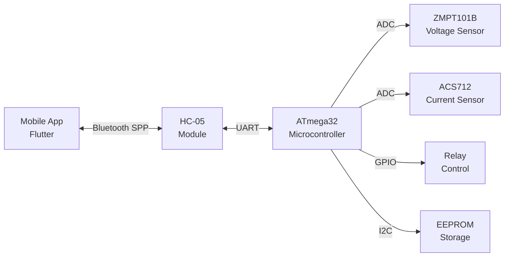
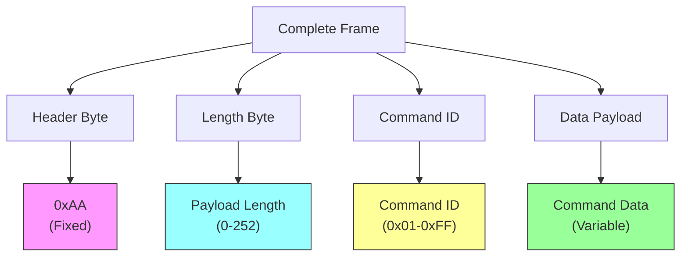
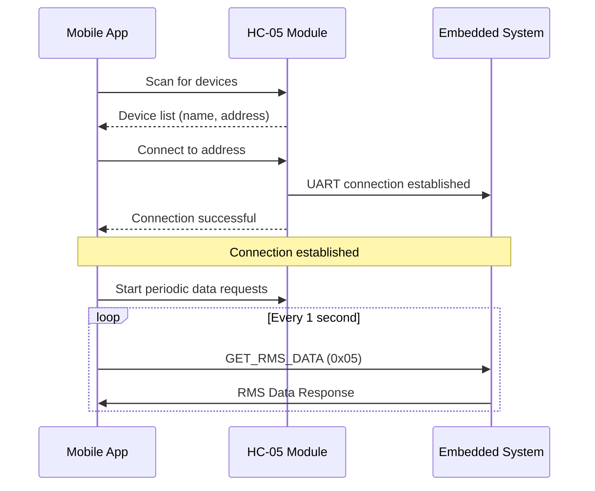
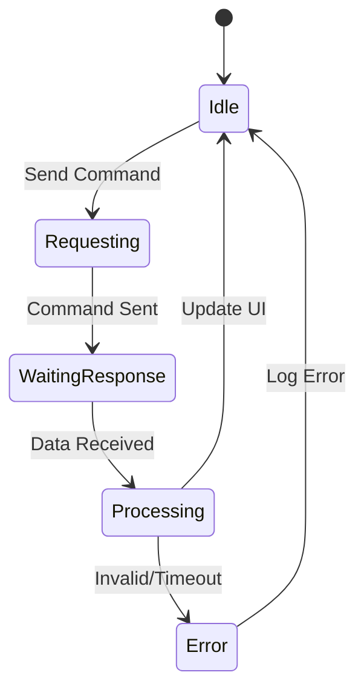
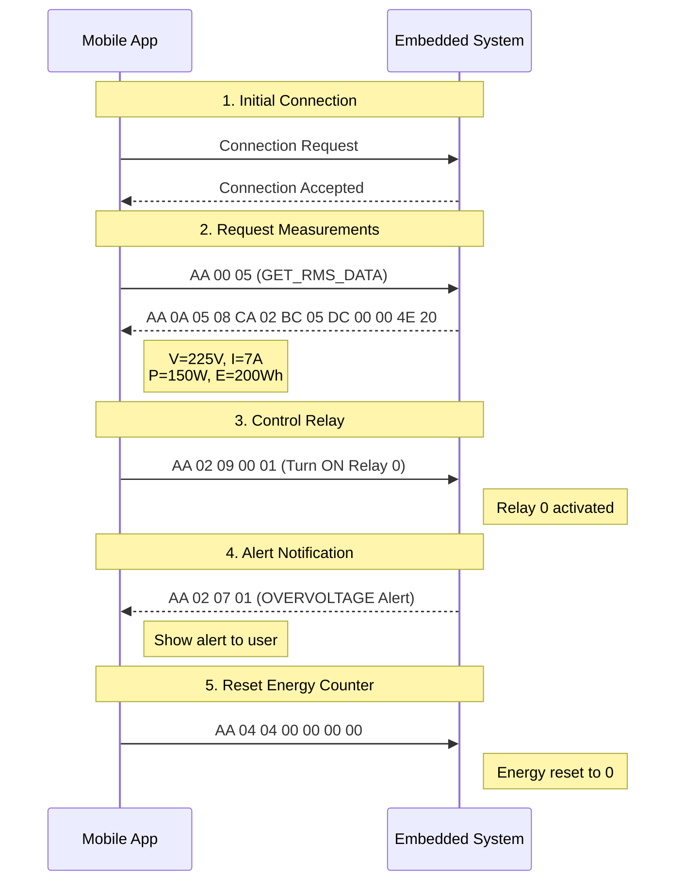
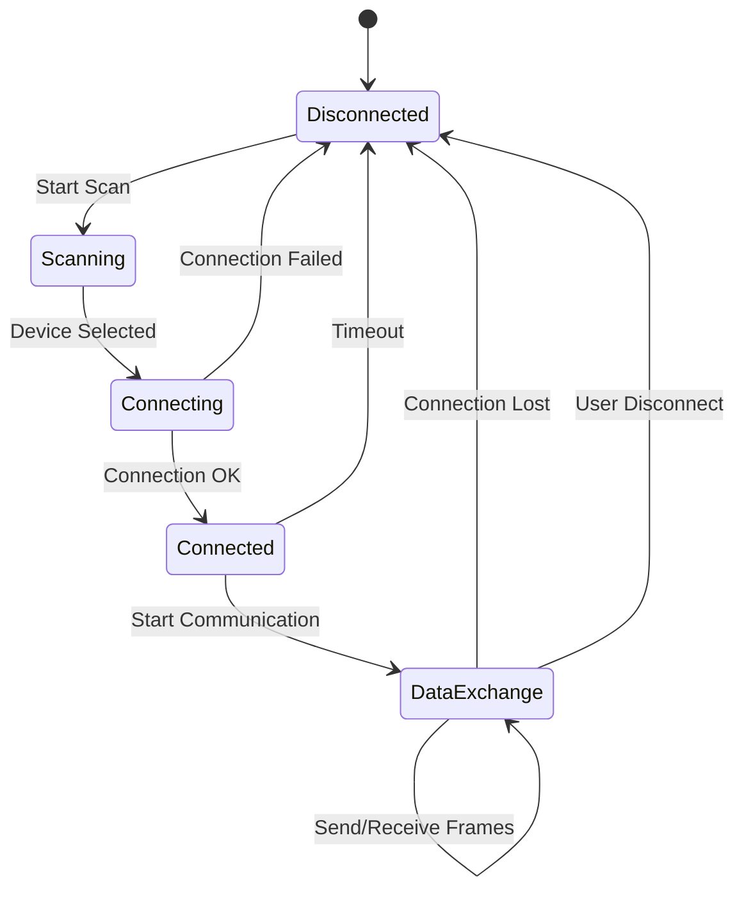

# Smart Energy Management System - Communication Protocol

**Document Version:** 1.0  
**Last Updated:** 29 January 2026  
**Protocol Type:** Bluetooth Classic (SPP - Serial Port Profile)

---

## Table of Contents

1. [Overview](#overview)
2. [Frame Structure](#frame-structure)
3. [Command Reference](#command-reference)
4. [Communication Flow](#communication-flow)
5. [Data Formats](#data-formats)
6. [Examples](#examples)
7. [Error Handling](#error-handling)

---

## Overview

This document describes the binary communication protocol between the **Mobile Application** and the **Embedded System** via Bluetooth Classic connection.

### Protocol Characteristics

- **Transport:** Bluetooth Serial Port Profile (SPP)
- **Baud Rate:** 9600 bps (HC-05 default)
- **Byte Order:** Big-endian (MSB first)
- **Frame Header:** 0xAA
- **Maximum Frame Size:** 255 bytes

### System Architecture



---

## Frame Structure

All communication uses a fixed frame structure for reliable data transmission.

### Frame Format

```
┌────────┬────────┬─────────┬────────────────┐
│ Header │ Length │ Command │      Data      │
│ (1 byte)│(1 byte)│(1 byte) │ (0-252 bytes)  │
└────────┴────────┴─────────┴────────────────┘
```

### Frame Components



| Field       | Size        | Description                           | Example               |
| ----------- | ----------- | ------------------------------------- | --------------------- |
| **Header**  | 1 byte      | Frame start marker (always `0xAA`)    | `0xAA`                |
| **Length**  | 1 byte      | Number of bytes in Data field (0-252) | `0x0A` (10 bytes)     |
| **Command** | 1 byte      | Command identifier                    | `0x05` (Get RMS Data) |
| **Data**    | 0-252 bytes | Command-specific payload              | Varies by command     |

### Frame Validation Rules

1. Every frame MUST start with header `0xAA`
2. Length field indicates ONLY data payload size (excludes header, length, and command bytes)
3. Total frame size = 3 + Length value
4. Device should discard any data before finding valid header

---

## Command Reference

### Command ID Table

| Command ID | Name              | Direction         | Description              |
| ---------- | ----------------- | ----------------- | ------------------------ |
| `0x03`     | READ_EEPROM       | Mobile → Embedded | Read EEPROM data         |
| `0x04`     | WRITE_EEPROM      | Mobile → Embedded | Write data to EEPROM     |
| `0x05`     | GET_RMS_DATA      | Mobile → Embedded | Request RMS measurements |
| `0x06`     | GET_LOGGED_DATA   | Mobile → Embedded | Request historical data  |
| `0x07`     | NOTIFICATION      | Embedded → Mobile | Send alert/notification  |
| `0x08`     | UPDATE_EEPROM     | Mobile → Embedded | Update EEPROM parameters |
| `0x09`     | CONTROL_RELAY     | Mobile → Embedded | Control relay on/off     |
| `0x0A`     | PROTECTION_SAFE   | Mobile → Embedded | Reset protection state   |
| `0x0B`     | CALIBRATE_SENSORS | Mobile → Embedded | Start sensor calibration |

---

## Communication Flow

### Connection Sequence



### Data Request/Response Pattern



---

## Data Formats

### 1. GET_RMS_DATA (0x05)

**Request from Mobile:**

```
[0xAA][0x00][0x05]
```

- Header: `0xAA`
- Length: `0x00` (no data payload)
- Command: `0x05`

**Response from Embedded:**

```
[0xAA][0x0A][0x05][VH][VL][IH][IL][PH][PL][E3][E2][E1][E0]
```

| Byte Index | Field   | Description                 | Unit | Scale             |
| ---------- | ------- | --------------------------- | ---- | ----------------- |
| 0          | Header  | Frame header                | -    | `0xAA`            |
| 1          | Length  | Payload length              | -    | `0x0A` (10 bytes) |
| 2          | Command | Command echo                | -    | `0x05`            |
| 3-4        | Voltage | AC Voltage (16-bit)         | V    | value / 10.0      |
| 5-6        | Current | AC Current (16-bit)         | A    | value / 100.0     |
| 7-8        | Power   | Active Power (16-bit)       | W    | value / 10.0      |
| 9-12       | Energy  | Accumulated Energy (32-bit) | Wh   | value / 100.0     |

**Data Extraction (Dart):**

```dart
final voltage = ((data[0] << 8) | data[1]) / 10.0;    // Volts
final current = ((data[2] << 8) | data[3]) / 100.0;   // Amperes
final power = ((data[4] << 8) | data[5]) / 10.0;      // Watts
final energy = ((data[6] << 24) | (data[7] << 16) |
                (data[8] << 8) | data[9]) / 100.0;    // Watt-hours
```

**Example:**

```
Request:  AA 00 05
Response: AA 0A 05  08 CA  02 BC  05 DC  00 00 4E 20

Decoded Values:
- Voltage: 0x08CA = 2250 → 225.0 V
- Current: 0x02BC = 700 → 7.00 A
- Power:   0x05DC = 1500 → 150.0 W
- Energy:  0x00004E20 = 20000 → 200.00 Wh
```

---

### 2. CONTROL_RELAY (0x09)

**Request from Mobile:**

```
[0xAA][0x02][0x09][RELAY_INDEX][STATE]
```

| Field       | Value            | Description           |
| ----------- | ---------------- | --------------------- |
| Header      | `0xAA`           | Frame header          |
| Length      | `0x02`           | 2 bytes of data       |
| Command     | `0x09`           | Control relay         |
| RELAY_INDEX | `0x00` or `0x01` | Relay number (0 or 1) |
| STATE       | `0x00` or `0x01` | 0=OFF, 1=ON           |

**Examples:**

```
Turn ON Relay 0:  AA 02 09 00 01
Turn OFF Relay 0: AA 02 09 00 00
Turn ON Relay 1:  AA 02 09 01 01
```

**Response:** No response (fire-and-forget)

---

### 3. WRITE_EEPROM (0x04)

**Request from Mobile (Reset Energy Counter):**

```
[0xAA][0x04][0x04][0x00][0x00][0x00][0x00]
```

| Field     | Value           | Description          |
| --------- | --------------- | -------------------- |
| Header    | `0xAA`          | Frame header         |
| Length    | `0x04`          | 4 bytes of data      |
| Command   | `0x04`          | Write EEPROM         |
| Data[0-3] | `0x00 00 00 00` | Reset energy to zero |

**Response:** No immediate response

---

### 4. NOTIFICATION (0x07)

**Sent from Embedded (Alert):**

```
[0xAA][LENGTH][0x07][ALERT_TYPE][DATA...]
```

| Alert Type   | Value  | Description                |
| ------------ | ------ | -------------------------- |
| OVERVOLTAGE  | `0x01` | Voltage exceeded threshold |
| OVERCURRENT  | `0x02` | Current exceeded threshold |
| OVERPOWER    | `0x03` | Power exceeded threshold   |
| SYSTEM_ERROR | `0xFF` | General system error       |

---

## Examples

### Complete Communication Session



---

## Error Handling

### Mobile App Error Handling

1. **Invalid Header**: Discard bytes until `0xAA` is found
2. **Incomplete Frame**: Buffer data until complete frame received
3. **Timeout**: If no response after 5 seconds, retry or notify user
4. **Invalid Data**: Log error and request data again

### Frame Buffer Processing (Pseudo-code)

```dart
List<int> frameBuffer = [];

void processIncomingData(List<int> newData) {
  frameBuffer.addAll(newData);

  while (frameBuffer.length >= 3) {
    // Find header
    int headerIndex = frameBuffer.indexOf(0xAA);

    if (headerIndex == -1) {
      frameBuffer.clear();
      return;
    }

    // Remove garbage before header
    if (headerIndex > 0) {
      frameBuffer.removeRange(0, headerIndex);
    }

    // Check if we have full frame
    int length = frameBuffer[1];
    int totalFrameLength = 3 + length;

    if (frameBuffer.length < totalFrameLength) {
      return; // Wait for more data
    }

    // Extract and process frame
    int commandId = frameBuffer[2];
    List<int> data = frameBuffer.sublist(3, totalFrameLength);

    processCommand(commandId, data);

    // Remove processed frame
    frameBuffer.removeRange(0, totalFrameLength);
  }
}
```

---

## Appendix: Byte Order Examples

### 16-bit Value Encoding (Big-Endian)

```
Value: 225.0 V → Internal: 2250 (0x08CA)
Bytes: [0x08, 0xCA]
       ^^^^  ^^^^
       MSB   LSB
```

### 32-bit Value Encoding (Big-Endian)

```
Value: 200.00 Wh → Internal: 20000 (0x00004E20)
Bytes: [0x00, 0x00, 0x4E, 0x20]
        ^^^^  ^^^^  ^^^^  ^^^^
        MSB              LSB
```

---

## Protocol State Machine



---

## Summary

This protocol provides:

- ✅ Simple framing for reliable transmission
- ✅ Bidirectional command/response communication
- ✅ Support for real-time monitoring and control
- ✅ Extensible command set for future features
- ✅ Robust error detection and recovery

For implementation details, refer to:

- **Mobile App:** `lib/services/bluetooth_service.dart`
- **Mobile Constants:** `lib/config/constants.dart`
- **Embedded Firmware:** `App/CommunicationManager/App_CommManager.c`

---

**End of Protocol Documentation**
